# Unity Cloud Build

[Unity Cloud Build 소개](https://unity3d.com/kr/services/cloud-build)

[자습서](https://unity3d.com/kr/learn/tutorials/topics/cloud-build-0)

## 01. Unity Cloud Build 소개

이 단원을 마치면 Unity Cloud Build가 무엇이며 어떻게 작동하는지 이해하게 될 것입니다.

### Unity Cloud Build란 무엇입니까?

Unity 게임을위한 빌드 파이프 라인[^1]을 자동화하는 서비스입니다.

[^1]: 시스템의 효율을 높이기 위해 명령문을 수행하면서 몇 가지의 특수한 작업들을 병렬 처리하도록 설계된 하드웨어.

### Cloud Build를 사용해야 하는 이유는 무엇인가?

클라우드 빌드 자동화 서비스를 사용하면 시간을 절약 할 수 있습니다.

빌드는 자동으로 컴파일되고 배포되므로 수작업과 개입이 최소화됩니다.

여러 플랫폼이있는 게임을 단일 빌드 프로세스로 통합 할 수 있습니다.

아래와 같은 장점이 있습니다.

1. 품질 향상.
    - 변화가 감지되면 지속적으로 게임을 제작하여 프로젝트에 도입 된 문제를 감지 할 수 있습니다.

2. 더 빠른 배포.
    - 클라우드 기반 인프라 스트럭처는 빌드를 컴파일합니다. 다중 플랫폼 프로젝트의 경우 병렬로 실행됩니다.
      완성 된 빌드는 Cloud Build의 웹 사이트를 통해 팀 구성원이 다운로드 할 수 있습니다.

### Unity Cloud Build는 어떻게 작동합니까?

Unity Cloud Build는 소스 제어 저장소 (예 : Git, Subversion, Mercurial, Perforce)를 모니터합니다.

변경 사항이 감지되면 Cloud Build가 자동으로 빌드를 생성합니다.

빌드가 완료되면 당신과 당신의 팀에게 이메일로 보냅니다.

당신과 당신의 팀 동료를 위해 당신의 빌드가 Unity에 의해 호스팅됩니다.

만약 빌드가 실패하면 문제를 해결하기 위해 로그가 제공됩니다.

### Unity Cloud Build를 사용하려면 무엇이 필요합니까?

소스 제어 저장소. 다음 소스 제어 관리 ("SCM") 시스템을 지원합니다.

- Git
- Subversion
- Mercurial
- Perforce

## 02. 당신의 첫 번째 소스 컨트롤 저장소 만들기

이 수업이 끝나면 로컬 Git repo가 생깁니다. 유니티 프로젝트가 포함되어 있으며, Git Sever와 연결될 것입니다.

프로젝트에 대한 소스 컨트롤(Git, Subversion, Perforce 또는 Mercurial)이 있는 리포지토리가 이미 있거나 Unity 프로젝트 빌드를 테스트하기 위해 샘플 프로젝트를 사용하려는 경우 3 단원 : 첫 클라우드 빌드 프로젝트 만들기로 진행할 수 있습니다 .

이 단원에서는 다음을 사용하여 리포지토리를 만듭니다.

- **Bitbucket**: 소규모 프로젝트를위한 무료 저장소
- **Git**: 인기있는 소스 제어 시스템, Bitbucket과 통합되었습니다.
- **SourceTree**: Git 및 Bitbucket에서 작동하는 사용자 친화적인 GUI 툴.

이 도구는 빠른 설정과 손쉬운 사용을 위해 SCM 초보자에게 유용합니다.

시작하려면 로컬 컴퓨터에 기존 Unity 프로젝트가 있어야합니다.

가지고 있지 않은 경우 다음 자습서를 완료하십시오.

[Space Shooter Tutorial](https://unity3d.com/kr/learn/tutorials/projects/space-shooter-tutorial)

### 01. Download SourceTree

SourceTree를 다운로드하여 설치하려면 [www.sourcetreeapp.com](http://www.sourcetreeapp.com)을 방문하십시오.

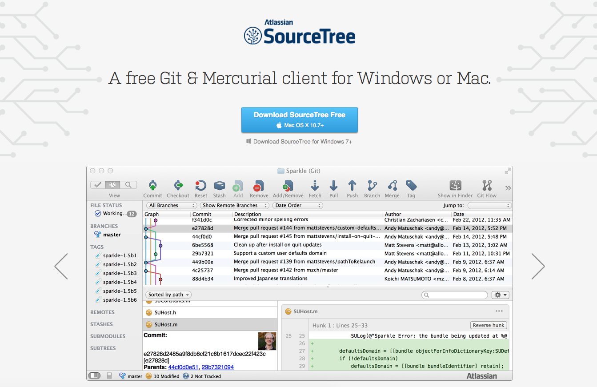

### 02. Bitbucket 계정 만들기

[bitbucket.org](https://bitbucket.org/)를 방문하여 무료 개인 계정에 가입하십시오.

첫 번째 저장소를 만들지 묻는 메시지가 표시되면 '아니요'라고 표시됩니다.

우리는 SourceTree로 저장소를 생성 할 것입니다.

### 03. SourceTree를 사용하여 Bitbucket에 저장소를 만듭니다.

SourceTree를 열고 Bitbucket 로그인 사용자 이름과 암호를 입력하라는 메시지가 나타나면 입력하십시오.

로그인하면 repo를 "Clone"하라는 메시지가 나타납니다 ("Clone a Repo"는 모든 관련 파일을 저장소에서 로컬 시스템으로 복사하는 것입니다).

Bitbucket 계정과 연결된 Repo를 만들지 않은 경우 목록이 비어 있어야합니다. "Skip Setup"을 클릭하십시오.

"Skip Setup"을 클릭하면 Repository Browser 창이 나타납니다.

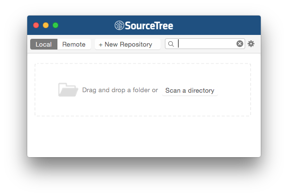

이전에 생성 한 Bitbucket 계정을 사용하여 원격 리포지토리를 만듭니다.

Repository Browser에서 "+ New Repository"를 클릭하십시오. 드롭 다운 목록이 나타납니다. '원격 저장소 만들기'를 선택하십시오.

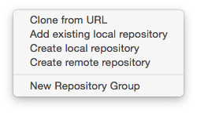

"Create a remote repository" 창이 나타납니다.

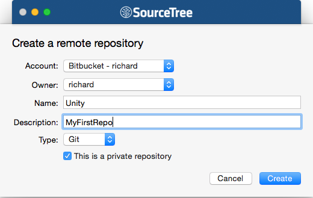

아래와 같은 설정으로 세팅합니다:

- Account: Bitbucket 계정
- Owner: Bitbucker 유저 이름
- Name: 무엇이든지 상관 없음
- Description: 무엇이든지 상관 없음
- Type: Git
- This is a private repository: Checked

“Create”를 클릭.

당신은 "Repository Window"로 되돌아 갈 것입니다. "Remote"을 클릭하면 방금 만든 목록의 이름이 목록에 표시됩니다.

### 04. 당신의 Repo Clone

Repository Window에서 | Remote window에서 이전 단계에서 생성 한 Bitbucket 저장소를 클릭하십시오. 다음 프롬프트가 나타납니다.

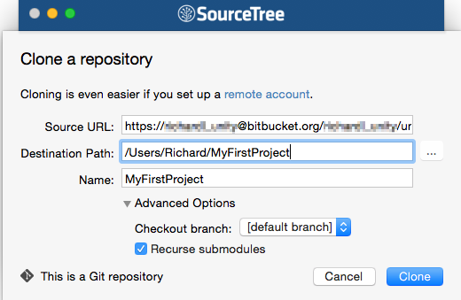

- Source URL: 있는 그대로 유지하고 나중에 기록해 두십시오. 나중에 Unity Cloud Build를 구성 할 때 사용하게됩니다.
- Destination Path: 저장소 파일이 저장 될 로컬 시스템의 위치를 선택하십시오. 대상 경로는 항목이 없는 디렉토리를 가리켜야 합니다.
- Name: 무엇이든지 상관 없음.
- Advance Options: 있는 그대로 둡니다.

“Clone”을 클릭.

그러면 Repository Window로 돌아 가게 됩니다. 로컬, 방금 작성한 저장소의 로컬 사본이 표시됩니다. 저장소는 비어 있습니다. 당신은 다음 단계에서 그것을 채울 것입니다.

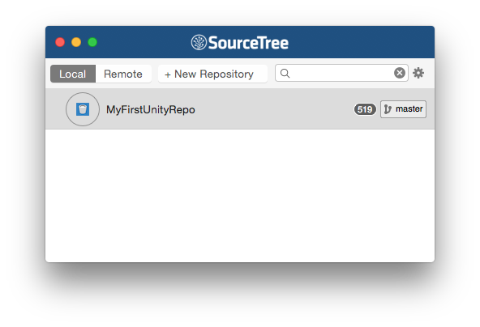

### 05. 유니티 프로젝트로 로컬 레포 채우기

Repository Window에서 | 로컬에서 repo를 더블 클릭하십시오. 메시지가 나타나면 이름과 이메일을 입력하십시오.

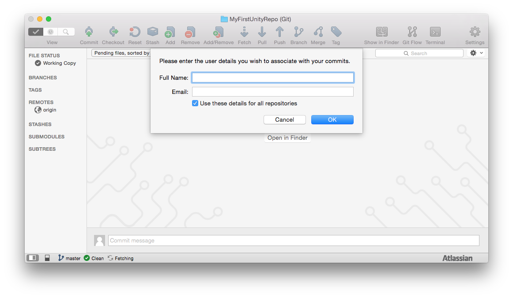

이제 로컬 저장소를 채 웁니다.

로컬 유니티 프로젝트를 찾고 모든 파일을 4단계에서 정의한 repo 대상 경로로 이동하십시오.

다음 스크린 샷에서 단일 프로젝트 "MyFirstProject"가 로컬 리포지토리 폴더 "MyFirstUnityRepo"로 이동합니다

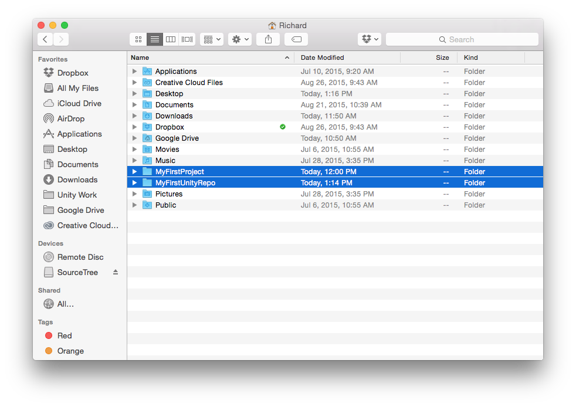

로컬 repo를 채울 때 SourceTree는 자동으로 변경 사항을 감지하고 다음과 같이 업데이트합니다 :

### 06. Commit 과 Push 로컬 Repo를 원격 Repo로 푸시합니다.

Unity Cloud Build는 원격 저장소를 모니터링합니다. 이렇게하려면 원격 repo에 파일을 COMMIT하고 PUSH해야합니다.

"Unstaged files"확인란을 선택하여 서버에 푸시 될 모든 파일을 선택합니다.

참고 : 각 파일 이름 오른쪽에 세 개의 점 (•••)이 있음을 알 수 있습니다.이 점을 클릭하면 '자세히'메뉴에 액세스 할 수 있습니다. 이 메뉴를 사용하여 Unity 'Library'폴더에 대해 '파일 무시'를 선택하십시오 (Unity Cloud Build는 빌드 프로세스 중에 Library 폴더를 생성합니다). 프로젝트를 빌드하기 위해 Unity가 필요로하지 않는 다른 파일도 '무시'할 수 있습니다. 이 단계를 완료하지 않으면 필요한만큼 빌드 프로세스가 느려집니다.

화면 상단의 "Commit"을 클릭하십시오. 메시지가 나타나면 이름과 이메일을 입력하십시오.

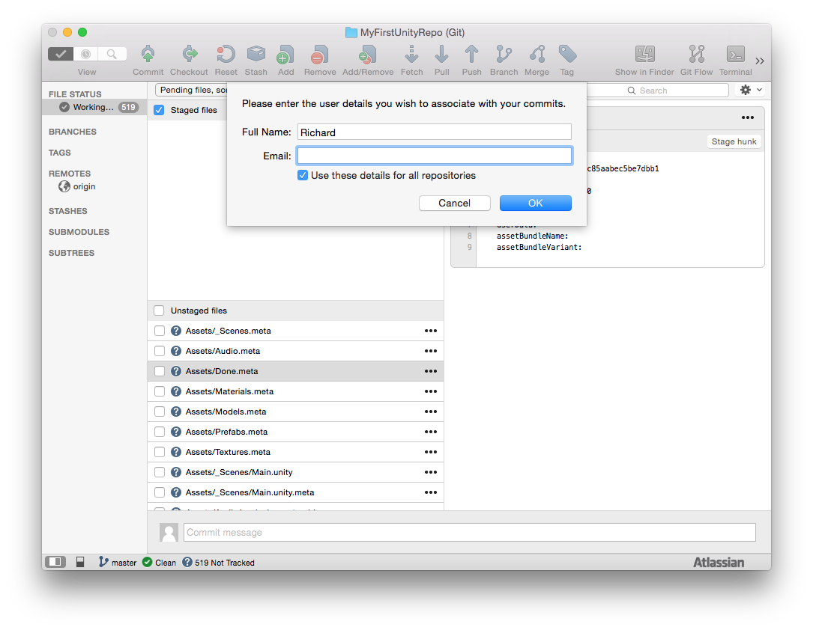

Comment를 입력하고 "Commit"을 클릭하십시오.

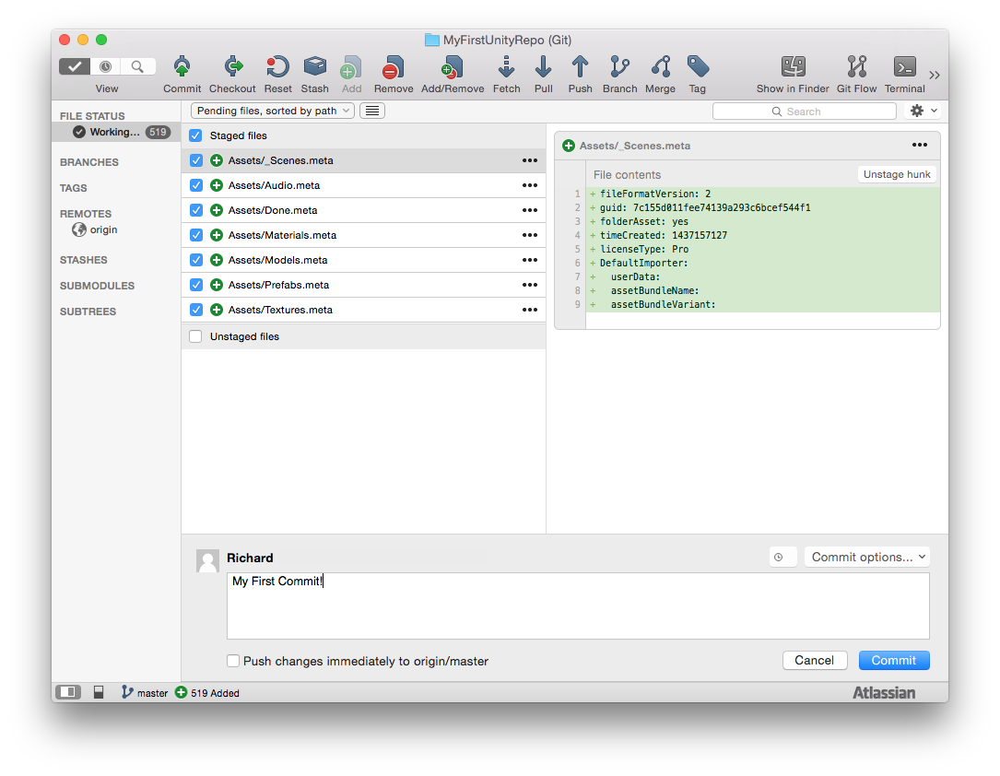

다음 메시지가 나타납니다. "There is nothing left to commit"

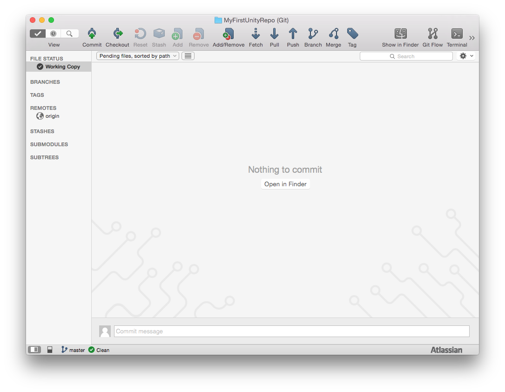

커밋 된 모든 파일을 원격 저장소에 복사하려면 "Push"를 클릭하십시오.

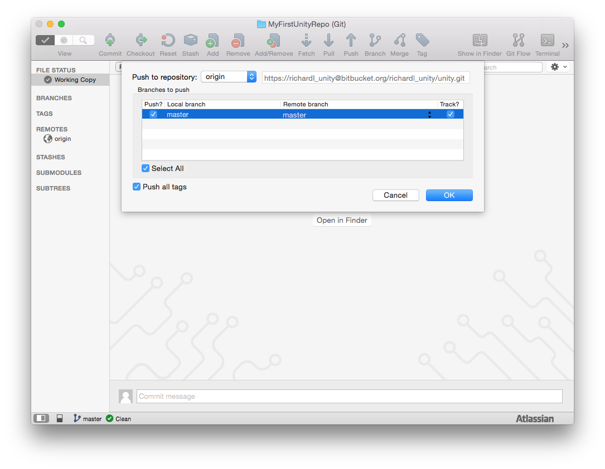

"확인"을 클릭하십시오. 업로드 프로세스가 시작됩니다.

### 07. 원격 저장소 확인

[bitbucket.org](https://bitbucket.org/)로 이동하여 너의 아이디로 로그인하십시오. 첫 번째 화면에 저장소 이름이 표시되어야합니다. Repo에 대한 페이지로 이동하려면 이름을 클릭하십시오.

repo 페이지에서 브라우저의 주소 표시 줄로 이동하여 표시되는 URL / 주소를 복사하십시오.

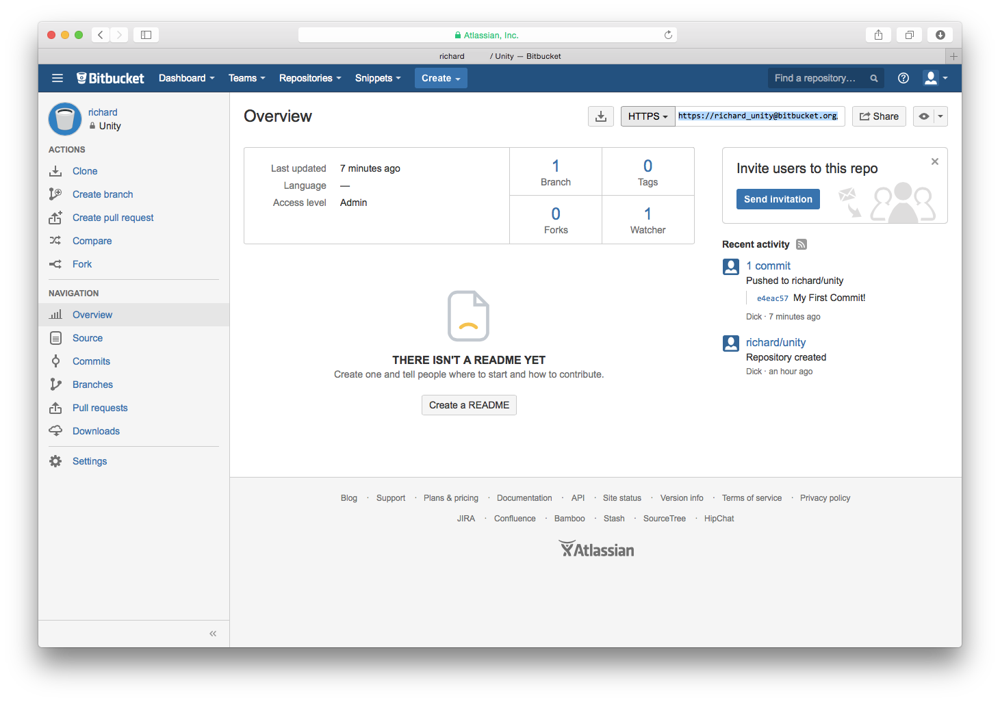

이 URL은 [새 프로젝트를 추가](https://build.cloud.unity3d.com/) 할 때 Unity Cloud Build에 제공하는 URL입니다.

이 페이지에서 'Git' 탭을 클릭하거나 Unity Cloud Build 설정 마법사의 지침에 따라 Bitbucket 계정에 SSH 키를 추가하여 액세스를 허용하십시오.

## 03. 첫번째 Cloud Build 프로젝트

이 레슨이 끝나면 코드 리포지토리에 커밋 할 때 자동으로 컴파일하고 알려주는 Unity Cloud Build 프로젝트를 갖게됩니다.

시작하려면 다음이 필요합니다.

1. 소스 제어 저장소. Unity Cloud Build는 Git, Subversion, Mercurial 및 Perforce를 지원합니다. 강의 1을 참조하십시오.
2. Unity Cloud Build 계정.

### 01. 프로젝트 만들기

[https://build.cloud.unity3d.com](https://build.cloud.unity3d.com)으로 이동하여 Unity Developer Account로 로그인하십시오. Cloud Build 홈페이지로 이동하게됩니다.

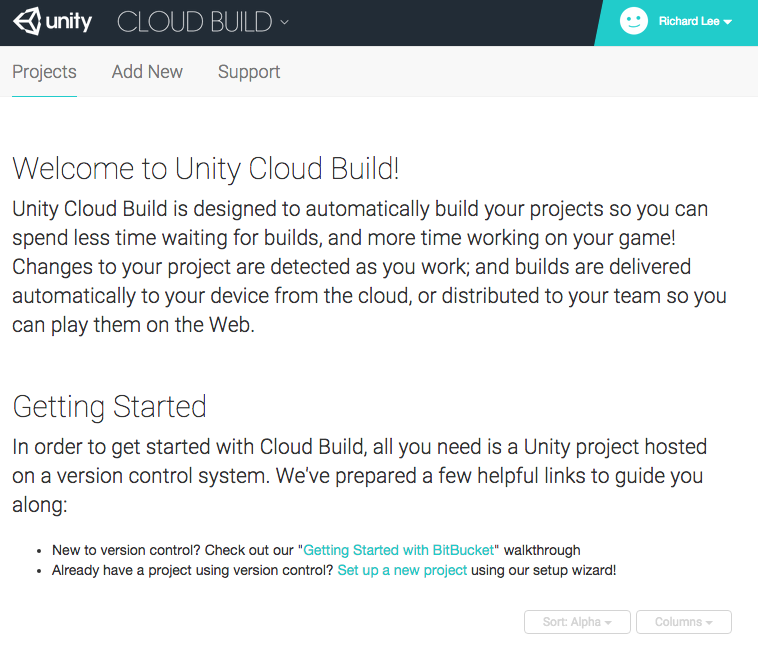

Cloud Build 홈 페이지에서 "Add New"를 클릭하십시오. Cloud Build는 프로젝트의 이름과 프로젝트가 속한 조직의 이름을 선택하도록 요청합니다.

- Organization: 드롭 다운 메뉴를 클릭하고 사용자 이름을 선택하십시오.
- Project Name: 무엇이든지 상관 없음.

### 02. Unity Cloud Build Project를 원격 저장소에 연결하십시오.

- 1단원 : 클라우드 빌드로 시작한 경우 BitBucket 레포에서 URL을 제공하십시오.
- 그렇지 않은 경우 다음 샘플 프로젝트를 사용하십시오. [https://github.com/tsugi/exampleunityangrybots](https://github.com/tsugi/exampleunityangrybots)

repo URL을 제공 한 후 다음을 클릭하십시오.

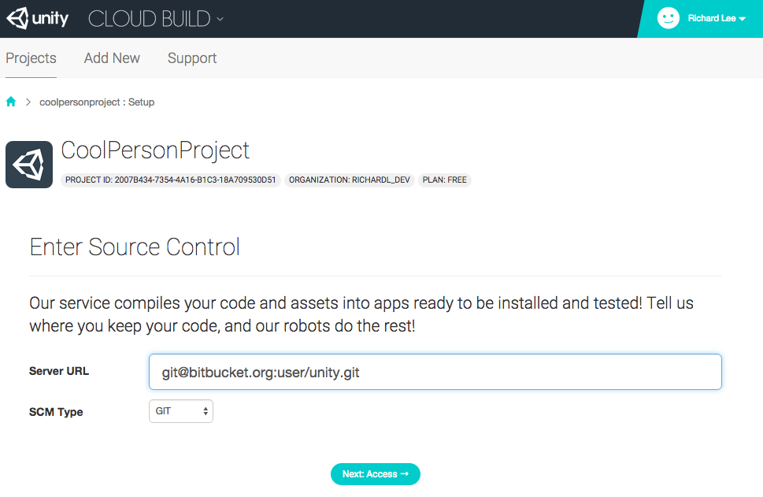

### 03. 액세스 권한 구성

repo가 비공개 인 경우 Cloud Build는 파일에 액세스하여 빌드 할 수 있도록 SSH 키를 추가하라는 메시지를 표시합니다 (공개 인 경우 자동으로 다음 단계로 건너 뜁니다)

이전 강의를 사용하여 BitBucket Repo를 만든 경우 Unity Cloud Build에서 제공하는 SSH 키를 BitBucket Repo에 첨부해야합니다

이 작업을 수행하지 않으면 빌드 시도가 실패하게됩니다. Bitbucket에 로그인하고 Cloud Build SSH 키를 Bitbucket 계정에 추가하십시오.

이전 단계의 샘플 프로젝트를 사용한 경우에는 액세스 권한을 구성하라는 메시지가 표시되지 않습니다. 프로젝트는 공개입니다.

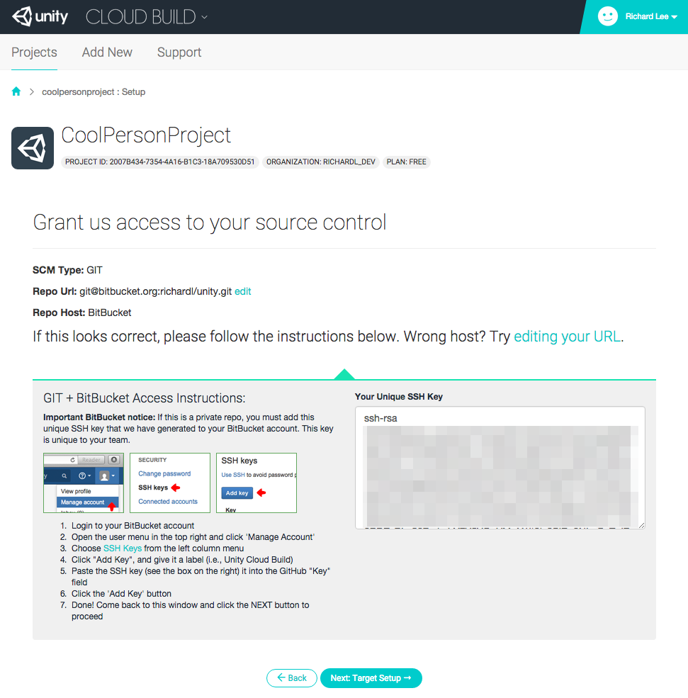

클라우드 빌드에서 제공하는 SSH 키 복사

Cloud Build에서 제공하는 SSH 키를 리포에 연결합니다. 만약 레슨 2를 진행 하였다면, BitBucket 레포에 SSH 키를 추가할 수 있을 것입니다.

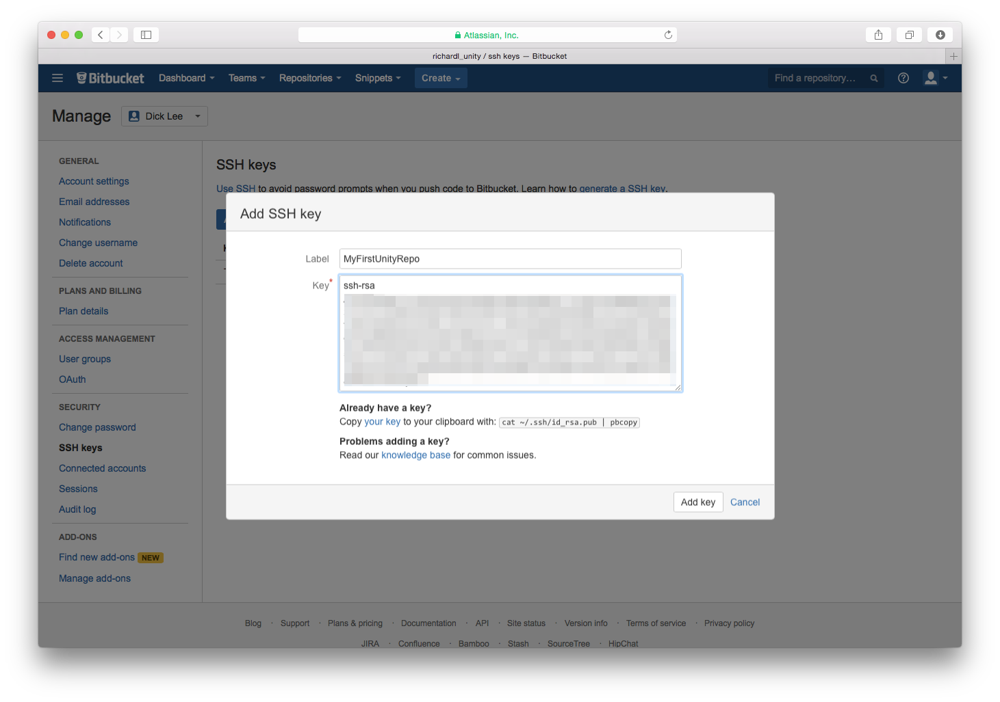

저장소 구성을 마치면 다음을 클릭하여 설정을 구성하십시오.

### 04. Unity Cloud Build 프로젝트 구성하기

플랫폼을 선택하라는 메시지가 나타납니다. 이 레슨에서는 Web Player를 선택하십시오.

자세한 구성 정보를 제공하라는 메시지가 나타납니다. 빌드 할 Repo에서 지점을 선택해야합니다. 레슨 2의 Bitbucket 레포를 사용하는 경우 "마스터"를 선택하십시오.

### 05. 빌드!

"Next"를 클릭하면 Unity Cloud Build가 자동으로 컴파일을 시작합니다.

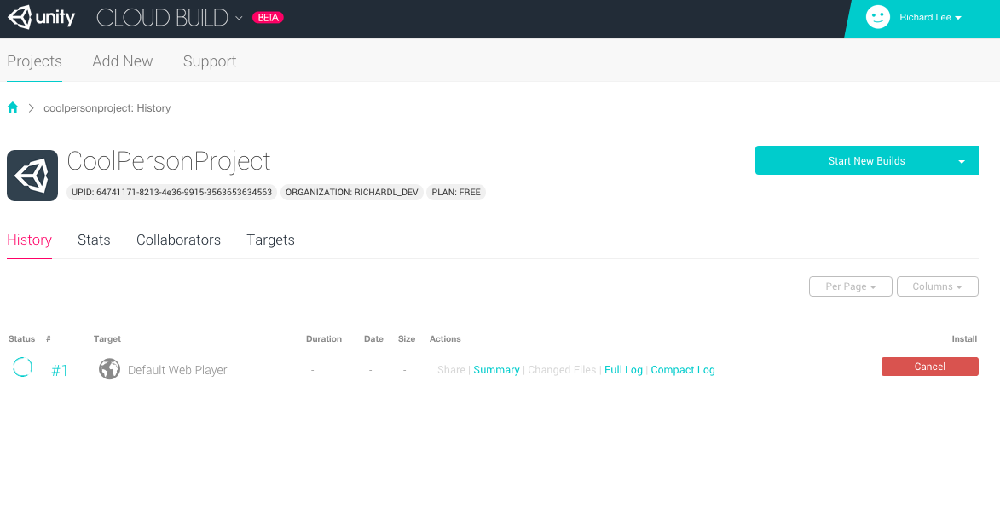

빌드 프로세스가 완료되면 자동으로 통지됩니다.

## 04. 부록 : 빌드 프로세스 기본 사항

### 소개

이 섹션에서는 게임 빌드 프로세스에 대한 높은 수준의 개요를 제공합니다. 이 단원을 마치면 빌드 프로세스와 구성 요소가 무엇인지 알 수 있습니다.

### 빌드 란 무엇입니까?

게임의 사용 가능한 버전.

플레이어는 장치를 사용하는 빌드를 중요하게 생각합니다.

종종 공개, 라이브 또는 프로덕션 빌드라고도합니다.

주어진 프로덕션 빌드의 경우 게임 개발자가 생성 한 빌드 수는 수백 개는 아니지만 수천 개에 달합니다.

게임이 제대로 작동하도록하기 위해 만들어졌습니다. 이러한 빌드는 모두 구성, 컴파일, 유효성 검사 및 배포에 시간이 필요합니다.

### 빌드 프로세스 (또는 빌드 파이프 라인) 란 무엇입니까?

게임 개발자가 빌드를 만드는 데 사용하는 일련의 도구 및 단계.

솔로 개발자라면 프로세스가 간단합니다.

코드, 자산, 버전, 빌드 환경 및 시스템은 모두 로컬 컴퓨터에 있습니다.

그러나 팀 환경에서는 팀이 개선해야하는 "권위있는"버전의 게임을 결정하기 위해 도구와 프로세스가 필요합니다.

### 빌드 프로세스는 무엇으로 구성됩니까?

일반적인 요소는 다음과 같습니다.

- 자산 및 코드가 저장되는 저장소 (또는 "Repo"). 전문적인 환경에서 프로젝트의 모든 파일은 소스 제어 관리("SCM") 시스템에 저장되므로 여러 팀 구성원이 최소한의 충돌로 동일한 리소스로 작업 할 수 있습니다.
- Build Environment는 저장소에서 코드와 자산을 가져 와서 게임의 실제 버전으로 컴파일합니다.
- 배포 서비스는 사용자에게 빌드를 가져옵니다. 대부분의 게임 개발 라이프 사이클에서 빌드는 유효성이 확인되면 내부적으로 배포됩니다.
- 자동화 엔진은 빌드 프로세스의 일부를 모니터하고 자동 조치를 취합니다. 보고서, 알림 및 배포뿐만 아니라 빌드 컴파일. 자동화 엔진이 없으면 팀원 중 한 명 이상이 수동으로 프로세스를 실행합니다.

일반적인 빌드 파이프 라인은 다음과 같습니다.

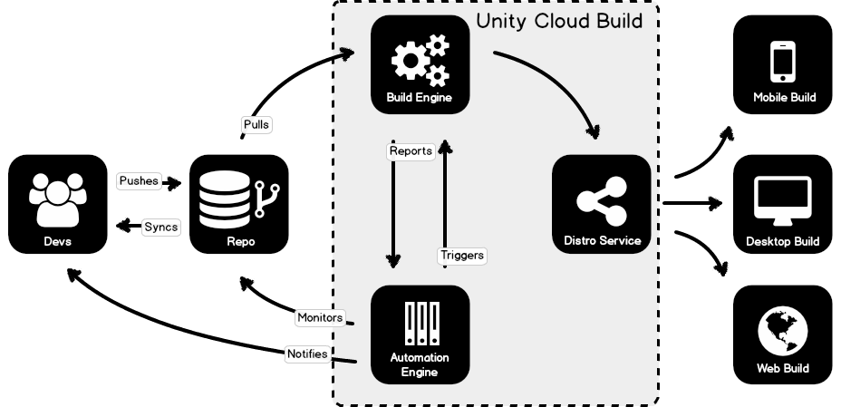

### 소스 제어는 무엇입니까?

소스 제어 (일반적으로 버전 제어라고도 함)는 여러 파일의 변경 사항을 '실행 취소'하는 방법을 제공하고 팀과 함께 소프트웨어 프로젝트를 공동 작업하는 시스템입니다.

소스 컨트롤을 사용하면 실수로 게임 시간을 잃지 않도록 보호하고 코드로 다른 것을 시도해 보는 것이 더 쉽지만보다 안정적인 버전의 프로젝트로 롤백하기 때문에 게임 개발에있어 '모범 사례'로 간주됩니다 당신이 당신의 접근 방식을 재고 할 필요가 있다면.

### 소스 제어는 어떻게 작동합니까?

특정 소스 관리 관리 시스템에 따라 다릅니다. 소프트웨어 개발을 위해 Git을 사용하기위한 워크 플로는 일반적으로 다음과 같이 작동합니다.

1. 당신은 repo (어딘가에서 호스팅)를 만들고 Unity 프로젝트를 넣습니다.
2. 변경 사항을보고 추적 할 수 있는 인터페이스를 제공하는 Git 클라이언트 (소프트웨어)를 선택합니다.
3. Git에게 라이브러리 폴더와 같은 특정 파일을 무시하도록 명령한다.
4. Unity 프로젝트를 약간 변경하고 Unity에 저장합니다.
5. Git 클라이언트로 전환하면 변경된 파일을 알려줍니다.
6. 그 파일을 선택하고 '커밋'하면됩니다 - 이것은 프로젝트의이 버전을 표시하는 것과 근본적으로 유사하므로 나중에 참조 할 수 있습니다.
7. 1 (또는 그 이상) 커밋이 끝나면 커밋을 Gitl 호스트 / 서버로 'push' 때문에 이제는 백업되고 프로젝트에서 작업중인 다른 사람도 볼 수 있습니다. 마지막 'push' 단계는 Unity Cloud Build가 프로젝트를 시청할 때 보는 단계입니다. 그러면 자동으로 새 빌드를 시작합니다.

### Cloud Build에서 지원하는 소스 제어 시스템은 무엇인가요?

Unity Cloud Build는 다음 소스 제어 관리 시스템 ("SCM")을 지원합니다.

- Git
- Subversion("SVN")
- Perforce
- Mercurial

특정 시스템에 대한 자세한 내용은 다음 리소스를 참조하십시오.

- [GitHub Bootcamp](https://help.github.com/categories/bootcamp/)
- [BitBucket 101](https://confluence.atlassian.com/bitbucket/bitbucket-tutorials-teams-in-space-training-ground-755338051.html)
- [Beanstalk - Getting Started with Subversion](http://support.beanstalkapp.com/article/793-getting-started-with-subversion)
- [Gamasutra Blogs - Git For Unity Developers](gamasutra.com/blogs/AlistairDoulin/20150304/237814/Git_for_Unity_Developers.php)
- [Using Version Control with Unity3D (Mercurial)](https://code.tutsplus.com/tutorials/using-version-control-with-unity3d--mobile-12304)

### 솔로 개발자는 빌드 파이프 라인이 필요합니까?

예, 직접 작업하는 개발자조차도 소스 제어 및 파이프 라인 구축의 이점을 누릴 수 있습니다.

소스 컨트롤은 하드 드라이브가 죽거나 실수로 프로젝트를 삭제하거나 중단 한 경우 복구 할 수있는 프로젝트의 백업을 제공합니다.

Unity Cloud Build와 같은 빌드 파이프 라인을 사용하면 여러 플랫폼에 대한 빌드를 한 번에 만들 수 있으므로 시간을 절약 할 수 있습니다.
