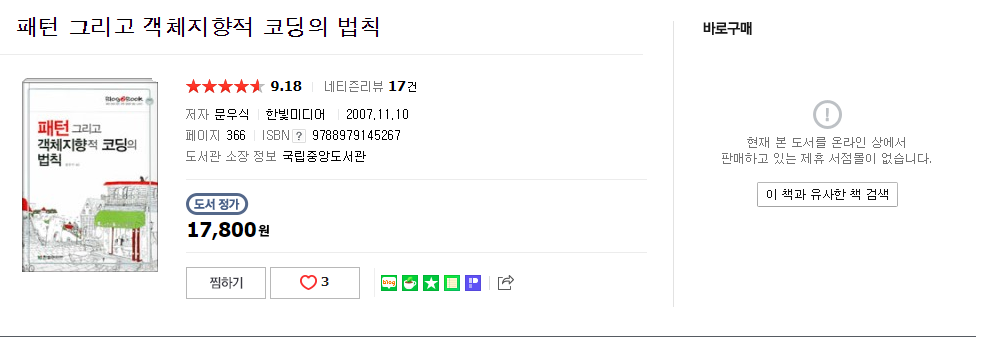

패턴과 객체지향적으로 코딩하는 방법에 대한 책

## 기간

5일

## 목적

대학교 때 구매했던 서적.

패턴과 객체지향에 대해 관심이 있어 구매 함.

## 리뷰

책 자체는 쉽게 읽을 수 있는 책이다.

처음에는 객체 지향적 사고 방식으로 생각하는 방법에 대해 설명 해준다.

저자는 2가지 방식을 중요시 한다.

1. 공통점 묶기
2. 조금만 알기

이 2가지만 알면 객체지향적 사고와 패턴의 원리를 모두 알 수 있다고 말한다.

아래에 대한 패턴에 대해 설명 해준다.

- 팩토리 패턴 (객체 생성은 객체 생성 전문가에게)
- 추상 팩토리 패턴 (관점의 차이가 곧 객체 생성의 차이)
- 팩토리 메서드 패턴 (필요한 것은 알아서 만들자)
- 템플릿 메서드 패턴 (순서를 정리하면 시점이 보인다)
- 빌더 패턴 (복잡한 조립은 조립 전문가에게 맡기자)
- 싱글톤 패턴 (오직 하나뿐인 그대)
- 프로토 타입 패턴 (너의 쌍둥이가 필요해)
- 어댑터 패턴 (수정할 수 없는 너무 안정적인 당신)
- 옵저버 패턴 (무슨 일 생기면 바로 알려줘)
- 이터레이터 패턴 (한 가지 탐색법만 기억하라)
- 컴포지트 패턴 (복합구조도 접근법은 하나)
- 스테이트 패턴 (난 기분에 따라 행동이 달라져)
- 스트래티지 패턴 (골라 쓰는 알고리즘)
- 프록시 패턴 (공유되는 정보와 대리인)
- 플라이웨이트 패턴 (공유되는 정보와 대리인)
- 커멘드 패턴 (행동만 따로 떼어보자)
- 데코레이터 패턴 (꾸미는 방법도 가지가지)

실무에서 사용할 만한 간단한 코드와 설명으로 수필 읽듯이 읽을 수 있는 장점이 있는 책이다.

하지만 자세한 소스 코드 까지는 나오지 않아, 가볍게 읽을 만한 책으로 느껴진다.

이 책을 읽고 이후 디자인 패턴에 대해 자세히 공부하려면, GOF의 디자인 패턴이나 Head First 디자인 패턴 책을 펴서 공부를 하면 좋을 듯 싶다.

## 평점 및 한줄평

설계 관련 간단히 읽을 수 있어 추천해 주고 싶은 책.

4 / 5