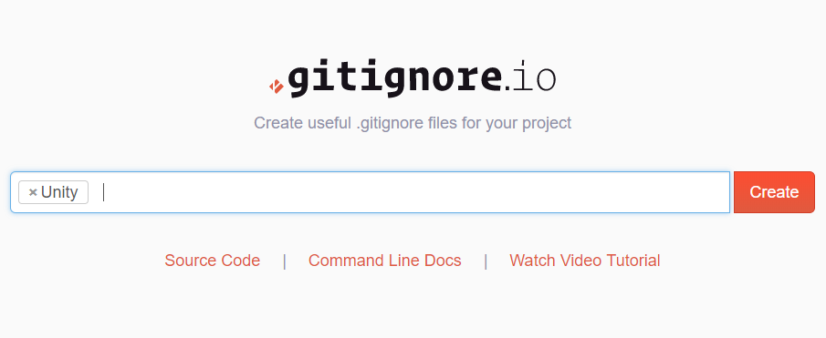
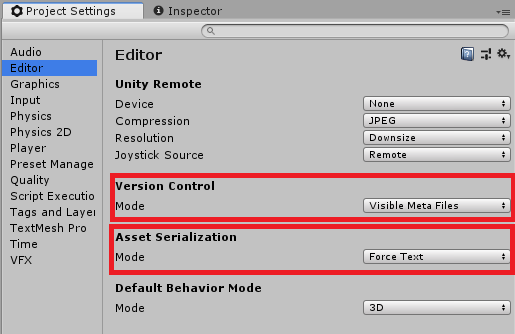

유니티에서 버전 관리 컨트롤[^1] 사용하기 버전 관리 컨트롤은 [git](https://git-scm.com/)을 사용한다.

## 환경
- Windows 10
- Unity 2018.3.0f2
- Git
- Source tree

## 설정 순서

1. ".gitignore" 파일 설정
2. Edit - Project Settings - Editor설정

2가지 설정만 하면 모든 설정이 완료 된다.

### 1. ".gitignore" 파일 설정

.gitignore 설정 방법



[gitignore.io](https://www.gitignore.io/) 사이트에서 unity를 타이핑 한 후 create 버튼을 누르면 아래와 같은 텍스트가 만들어진다.

```gitignore
# Created by https://www.gitignore.io/api/unity
# Edit at https://www.gitignore.io/?templates=unity

### Unity ###
[Ll]ibrary/
[Tt]emp/
[Oo]bj/
[Bb]uild/
[Bb]uilds/
Assets/AssetStoreTools*

# Visual Studio cache directory
.vs/

# Autogenerated VS/MD/Consulo solution and project files
ExportedObj/
.consulo/
*.csproj
*.unityproj
*.sln
*.suo
*.tmp
*.user
*.userprefs
*.pidb
*.booproj
*.svd
*.pdb
*.opendb
*.VC.db

# Unity3D generated meta files
*.pidb.meta
*.pdb.meta

# Unity3D Generated File On Crash Reports
sysinfo.txt

# Builds
*.apk
*.unitypackage

# Crashlytics generated file
Assets/StreamingAssets/crashlytics-build.properties


# End of https://www.gitignore.io/api/unity
```

위 텍스트를 복사하여 .gitignore 파일을 생성한다. (visual studio code 같은 텍스트 편집기를 사용해서 생성한다.)

.gitignore 파일을 Assets 폴더와 같은 폴더에 위치 시킨다.


### 2. Edit - Project Settings - Editor설정
  - Version Control Mode를 Visible Meta Files 변경
  - Asset Serialization Mode를 Force Text로 변경



### 참고 사항

- 예전 버전(2018 이전)에서는 위와 같이 설정하고 바로 커밋을 하는 경우 제대로 Scene 파일이 존재하지 않아 문제가 생겼었다. (제대로 프로젝트가 불려오지 않는 현상) 그래서 더미 Scene 파일까지 만들어서 커밋을 하였다.
2018 버전에서는 자동으로 Sample Scene이 만들어지기 때문에 그런 문제는 없을 것 같다.
- Edit - Project Settings - Editor 설정 화면이 바뀌어서 조금 해맸다. 처음에 설정 할 수 있는 셀렉트 박스가 안보였는데. Project Settings 세팅 창을 최대한 늘리면 보이게 된다.

[^1]: 버전 관리 시스템은 파일의 변화를 시간에 따라 기록하여 과거 특정 시점의 버전을 다시 불러올 수 있는 시스템이다.