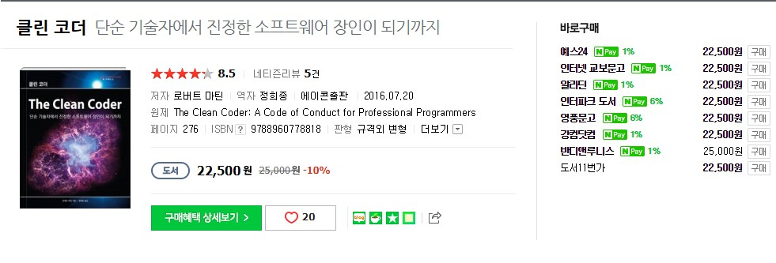

## 기간

일주일

## 목적

클린코더는 로버트 마틴의 클린 코드 다음에 나온 서적이다.

전작인 클린코드가 코드 자체에 중점을 둔 책이라면, 클린코더는 사람 자체를 중심으로 쓰여진 책인 것 같다.

진정한 소프트웨어 장인이 되기 위해 한발짝 다가가기 위해 이 책을 읽게 되었다.

## 리뷰

이 책은 프로 소프트웨어 개발자의 마음가짐, 즉 소프트웨어 프로페셔널리즘에 관한 책이다.

다음은 프로 소프트웨어 개발자라면 알아야 하는 최소한의 기술 목록
- 디자인 패턴 : 24가지 GOF 패턴을 설명할 수 있고, POSA 패턴을 실무에 적용할 수준으로 알아야 한다.
- 설계 원칙 : SOLID 객체지향 원칙을 알아야 하고 컴포넌트 개념을 충분히 이해해야 한다
- 방법론 : XP, 스크림, 린, 칸반, 폭포수, 구조적 분석, 구조적 설계 개념을 충분히 이해해야 한다
- 원칙 : 테스트 주도 개발, 객체지향 설계, 구조적 프로그래밍, 지속적 통합, 짝 프로그래밍을 실천해야 한다
- 도구 : UML, 데이터 흐름도, 구조 차트, 패트리 넷, 상태 전이 다이어그램과 테이블, 흐름도, 결정 테이블을 어떻게 쓰는지 알아야 한다.

책에서 강조하는 주요 내용
- 온라인 카타
- 프로의 마음 가짐 (아니오 라고 말하기)
- 단위 테스트 (TDD)
- 인수 테스트
- 지속적 통합 (CI)
- 테스트 자동화

저자가 직접 사용하는 도구
- 소스코드 제어 : git
- 이슈 관리 : Tracker
- 지속적 빌드 : Jenkins
- IDE : IntelliJ
- 테스트 : XUnit
- 컴포넌트테스트 : FitNesse

## 평점 및 한줄평

소프트웨어 개발자로서 한번은 읽어 볼 만한 책

3.5/5