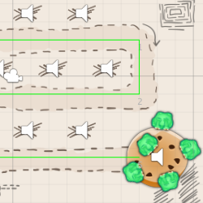
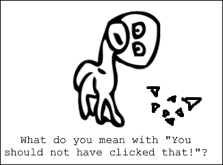
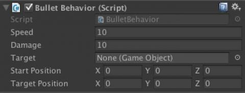
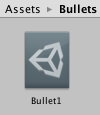
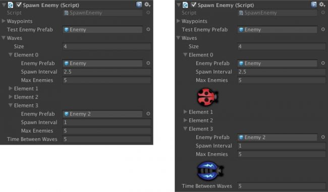
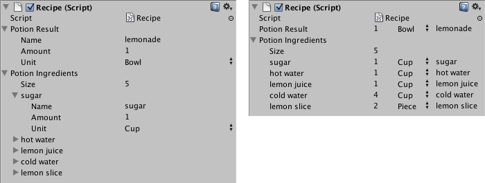
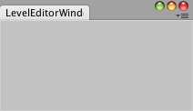
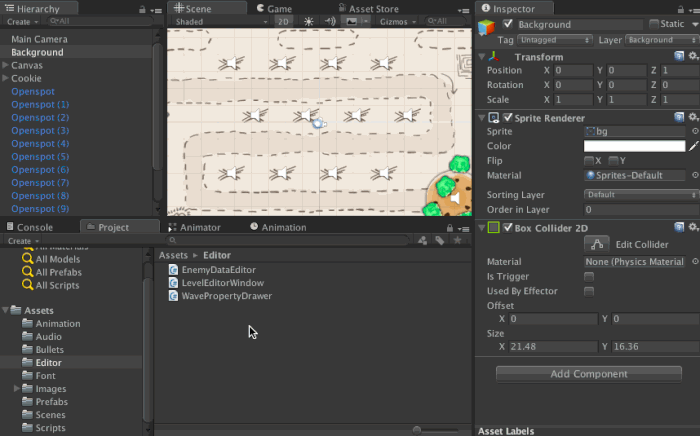
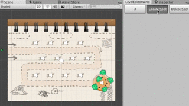
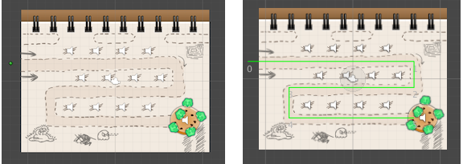

원문
- https://www.raywenderlich.com/939-extend-the-unity3d-editor

# Extend the Unity3d Editor

이 튜토리얼에서는 유니티 에디터를 확장하여 게임의 필요에 맞게 유니티 에디터를 커스텀 하는법을 배웁니다.



유니티 에디터는 게임 제작을 위한 멋진 엔진이지만, 실제로는 사용자의 요구를 실제로 충족시킬 수 있습니다. 때로는 "내 뜻대로" 버튼을 원하는 경우가 있을 것입니다.

유니티 (Unity)는 신비한 버튼을 통해 뇌파를 해석 할 수는 없지만, 이 도구를 사용하면 더 유용하고 사용하기 쉽도록 확장 할 수 있습니다.

이 Unity 튜토리얼에서는 엔진을 확장하고 사용자 정의하는 방법을 배웁니다. 도메인 마스터의 성취와는 별개로 프로세스를 약간 (또는 많은) 더 희박하게 만들어 게임 개발 속도를 높이는 도미노 효과가 있어야합니다. :]

특히 다음을 사용하는 방법에 중점을 둡니다.

- 기본 사용자 정의를 위한 특성
- 사용자 정의 자산을 만들고 메모리 사용을 줄이기위한 ScriptableObject
- PropertyDrawer와 Editor를 사용하여 Inspector 사용자 정의
- 자신의 편집 도구를 제공하는 새 편집기 창 만들기
- Gizmos가있는 장면에서 그립니다.

유니티 사용자 정의가 도움이 될지 의심 스럽습니까? 가마 수트라에서는 [Unity 에디터와 에디터 툴](http://www.gamasutra.com/blogs/GuillermoAndrades/20160302/267041/Unity_and_the_editor_tools.php%20?elqTrackId=7e7cbefb62b04600adb71c8361a4de3b&elq=d79348739d9249b5a3275655771269d7&elqaid=68132&elqat=1&elqCampaignId=19874)에 대한 훌륭한 기사를 볼 수 있습니다. 이 툴은 커스텀 에디터가 게임 디자인과 제작에 어떻게 도움이 될 수 있는지 보여줍니다.

## 전제 조건

스타터 프로젝트를 성공적으로 로드하려면 Unity 버전 5.3 이상이 필요합니다. 가지고 있지 않다면 [Unity3D.com](https://store.unity.com)에서 Unity를 다운로드하십시오.

이 튜토리얼은 고급 Unity 개발자를 대상으로하므로 기본 스크립팅을 알고 Unity Editor에서 편안하게 작업해야합니다. 만약 당신이 거기에 없다면 다른 [Unity 튜토리얼](https://www.raywenderlich.com/unity)로 지식을 연마 해보십시오.

## 시작하기

스타터 프로젝트를 다운로드하고 zip 파일의 압축을 풀고 Unity를 사용하여 결과로 나오는 TowerDefenseEditor 폴더를 엽니 다. 폴더 이름에서 알 수 있듯이이 프로젝트는 타워 방어 게임입니다.

```
참고 : 그것이 어디서 왔는지, 어떻게 만들어야 하는지 보려면 여기를 보십시오.
튜토리얼 : [유니티에서 타워 디펜스 게임을 만드는 법, Part 1.](https://www.raywenderlich.com/269-how-to-create-a-tower-defense-game-in-unity-part-1)
```

게임이 원활하게 실행 되더라도 편집하기가 어렵습니다. 예를 들어, 새로운 "탑"을 배치 할 목적으로 새로운 open Spot을 추가하는 과정은 약간 짜증납니다. 또한 적들이 이동하는 경로를 쉽게 볼 수 없습니다.

이 튜토리얼에서는 유니티 에디터를 확장하여 더 많은 기능을 추가하여 다음과 같이 보입니다 :


이 튜토리얼은 작은 변화에서 큰 변화로 이동합니다. 각 섹션은 독립적이므로 귀하의 관심을 끄는 Editor 확장 부분만 작업 할 수 있습니다.

## 특성을 사용한 기본 사용자 지정

Unity3D 편집기를 대폭 재구성 할 수 있는 힘을 제공하지만 필드 숨기기, 툴팁 표시 또는 헤드 라인 추가 등 약간의 조정 만 필요한 경우도 있습니다. 원치 않는 필드를 숨기고 다른 것을 보호하는 것은 속성에 대한 두 가지 유스 케이스입니다.

### 공개 필드 숨기기 - [HideInInspector]

기본값에 따라 MonoBehavior의 모든 public 필드는 Inspector에 표시되지만 때로는 모든 것을 원하지 않는 경우도 있습니다. 가끔은 다음과 같이하고 싶을 때가 있습니다.

- Inspector에서 너무 많은 정보 제거
- 게임을 엉망으로 만들 수있는 실수로 인한 변수 변경 방지



손을 더럽힐 시간!

Assets/Prefabs 폴더로 이동하여 Bullet1을 선택한 다음 Inspector를 봅니다. 다음을 보아야 합니다.



Target, Start Position 및 Target Position 필드를 볼 수 있습니다. 이러한 변수는 ShootEnemies 스크립트에 의해 지정되어야하기 때문에 public입니다.

그러나 총알은 항상 몬스터에서 타겟으로 날아가므로 인스펙터에서 편집 할 필요는 없습니다. 이 필드를 노출시키지 않아도 됩니다.

Assets/Scripts 폴더에서 BulletBehavior.cs 스크립트를 엽니다. using System;을 라인 2에 삽입합니다.

Before:
```csharp
using UnityEngine;
using System.Collections;
```

After:
```csharp
using UnityEngine;
using System;
using System.Collections;
```

target, startPosition 및 targetPosition 필드의 정의를 포함하는 행 앞에 [HideInInspector] 및 [NonSerialized] 속성을 추가하십시오. [NonSerialized]는 System NameSpace의 일부이므로 위에서 System을 사용하여 삽입 하였습니다.

Before:
```csharp
public GameObject target;
public Vector3 startPosition;
public Vector3 targetPosition;
```

After:
```csharp
[HideInInspector]
[NonSerialized]
public GameObject target;
[HideInInspector]
[NonSerialized]
public Vector3 startPosition;
[HideInInspector]
[NonSerialized]
public Vector3 targetPosition;
```

[HideInInspector]는 Inspector에서 필드를 제거하고 필드를 성공적으로 숨깁니다. 그러나 사물을 숨기 전에 Inspector에서 변수 값을 편집하면 Unity가 사용자가 설정 한 값을 기억합니다. 혼란스러울 수 있습니다.

이를 방지하려면 [NonSerialized] 속성을 사용하여 Unity가 변수의 값을 기억하지 못하도록 합니다.


```
참고 : 속성 사용은 간단합니다. 
필드, 메서드 또는 클래스에 영향을 주어야하며, 여러 속성을 결합 할 수도 있습니다.
```

### [RequireComponent] : 실수로 Component 제거 방지

OpenSpot 프리팹에서 이것을 시도해 배치가 항상 예상대로 작동하게 하십시오.

Assets/Scripts 폴더에서 PlaceMonster.cs 파일을 엽니다. 다음과 같이 코드를 편집하십시오.

Before:
```csharp
using System.Collections;

public class PlaceMonster : MonoBehaviour {
```

After:
```csharp
using System.Collections;

[RequireComponent (typeof(AudioSource))]
[RequireComponent (typeof(Collider2D))]

public class PlaceMonster : MonoBehaviour {
```

Inspector에서 Assets/Prefabs 폴더에있는 OpenSpot 프리팹에서 Collider2D 또는 AudioSource 구성 요소를 제거하십시오. RequireComponent 때문에 삭제하려고하면 대화 상자가 나타납니다. 제거 할 수 없다는 메시지가 표시되고 필요한 스크립트를 알려줍니다. 아주 산뜻합니다!


### 기타 흥미로운 태그들

위에서 작업 한 것들 외에도 멋진 속성이 많이 있습니다. 간략한 개요는 다음과 같습니다.

| 용법      | 속성 |
| ----------- | ----------- |
| Unity의 메뉴에 항목 추가하기    | [MenuItem](https://docs.unity3d.com/kr/current/ScriptReference/MenuItem.html), [AddComponentMenu](https://docs.unity3d.com/kr/current/ScriptReference/AddComponentMenu.html), [ContextMenu](https://docs.unity3d.com/kr/current/ScriptReference/ContextMenu.html), [ContextMenuItem](https://docs.unity3d.com/kr/current/ScriptReference/ContextMenuItemAttribute.html), [CreateAssetMenu](https://docs.unity3d.com/kr/current/ScriptReference/CreateAssetMenuAttribute-menuName.html)      |
| 정보 표시 또는 숨기기   | [HeaderHelpURL](https://docs.unity3d.com/kr/current/ScriptReference/HelpURLAttribute.html), [Tooltip](https://docs.unity3d.com/kr/current/ScriptReference/TooltipAttribute.html), [HideInInspector](https://docs.unity3d.com/kr/current/ScriptReference/HideInInspector.html)        |
| Inspector의 레이아웃 표시   | [Multiline](https://docs.unity3d.com/kr/current/ScriptReference/MultilineAttribute.html), [Range](https://docs.unity3d.com/kr/current/ScriptReference/RangeAttribute.html), [Space](https://docs.unity3d.com/kr/current/ScriptReference/Space.html), [TextArea](https://docs.unity3d.com/kr/current/ScriptReference/TextAreaAttribute.html)       |
| 구성 요소 사용에 대한 제약 조건 정의   | [RequireComponent](https://docs.unity3d.com/kr/current/ScriptReference/RequireComponent.html), [DisallowMultipleComponent](https://docs.unity3d.com/kr/current/ScriptReference/DisallowMultipleComponent.html)       |
| 필드의 값을 기억할지 여부를 지정합니다.   | [NonSerialized](https://docs.unity3d.com/kr/current/ScriptReference/NonSerialized.html), [Serializable](https://docs.unity3d.com/kr/current/ScriptReference/Serializable.html)      |
| Editor가 playmode에 있지 않을 때에도 콜백 함수를 실행합니다.   | [ExecuteInEditMode](https://docs.unity3d.com/kr/current/ScriptReference/ExecuteInEditMode.html)       |
| ColorPicker 사용 구성   | [ColorUsage](https://docs.unity3d.com/kr/current/ScriptReference/ColorUsageAttribute.html)       |

## ScriptableObject : 사용자 정의 자산 만들기 및 메모리 사용 줄이기

이 섹션에서는 GameObject 내부가 아닌 ScriptableObject에 총알 구성을 저장합니다.

당신은 아마 생각할 것입니다. (GameObject로 완벽하게 작동했습니다! 왜 그것을 바꿔야합니까?) 왜 이 작업을 하면 좋을지 이해하려면 스크립팅 가능 객체의 기본 사항을 살펴보십시오.

### 스크립팅 가능 객체 : 기본 사항

ScriptableObject의 의도 된 사용 사례는 값의 복사본을 피함으로써 메모리 사용을 줄여야 할 때를 위한 것입니다.

어떻게 그럴 수 있죠? GameObject를 만들면 Unity는 값과 연결된 모든 기본 유형을 저장합니다.

총알에는 speed와 damage이라는 두 개의 정수 필드가 있습니다. 하나의 정수에는 2 바이트가 필요하므로 총 4 바이트가 필요합니다. 이제 총알이 100개라고 가정하십시오. 이미 최소 400 바이트가 필요합니다. speed와 damage에 변화가 없습니다. 리소스를 빠르게 소비하는 가장 좋은 방법 입니다!!!!!!


ScriptableObject는 이러한 값을 참조로 저장하므로 다음과 같은 경우에 사용할 수 있습니다
- 특정 유형의 객체에 대해 많은 데이터를 저장합니다.
- 값은 많은 게임 객체간에 공유됩니다.

ScriptableObject의 주요 가치는 메모리 요구 사항을 줄이는 것이지만 대화 상자, 레벨 데이터, 타일 세트 등에 대한 사용자 정의 자산을 정의하는 데 사용할 수도 있습니다. 이렇게하면 데이터와 GameObject를 분리 할 수 있습니다.

### ScriptableObject 구현하기

이 하위 섹션에서는 스크립트 가능한 첫 번째 객체를 만듭니다.
Unity 내부와 프로젝트 브라우저에서 Assets/Scripts 폴더를 열고 마우스 오른쪽 버튼으로 클릭 한 다음 Create>C# Script를 선택하십시오. BulletConfig 스크립트의 이름을 지정하고 열고 연 다음과 같이 내용을 변경하십시오.

```csharp
using UnityEngine;

[CreateAssetMenu(menuName = "Bullet", fileName = "Bullet.asset")]
public class BulletConfig : ScriptableObject {
  public float speed;
  public int damage;
}
```

그리고 저장해라.

CreateAssetMenu를 사용하면 Assets 메인 메뉴 옵션에서 ScriptableObject를 만들 수 있습니다.

Unity로 다시 전환하고 프로젝트 탐색기로 이동하여 Assets/Bullets 폴더로 이동하십시오. 기본 메뉴에서 Assets/Create/Bullet을 클릭하십시오. 생성 된 애셋의 이름을 Bullet1 - 이제는 멋진 ScriptableObject를 가집니다.




Bullet2 및 Bullet3이라는 두 개의 에셋을 추가로 만듭니다.
이제 Bullet1을 클릭하고 Inspector로 이동하십시오. speed를 10으로 설정하고 damage 10으로 설정합니다.

Bullet2 및 Bullet3에 대해 다음 값을 사용하여 반복합니다.
- Bullet2: speed = 10, damage = 15
- Bullet3: speed = 10, damage = 20

이제 BulletBehavior의 speed 및 damage 필드를 BulletConfig로 대체합니다. BulletBehavior를 엽니다. speed와 damage 필드를 제거하고 다음 필드를 추가하십시오.

before:
```csharp
public float speed = 10;
public int damage;
```

After:
```csharp
public BulletConfig bulletConfig;
```

다른 모든 스크립트는 여전히 speed와 damage에 대한 읽기 액세스 권한이 필요 하므로 두 변수에 대한 getter를 만들어야합니다.

클래스의 닫는 중괄호 앞에 다음을 추가하십시오.

```csharp
private int damage {
  get {
    return bulletConfig.damage;
  }
}

private float speed {
  get {
    return bulletConfig.speed;
  }
}
```

변경 사항을 저장하십시오.

다른 스크립트를 건드리지 않고도 글 머리 기호 내부의 변수를 스크립팅 가능 객체로 대체하여 메모리 사용을 향상 시켰습니다.

마지막으로 스크립트 가능한 객체를 총알 프리 팹에 할당 해야합니다.

프로젝트 탐색기에서 Prefabs/Bullet1을 선택합니다. Inspector에서 Bullet Config를 Bullet1.asset으로 설정합니다. 그에 따라 Bullet2 및 Bullet3에 대해 이를 반복합니다. 이것이 끝입니다!


게임을 실행하여 모든 것이 여전히 작동하는지 확인하십시오.

## PropertyDrawer 및 편집기로 인스펙터 맞춤 설정

지금까지는 사소한 일만 변경했지만 Inspector에서는 거의 모든 것을 다시 그릴 수 있었습니다. 이 섹션은 다시 그리는 근육을 구부리기위한 것입니다.

### Editor

Editor를 사용하면 MonoBehavior에 대한 Inspector GUI를 대체 할 수 있습니다. 구현은 슬라이더를 사용하여 각 적의 상태를 표시하는 것입니다. 슬라이더의 길이는 적의 최대 건강 상태에 따라 다르므로 유효하지 않은 값을 입력 할 수 없습니다.


Assets/Editor 폴더에서 EnemyDataEditor라는 새 C# 스크립트를 만듭니다. MonoDevelop에서 스크립트를 엽니다. 내용을 다음으로 교체하십시오.

```csharp
using UnityEditor;

// 1
[CustomEditor(typeof(MoveEnemy))]
// 2
public class EnemyDataEditor : Editor {
  // 3
  public override void OnInspectorGUI() {
  // 4
    MoveEnemy moveEnemy = (MoveEnemy)target;
    HealthBar healthBar = moveEnemy.gameObject.GetComponentInChildren<HealthBar> ();
  // 5
    healthBar.maxHealth = EditorGUILayout.FloatField ("Max Health", healthBar.maxHealth);
  // 6
    healthBar.currentHealth = EditorGUILayout.Slider("Current Health",   healthBar.currentHealth, 0, healthBar.maxHealth);
  // 7
    DrawDefaultInspector ();
  }
}
```

변경 사항을 저장하십시오.

이것이 각 단계의 작동 방식입니다.

1. 이 속성에서 Unity가 MoveEnemy 용 CustomEditor를 생성하도록 지정하십시오.
2. EnemyDataEditor를 OnInspectorGUI와 같은 메서드에 액세스 할 수 있도록 Editor의 하위 클래스로 만듭니다.
3. 편집기를 그릴 때 호출되는 OnInSpectorGUI 메서드를 추가하십시오.
4. 편집기에서 대상을 통해 프로젝트 탐색기 또는 계층 구조에서 현재 선택된 인스턴스에 액세스 할 수 있습니다. 그런 다음 MoveEnemy로 캐스팅합니다. 마지막으로, 당신은 유일한 자식 인 HealthBar를 얻습니다.
5. EditorGUILayout.FloatField를 사용하여 float 값만 허용하는 maxHealth 필드를 추가하십시오.
6. EditorGUILayout.Slider를 사용하여 실제 현재 상태에 대한 슬라이더를 만듭니다. 변수에 따라 슬라이더의 범위를 조정할 수 있기 때문에 [Range] 속성을 사용하는 것과는 다릅니다. 이 경우 healthBar.maxHealth입니다.
7. 사용자 정의 편집기는 보통 Inspector에 나타나는 모든 것을 바꿉니다. 기존보기 만 확장하려는 경우 DrawDefaultInspector를 호출합니다. 통화를 추가 한 위치에 나머지 기본 콘텐츠를 그립니다.

Unity로 다시 전환하고 프로젝트 브라우저에서 Prefabs/Enemy를 선택하고 결과를 즐깁니다.


게임을 실행하여 모든 것이 여전히 작동하는지 확인하십시오. 게임이 진행되는 동안 Hierarchy에서 Enemy (Clone)를 선택하고 Inspector에서 슬라이더의 상태를 변경할 수 있어야합니다. 부정 행위는 결코 그렇게 재미 있지 않았습니다. :]


### Property Drawers

Property Drawers을 사용하면 다음을 수행할 수 있습니다.
- Wave와 같은 Serializable 클래스의 모든 인스턴스에 대해 GUI를 사용자 정의
- Range와 같은 사용자 정의 PropertyAttributes가있는 필드의 GUI를 사용자 정의

Hierarchy 에서 Road를 선택하십시오. Inspector에서 모든 Waves를 확인하십시오.

Enemy Prefab 외에도 해당 프리팹의 미리보기 이미지를 표시하려고합니다. 웨이브용 PropertyDrawer로이 작업을 수행 할 수 있습니다.



먼저 프로젝트 브라우저의 Assets/Editor 폴더에 WavePropertyDrawer라는 새 C# 스크립트를 만듭니다. MonoDevelop에서 열고 다음과 같이 전체 내용을 바꿉니다.

```csharp
//1
using UnityEditor;
using UnityEngine;

//2
[CustomPropertyDrawer(typeof(Wave))]
//3
public class WavePropertyDrawer : PropertyDrawer {
  //4
  private const int spriteHeight = 50;
}
```

변경 사항을 저장하십시오.

이 코드 블록에서 다음을 수행합니다.

1. UnityEditor를 임포트하여 에디터의 라이브러리에 액세스 할 수 있게 하십시오.
2. Attribute을 사용하여 클래스에 Wave용 CustomPropertyDrawer를 알립니다.
3. PropertyDrawer의 서브 클래스로 만듭니다.
4. 적의 스프라이트가 그려지는 높이를 저장하기위한 상수를 생성하십시오.

Unity로 돌아가서 Hierarchy에서 Road를 선택하십시오. Inspector에 No GUI implemented 메시지가 표시됩니다.


이것을 변경하고 WavePropertyDrawer에 OnGUI를 추가하십시오 :

```csharp
public override void OnGUI (Rect position, SerializedProperty property, GUIContent label) {
  EditorGUI.PropertyField(position, property, label, true);
}
```

OnGUI를 재정의하면 고유 한 GUI를 구현할 수 있습니다. 이 메서드는 세 가지 인수를 취합니다.
- position : GUI를 그리는 직사각형
- property : 그릴 속성
- label : 속성에 레이블을 붙이는 텍스트

EditorGUI.PropertyField 메서드를 사용하여 속성의 기본 GUI를 그립니다. OnGUI에서 가져 오는 모든 변수가 필요합니다.

마지막 매개 변수는 Unity에게 속성 자체와 그 자식을 그리도록하는 bool 변수입니다.

OnGUI 외에도 GetPropertyHeight()를 구현해야합니다.

```csharp
public override float GetPropertyHeight(SerializedProperty property, GUIContent label) {
  return EditorGUI.GetPropertyHeight (property);
}
```

이 메서드는 속성의 높이를 반환하며 속성이 확장되는지 여부에 따라 높이를 변경할 수 있는 속성에 특히 중요합니다.

당신이 그것을 구현하지 않으면 Unity는 기본 높이를 가정합니다. 귀하의 재산이 더 높은 경우, Inspector의 다른 필드 위에 그려집니다. 이것은 보통 당신이 원하는 것이 아닙니다. :]


이제 기초가 마련되었으므로 GUI를 자유롭게 사용자 정의 할 수 있습니다. OnGUI ()에 다음 코드를 추가합니다.

```csharp
// 1
if (property.isExpanded) {
  // 2
  SerializedProperty enemyPrefabProperty = property.FindPropertyRelative ("enemyPrefab");
  GameObject enemyPrefab = (GameObject) enemyPrefabProperty.objectReferenceValue;
  // 3
  if (enemyPrefab != null) {
    SpriteRenderer enemySprite = enemyPrefab.GetComponentInChildren<SpriteRenderer> (); 
    // 4
    int previousIndentLevel = EditorGUI.indentLevel;
    EditorGUI.indentLevel = 2;
    // 5
    Rect indentedRect = EditorGUI.IndentedRect (position);
    float fieldHeight = base.GetPropertyHeight (property, label) + 2;
    Vector3 enemySize = enemySprite.bounds.size;
    Rect texturePosition = new Rect (indentedRect.x, indentedRect.y + fieldHeight * 4, enemySize.x / enemySize.y * spriteHeight, spriteHeight);
    // 6
    EditorGUI.DropShadowLabel(texturePosition, new GUIContent(enemySprite.sprite.texture));
    // 7
    EditorGUI.indentLevel = previousIndentLevel;
  }
}
```

변경 사항을 저장하십시오.

단계별 분석 :

1. 예를 들어 사용자가 Inspector에서 전개 할 때 속성의 세부 정보가 표시되어야 할 때만 적 스프라이트를 그립니다. 이 경우 property.isExpanded는 true입니다.
2. enemyPrefab을 얻는다. FindPropertyRelative를 먼저 호출하여 이름별로 다른 속성에 연결된 속성을 검색합니다. 그런 다음 enemyPrefab가 포함 된 실제 GameObject를 저장하는 objectReference를 가져옵니다.
3. enemyPrefab이 설정되면 Sprite를 얻습니다.
4. indentLevel을 올바르게 설정하십시오. 이 레벨은 Unity가 그리기를 시작하는 정도까지 지정합니다. 그리기가 끝나면 원래 값을 복원해야하므로 변수에 먼저 저장 한 다음 indentLevel을 2로 설정합니다.
5. indentedRect의 위치를 가져 와서 속성 서랍 안쪽에 그리는 데 필요한 좌표를 계산할 수 있습니다. 그런 다음 GetPropertyHeight를 사용하여 하나의 정상 필드 높이를 얻습니다. 적의 스프라이트 크기도 필요합니다. 이 세 가지 값을 사용하여 텍스처를 그리는 rect를 계산할 수 있습니다. 원점은 indentedRect의 원점입니다. 그러나 fieldHeight의 4 배를 추가하여 그려진 필드의 공간을 예약하십시오. 높이가 같아야하므로 적의 실제 크기와 관계없이 너비를 적절하게 조정합니다.
6. 지정된 위치에 텍스처를 그리려면 DropShadowLabel을 호출하십시오.
7. 결국 들여 쓰기 수준을 다시 설정합니다.

unity으로 돌아가 적의 스프라이트이 올바른 위치에 있는지 확인하십시오. 거기에 있지만 다음 속성과 겹칩니다. 왜?

원래 프로퍼티의 높이와 스프라이트의 높이를 반환하도록 GetPropertyHeight ()의 구현을 변경해야합니다.

```csharp
public override float GetPropertyHeight(SerializedProperty property, GUIContent label) {
  SerializedProperty enemyPrefabProperty = property.FindPropertyRelative ("enemyPrefab");
  GameObject enemyPrefab = (GameObject)enemyPrefabProperty.objectReferenceValue;
  if (property.isExpanded && enemyPrefab != null) {
    return EditorGUI.GetPropertyHeight (property) + spriteHeight;	
  } else {
    return EditorGUI.GetPropertyHeight (property);
  }
}
```

변경 사항을 저장하십시오!
GetPropertyHeight에서 적의 프리팹을 검색합니다.
속성이 확장되어 enemyPrefab이 null이 아닌 경우 spriteHeight를 추가합니다. 그렇지 않으면 정상적인 속성 높이 만 반환합니다.

Unity로 돌아가 Hierarchy에서 Road를 선택하십시오. Inspector에서 이제 적의 스프라이트를 올바르게 볼 수 있습니다.

하나 이상의 스프라이트를 추가하는 대신 Inspector를 더 크게 변경할 수 있습니다. 한 가지 예가 [PropertyDrawer 설명서](https://docs.unity3d.com/ScriptReference/PropertyDrawer.html)에서 직접 가져온 것입니다.



Property Drawers을 사용하면 Serializable 클래스의 속성에 대해 Inspector가 그려지는 방식을 사용자 정의 할 수 있습니다. Inspector의 나머지 부분을 변경하지 않고 MonoBehavior의 특정 속성을 가져 오는 방법을 지정할 수 있습니다.

Property Drawers은 배열의 항목을 다시 그리려면 특히 유용합니다.

그러나 몇 가지 심각한 단점이 있습니다. 즉, EditorGUILayout()에 대한 액세스 권한이 없으므로 각 필드의 위치를 직접 계산을 해야 합니다. 또한 속성 또는 해당 하위에 저장된 정보에만 액세스 할 수 있습니다.

## 나만의 편집 도구를 제공하는 새 편집기 창 만들기

Unity에는 Animator, Inspector 및 Hierarchy와 같은 멋진 편집기 창이 있습니다. 그리고 물론, 당신도 당신 자신을 만들 수 있습니다.

이 섹션에서는 클릭 한 번으로 OpenSpot을 배치하고 삭제할 수있는 편집기보기를 구현합니다.


프로젝트 탐색기에서 Assets/Editor로 이동 한 다음 LevelEditorWindow라는 새 C# 스크립트를 만듭니다. MonoDevelop에서 엽니다.

```csharp
using UnityEngine;
//1
using UnityEditor;

//2
public class LevelEditorWindow : EditorWindow {
  //3
  int selectedAction = 0;
}
```

1. UnityEditor 임포트
2. LevelEditorWindow를 EditorWindow의 하위 클래스로 만들어 EditorWindow에서 사용할 수있는 메서드 및 필드에 액세스 할 수 있도록 합니다.
3. 사용자가 현재 selectedAction 변수를 사용하여 선택한 작업을 추적합니다.

지금 당장은, 당신의 삶이 그것에 달려있다 할지라도 유니티 안에서 이 레벨 편집기를 열 수 없으니, 다음과 같은 방법으로 변경하십시오 :

```csharp
[MenuItem ("Window/Level Editor")]
static void Init () {
  LevelEditorWindow window = (LevelEditorWindow)EditorWindow.GetWindow (typeof (LevelEditorWindow));
  window.Show();
}
```

첫 번째 줄에서는 Unity에게 Window 메뉴 아래에 Level Editor라는 MenuItem을 만들고, Init를 실행하기 위해 그것을 클릭하기만 하면된다.

내부에 GetWindow를 사용하면 기존 열린 창을 가져 오거나 존재하지 않는 창을 새로 만들 수 있습니다. 그런 다음 Show와 함께 표시합니다.

변경 사항을 저장하고 Unity로 돌아갑니다. 경고가 표시됩니다. 괜찮습니다. 잠시 후에 고칠 것입니다. 메인 메뉴 인 Window/Level Editor를 클릭하면 빈 편집기보기가 나타납니다.



이제 빈 뷰에 내용을 채우십시오. MonoDevelop로 다시 전환하고 LevelEditorWindow에 다음 코드를 추가합니다.

```csharp
void OnGUI() {
  float width = position.width - 5;
  float height = 30;
  string[] actionLabels = new string[] {"X", "Create Spot", "Delete Spot"};
  selectedAction = GUILayout.SelectionGrid (selectedAction, actionLabels, 3, GUILayout.Width (width), GUILayout.Height (height));
}
```

먼저 너비와 높이를 얻습니다. 너비에 대해서는 약간의 공간을 남기기 위해 5를 공제합니다. 다음으로 각 동작에 대한 레이블이있는 문자열 배열을 만듭니다. "X"는 아무런 작업도하지 않습니다. 이렇게하면 열린 지점을 만들거나 삭제하는 대신 GameObject를 선택할 수 있습니다.

이 배열에서 SelectionGrid를 만들면 한 번에 하나만 선택할 수 있는 버튼 격자를 만듭니다. SelectionGrid의 반환 값은 현재 선택된 버튼의 인덱스이므로 selectedAction에 저장합니다.

변경 사항을 저장하고 Unity에서 작성한 내용을 살펴보십시오.


장면의 선택된 버튼에 의존하는 클릭에 대해 다른 반응을 나타내려고 하므로 다음 메소드를 추가하십시오.

```csharp
void OnScene(SceneView sceneview) {
  Event e = Event.current;
  if (e.type == EventType.MouseUp) {
    Ray r = Camera.current.ScreenPointToRay (new Vector3 (e.mousePosition.x, Camera.current.pixelHeight -e.mousePosition.y));
    if (selectedAction == 1) {
      // TODO: Create OpenSpot
      Debug.Log("Create OpenSpot");
    } else if (selectedAction == 2) {
      // TODO: Delete OpenSpot
	Debug.Log("Delete OpenSpot");
    }
  }
}
```

먼저 현재 이벤트를 변수에 저장합니다. 유형이 MouseUp과 같으면 마우스 클릭에 반응합니다.

이를 위해 어떤 GameObject가 선택되었고 Raycasting을 사용하고 있는지 알아야합니다. 그러나 먼저 장면을 가리키는 광선을 만들어야합니다.

광선을 만들려면 Helper 메서드 인 ScreenPointToRay()를 사용합니다. 이 메서드는 이벤트에 저장된 마우스 위치를 호출합니다. 카메라와 이벤트 좌표계 사이에서 y 좌표가 역전되므로 현재 뷰의 높이에서 원래의 y 좌표를 차감하여 변환합니다.

마지막으로, 당신은 SelectedAction과 짧은 메시지로 나누었습니다.

메소드가 실제로 다음과 같이 호출되는지 확인하십시오.

```csharp
void OnEnable() {
  SceneView.onSceneGUIDelegate -= OnScene;
  SceneView.onSceneGUIDelegate += OnScene;
}
```

OnScene을 대리자로 추가합니다.

변경 사항을 저장하고 Unity로 다시 전환하십시오. LevelEditorWindow 안의 Create Spot 또는 Delete Spot 버튼을 선택한 다음 Scene 내부를 클릭하십시오. 로그 메시지가 콘솔에 나타납니다.


Hierarchy에서 Background를 선택하십시오. Inspector에서 레이어를 배경으로 설정합니다. 그런 다음 Physics 2D / Box Collider 2D 구성 요소를 추가하십시오.


Prefabs/Openspot의 레이어를 Spots으로 설정하십시오. 이제 광선이 배경 또는 열린 지점과 충돌 한 곳을 확인할 수 있습니다.



TODO: Create OpenSpot을 다음 코드로 대체하십시오.

```csharp
RaycastHit2D hitInfo2D = Physics2D.GetRayIntersection (r, Mathf.Infinity, 1 << LayerMask.NameToLayer ("Background"));
if (hitInfo2D) {
  GameObject spotPrefab = AssetDatabase.LoadAssetAtPath<GameObject> ("Assets/Prefabs/Openspot.prefab");
  GameObject spot = (GameObject)PrefabUtility.InstantiatePrefab (spotPrefab);
  spot.transform.position = hitInfo2D.point;
  Undo.RegisterCreatedObjectUndo (spot, "Create spot");
}
```

여기 당신이하는 일이 있습니다 :

ray가 배경 이미지와 교차하는지 여부를 확인하여 시작합니다. 그렇다면 hitInfo2D가 null이 아니면 이 위치에 새 OpenSpot을 만듭니다.

LoadAssetPath로 프리팹을 얻습니다. 이 인스턴스에서 PrefabUltility.InstantiatePrefab을 사용하여이 프리 팹의 새 인스턴스를 만듭니다.

InstantiatePrefab()은 프리팹 (prefab) 연결을 생성합니다. 이 경우 프리 팹 연결은 이 경우 더 적절하게 만들고 인스턴스화합니다. 그런 다음 지점의 위치를 충돌 지점으로 설정합니다.

Unity는 항상 작업을 실행 취소 할 수 있으므로 사용자 정의 편집기 스크립트를 만들 때 기억하십시오. 사용자 지정 작업으로 실행 취소를 허용하려면 Undo.RegisterCreatedObjectUndo를 사용하여 GameObject를 만드는 데 사용 된 동작을 등록하기만 하면 됩니다.

이제 지형지물 삭제를 처리 할 수 있습니다. /// TODO: Delete OpenSpot with this:

```csharp
RaycastHit2D hitInfo2D = Physics2D.GetRayIntersection (r, Mathf.Infinity, 1 << LayerMask.NameToLayer ("Spots"));
if (hitInfo2D) {
  GameObject selectedOpenSpot = hitInfo2D.collider.gameObject;
  Undo.DestroyObjectImmediate (selectedOpenSpot);
}
```

이렇게하면 광선과 Spots 레이어 안의 모든 오브젝트 사이의 충돌이 감지됩니다. 그렇다면, 맞았던 GameObject를 얻습니다. 그런 다음 Undo.DestroyObjectImmediate (Undo.DestroyObjectImmediate)로 삭제하면 자리를 제거하고 실행 취소 관리자에 작업을 등록합니다.



## Gizmos로 Scene에 그림 그리기

Gizmos를 사용하면 Scene View로 그리면 시각적인 디버깅 또는 편집 보조 도구로 사용할 정보를 제공 할 수 있습니다.

예를 들어 게임에는 적을 따라갈 수있는 경유지가 포함되어 있지만 게임 중에나 편집 중에는 보이지 않습니다. 진지한 조사 작업을 하지 않고도 어떤 길을 따라갈 지 알 수 없습니다. 다른 레벨을 만들고 싶다면 여전히 경로를 볼 수 없습니다.



다행스럽게도 Gizmos를 사용하면이 보이지 않는 경로를 볼 수 있습니다.

모든 웨이 포인트를 저장하는 Assets/Scripts/SpawnEnemy를 열고 다음 메소드를 추가합니다.

```csharp
// 1
void OnDrawGizmos() {
  // 2
  Gizmos.color = Color.green;
  // 3
  for (int i = 0; i < waypoints.Length - 1; i++) {
    // 4
    Vector3 beginPosition = waypoints[i].transform.position;
    Vector3 endPosition = waypoints[i+1].transform.position;
    // 5
    Gizmos.DrawLine(beginPosition, endPosition);
    // 6
    UnityEditor.Handles.Label (beginPosition, i + "");
  }
  // 7
  Vector3 lastWaypointPosition = waypoints[waypoints.Length - 1].transform.position;
  UnityEditor.Handles.Label (lastWaypointPosition, (waypoints.Length - 1) + "");
}
```

1. 기즈모 그리기는 OnDrawGizmos() 또는 OnDrawGizmosSelected()에서만 사용할 수 있습니다. 경로를 항상 그려야하므로 OnDrawGizmos ()를 구현합니다.
2. 기즈모의 그림에 대한 색상을 설정합니다. 모든 그리기 호출은 변경할 때까지 이 색상을 사용합니다.
3. 라인을 그릴 후계자가 없는 마지막 웨이 포인트를 제외한 모든 웨이 포인트를 반복하므로 웨이 포인트 길이-1일때 멈춥니다.
4. 웨이 포인트 i의 위치와 그 후속 i + 1을 저장합니다. 모든 반복과 함께 변수로.
5. 정적 메서드 Gizmos.Drawline (Vector3, Vector3)을 사용하면 현재 웨이 포인트에서 다음 웨이 포인트까지 선을 그립니다.
6. UnityEditor.Handles.Label (string)을 사용하면 경로를 표시하고 적들이 이동하는 방향을 시각화하기 위해 인접한 웨이 포인트 인덱스를 작성합니다.
7. 마지막 웨이 포인트의 위치를 얻고 그 옆에 인덱스를 표시합니다.

경로를 보려면 Unity로 다시 전환하십시오. 경유지를 따라 이동하면 경로가 따라옵니다.

DrawLine () 외에도 Gizmos는 여러 그리기 기능을 제공합니다. 전체 목록은 [설명서](https://docs.unity3d.com/ScriptReference/Gizmos.html)에서 찾을 수 있습니다. 심지어 DrawRay가 있습니다.

## 이제 앞으로 뭘 하면 될까요??

이 튜토리얼에서는 Unity Editor의 일부를 직접 만드는 방법을 배웠습니다. 최종 결과를 보려면 여기에서 완료된 프로젝트를 다운로드하십시오.
아마도 짐작할 수 있듯이 Unity를 확장하는 더 많은 방법이 있습니다. 다음과 같은 몇 가지 추가 지침이 있습니다.

- [가져 오기](https://docs.unity3d.com/ScriptReference/AssetPostprocessor.html) 및 [저장](https://docs.unity3d.com/ScriptReference/AssetModificationProcessor.html) 후 애셋 처리
- [편집기 마법사](https://docs.unity3d.com/ScriptReference/ScriptableWizard.html) 작성하기
- ColorField, CurveField, Toggle 또는 Popup과 같은 더 많은 GUI 요소를 익히려면
- [레이아웃](https://docs.unity3d.com/ScriptReference/EditorGUILayout.html)에 대해 더 배우기

이제 당신은 맨 아래에 도달 했으므로 자신 만의 목적과 프로젝트를 위해 Unity를 커스터마이징하는 방법에 대한 지식을 시작해야합니다.
포럼에 참여하여 아이디어와 예제를 둘러보고 Unity를 사용자 정의하는 방법에 대해 질문하십시오. 나는 네가 생각해내는 것을보기를 고대하고있다.