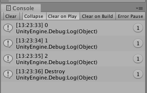

## 환경

- macOS Mojave v10.14.6
- Unity 2019.2.5f1
- Github Desktop
- Rider 2019.2
- UniRx v7.1.0

원문 : [https://qiita.com/toRisouP/items/35b4d6255c1f9ecf27d1](https://qiita.com/toRisouP/items/35b4d6255c1f9ecf27d1)

이 포스팅은 원문을 단순히 구글 번역을 하여 정리한 내용입니다. 일본어를 잘하시는 분은 원문을 보시는게 더 좋으실 것 같습니다. 

UniRx에 대한 기사 요약은 [여기](https://qiita.com/toRisouP/items/48b9fa25df64d3c6a392)

---

## Subscribe 및 Dispose

Rx에서는 Observable를 구독하고 메시지를 대기하는 것을 Subscribe라고 부르고, 그 구독을 중지하는 것을 Disponse라고 부릅니다.

이 Subscribe는 조심해야 되는 부분이 있습니다. Observable이 파괴된 타이밍에 제대로 Dispose 할 필요가 있습니다. 

Observable이 파괴될 때에 OnCompleted가 발행되면 자동으로 Dispose가 됩니다만, 스트림에 따라서는 OnCompleted가 발행되지 않는 경우도 있습니다.

## Observable의 수명을 고려하지 않고 사용한 경우

우선 다음 코드와 실행 결과를 봅시다.
```csharp
using System;
using UniRx;
using UnityEngine;

public class ObservableLifeTime : MonoBehaviour
{
    private void Start()
    {
        // 1 초마다 메시지를 발행하는 Observable
        Observable.Timer(TimeSpan.FromSeconds(0), TimeSpan.FromSeconds(1))
            .Subscribe(x => Debug.Log(x));
        
        // 3 초 후에 GameObject를 제거한다
        Invoke("DestroyGameObject", 3);
    }

    /// <summary>
    /// 로그를 출력하고 오브젝트를 제거한다.
    /// </summary>
    private void DestroyGameObject()
    {
        Debug.Log("Destroy");
        Destroy(gameObject);
    }
}
```
실행 결과


Destroy에서 GameObject가 파괴 된 후에도, Observable.Timer로 만든 스트림은 계속 실행되고 있습니다. 

이것은 Observable.Timer로 만든 Observable가 static으로 생성되어 버려, GameObject에 관계없이 독립적으로 작동하기 때문 입니다.

## AddTo로 Subscribe와 GameObject를 연결한다.

**AddTo**를 사용하면 이 문제를 쉽게 해결할 수 있습니다.
```csharp
using System;
using UniRx;
using UnityEngine;

public class ObservableLifeTime : MonoBehaviour
{
    private void Start()
    {
        // 1 초마다 메시지를 발행하는 Observable
        Observable.Timer(TimeSpan.FromSeconds(0), TimeSpan.FromSeconds(1))
            .Subscribe(x => Debug.Log(x))
            .AddTo(gameObject); // GameObject의 수명과 연결.

        // 3 초 후에 GameObject를 제거한다
        Invoke("DestroyGameObject", 3);
    }

    /// <summary>
    /// 로그를 출력하고 오브젝트를 제거한다.
    /// </summary>
    private void DestroyGameObject()
    {
        Debug.Log("Destroy");
        Destroy(gameObject);
    }
}
```
실행 결과



AddTo를 사용하는 것으로, Subscribe의 Dispose를 지정한 GameObject의 수명에 연결시켜, **GameObject가 Destroy시에 자동으로 Dispose 해주게 되었습니다.**

이제 Dispose 관리를 신경 쓰지 않고 [팩토리 메소드](https://ko.wikipedia.org/wiki/%ED%8C%A9%ED%86%A0%EB%A6%AC_%EB%A9%94%EC%84%9C%EB%93%9C_%ED%8C%A8%ED%84%B4)를 사용할 수 있게 되었습니다! (UniRx 내부적으로 Timer의 경우 new TimeObservable 형태의 팩토리 메서드 패턴 형태로 구현되어 있습니다)

다만, OnCompleted가 실행되는 것은 아니기 때문에 그 점은 조심하시기 바랍니다.