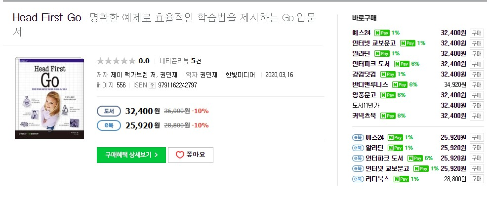

# 기간

한달

# 목적

go 언어에 대한 이해를 이해 구입

# 리뷰

> Go 언어를 익히는 가장 확실하고 효율적인 방법

Go 관련 책이 잘 나오지 않는 상황에서 Go 관련 서적이 출간되어 바로 구입 하였다.

1~16장으로 구성되어 있으며, 기본적인 Go 언어의 특징 및 문법에 대해 설명하고 간단한 예제 프로그램을 만들고, 마지막엔 간단한 웹앱을 만든다.

거의 모든 프로그래밍 서적이 그렇지만 조금은 더 깊게 파고드는 부분은 없는 것 같아 좀 아쉽긴 하다.

처음 Go에 대해서 알아보고 어떤 언어 인지 파악하고 싶은 분들 이라면 한번 쯤은 읽어볼 만 할 수도 있겠다.

Go를 이미 접해본 분이라면 딱히 추천하고 싶지는 않다.

# 평점 및 한줄평

go를 처음 접하시는 분이라면 읽어볼 만한 책

3.5/5