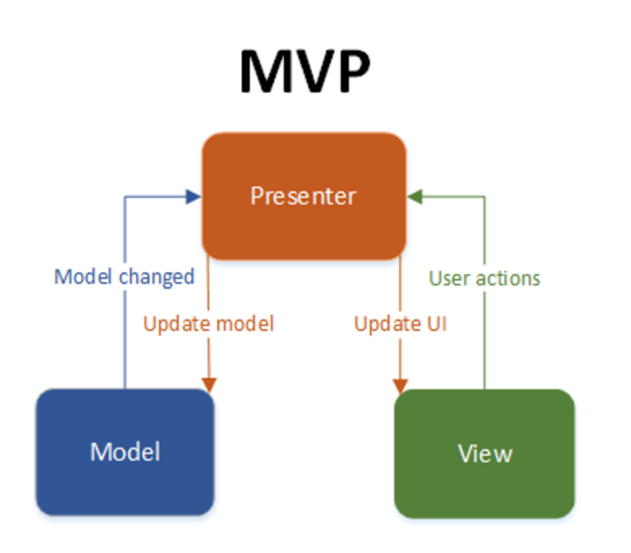
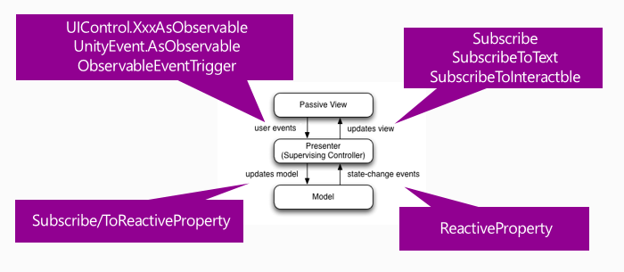

## 개요

> 유니티로 게임을 개발시 좀 더 구조화된 방법으로 개발하고 싶다.

유지보수가 쉽고, 유연하며, 남들이 쉽게 알아볼 수 있는 코드로 개발하는 것이 목표이다.

학부 과정에서는 MVC 패턴에 대해 배우고, 웹 프레임워크들이 MVC 패턴 구조로 많이 개발되어 있는 것도 알고 있다. MVC 패턴의 장점은 사용자 인터페이스로부터 비즈니스 로직을 분리하여 애플리케이션의 시각적 요소나 그 이면에서 실행되는 비즈니스 로직을 서로 영향 없이 쉽게 고칠 수 있는 애플리케이션을 만들 수 있다는 것이다.

MVC에서 파생되는 다양한 패턴들 MVP, MVVM은 결국 위와 같이 역할의 분리에 초점을 맞추고 있다고 보면 되고, 세부적인 내용이 조금 다르다고 이해해도 크게 무리가 없다고 생각한다.

## 유니티에서의 패턴

MVC, MVP, MVVM 중 유니티에 알맞는 패턴?

안드로이드에서는 보통 MVP나 MVVM 패턴을 사용함. 

MVVM은 개인적으로는 너무 복잡해지는 경향이 있는 것 같아 아예 제외시킴. (뷰와 모델의 바인딩 처리도 유니티에서는 따로 처리하기 힘든 부분이 있고, 복잡해짐)

결국 MVC나 MVP 중에 선택을 해야 되는 문제이고, 유니티에서는 MVP가 더 적합하다는 판단이 들어 MVP를 선택하기로 함. (유니티에서는 일반적으로 UI를 표현하는 컴포넌트들이 화면을 직접 그리는 역할과 액션 처리를 함께 담당한다. 이러한 특징으로 MVC패턴을 사용하여 화면을 그리는 View와 액션을 처리하는 Controller을 완전히 분리하기 어렵게 된다)

## MVP 패턴이란?

MVP 패턴에 대한 자료를 찾아보면, 정확한 정의는 없고, 대략적인 공통점들은 있다.

기본적인 기조는 같지만, 세부 적인 구현 내용은 개발자의 역량에 달린 것으로 보인다.

대략적으로 MVP 패턴은 아래 특징을 가지고 있다.

> Model - View - Presneter

### Model

- Data와 관련된 모든 처리를 담당한다. 비즈니스 로직 처리.
    - 비즈니스 로직은 컴퓨터 프로그램에서 실세계의 규칙에 따라 데이터를 생성·표시·저장·변경하는 부분을 일컫는다.

### View

- 사용자에게 보여지는 UI 부분 (유니티에서는 모든 렌더링 되는 Object)

### Presenter

- View에서 요청한 정보(User actions)로 Model을 가공하여(Update model) 변경된 Model정보를 받아(Model changed) View에게 전달(Update UI)해주는 부분
- 접착제 역할

## 관계도



## 특징

- View와 Model은 서로를 알지 못한다. (어떤 방법으로든 접근할 수 없다)
- Presenter은 View와 Model을 알고 있다.

**여기서 알고 있다는 부분에 대한 해석으로 좀 헤매였던 부분이 있었는데, 알고 있다는 부분은 해당 인스턴스를 직접적으로 조작한다로 해석해도 무방할것으로 보인다.**

→ 직접 조작하지만 않으면 알고 있지 않은 것 (이벤트 방식, SendMessage 등)

## MV(R)P

[UniRx](https://github.com/neuecc/UniRx) 플러그인을 사용하면 유니티에서 MVP 패턴을 좀 더 쉽게 구현할 수 있다. (MVP 패턴에서 구현해야 되는 이벤트 기반 코드들을 더 쉽게 사용) 2020년 10월 9일 기준 v7.10(19년 7월 1일) 까지 나와 있는 상태이고, 원래는 Reactive Programming을 유니티에서 쉽게 사용 하기 위해 만들어진 플러그인이다.

> UniRx를 사용하면 MVP (MVRP) 패턴을 구현할 수 있습니다.


MVVM 대신 MVP를 사용해야하는 이유?

유니티는 UI 바인딩을 제공하지 않으며, 바인딩 레이어를 만드는 것은 복잡하며, 오버헤드가 크다. 

MVP 패턴을 사용하는 Presenter는 View의 구성요소를 알고 있으며 업데이트 할 수 있다. 실제 바인딩을 하지 않지만, View를 구독(Observable)하여 바인딩 하는 것과 유사하게 동작하게 할 수 있다. (복잡하지 않고, 오버 헤드도 적게 사용 가능)

이 패턴을 Reactive Presenter라고 한다.

```csharp
// Presenter는 씬의 canvas 루트에 존재.
public class ReactivePresenter : MonoBehaviour
{
    // Presenter는 View를 알고 있다(인스펙터를 통해 바인딩 한다)
    public Button MyButton;
    public Toggle MyToggle;
    
    // Model의 변화는 ReactiveProperty를 통해 알 수 있다.
    Enemy enemy = new Enemy(1000);

    void Start()
    {
        // Rx는 View와 Model의 사용자 이벤트를 제공한다.
        MyButton.OnClickAsObservable().Subscribe(_ => enemy.CurrentHp.Value -= 99);
        MyToggle.OnValueChangedAsObservable().SubscribeToInteractable(MyButton);

        // Model들은 Rx를 통해 Presenter에게 자신의 변화를 알리고, Presenter은 Viw를 업데이트 한다.
        enemy.CurrentHp.SubscribeToText(MyText);
        enemy.IsDead.Where(isDead => isDead == true)
            .Subscribe(_ =>
            {
                MyToggle.interactable = MyButton.interactable = false;
            });
    }
}

// Model. 모든 프로퍼티는 값의 변경을 알려 준다. (ReactiveProperty)
public class Enemy
{
    public ReactiveProperty<long> CurrentHp { get; private set; }

    public ReactiveProperty<bool> IsDead { get; private set; }

    public Enemy(int initialHp)
    {
        // 프로퍼티 정의
        CurrentHp = new ReactiveProperty<long>(initialHp);
        IsDead = CurrentHp.Select(x => x <= 0).ToReactiveProperty();
    }
}
```

View는 하나의 Scene이며, Unity의 hierarchy이다. (하나의 개체 혹은 객체?)

View는 초기화시 Unity 엔진에 의해 Presenter와 연결된다.

XxxAsObservable 메서드를 사용하면 오버 헤드없이 이벤트 신호를 간단하게 생성 할 수 있습니다. SubscribeToText 및 SubscribeToInteractable은 간단한 바인딩 처럼 사용할 수 있게 하는 helper 클래스 입니다. 이것은 단순한 도구 일 수 있지만 매우 강력합니다. Unity 환경에서 자연스럽게 느껴지며 고성능과 깨끗한 아키텍처를 제공합니다.



- V-> RP-> M-> RP-> V가 완전히 Reactive(반응적인)한 방법으로 연결되었다.

- GUI 프로그래밍은 ObservableTrigger의 이점도 제공합니다. ObservableTrigger는 Unity 이벤트를 Observable로 변환하므로이를 사용하여 MV(R)P 패턴을 구성 할 수 있습니다. 예를 들어 ObservableEventTrigger는 uGUI 이벤트를 Observable로 변환합니다.

```csharp
var eventTrigger = this.gameObject.AddComponent<ObservableEventTrigger>();
eventTrigger.OnBeginDragAsObservable()
    .SelectMany(_ => eventTrigger.OnDragAsObservable(), (start, current) => UniRx.Tuple.Create(start, current))
    .TakeUntil(eventTrigger.OnEndDragAsObservable())
    .RepeatUntilDestroy(this)
    .Subscribe(x => Debug.Log(x));
```

## 설계 방향

- MVP 패턴을 보면서 헷갈리거나 정립되지 않는 부분은 과감히 내 방식으로 정립하고, 구현 후 문제점 발생시 개선하는 방향으로 진행.
- 완전히 디자인 패턴을 따르지는 않을 예정 (클린 코드가 되는 대신 생산성이 저하되는 부분은 과감히 생산성을 따르는 방향)
- 하나의 Presenter에 여러개의 Model이 존재할 수 있다.
    - 각 모델의 경우 역할별로 클래스화 작업.
- 하나의 Presenter에 여러개의 View가 존재할 수 있다.
- Presenter는 각 팝업, 각 오브젝트 별로 존재한다. (컴포넌트 개념으로 생각)
    - 팝업의 아이템이 존재한다면 그 아이템도 각각의 Presenter가 존재. 구조가 복잡하지 않는다면 없어도 무방.
- 간단한 예제에서는 항상 View-Presenter-Model은 1개씩 존재 했기 때문에, 각 Presetenr 1개에 2개이상의 view와 model이 존재해도 문제 없는지에 대한 고민을 함.
- 그리고 Model의 구현시 거의 모든 역할을 Model에서 한다고 생각하면 될것으로 보임 (Presenter는 Model의 메서드를 호출하는 정도의 역할)
    - 보통의 예제에서는 간단한 메서드 구현 정도는 Presenter에서 해주는 부분도 있지만,  Model이 전부 해주는게 더 일반적인 구조인것으로 보임.

## 결론

- MV(R)P를 사용한 설계 진행
- MV(R)P 아키텍처에 대해 다양한 자료 조사를 진행하였음. Github에서 UniRx 개발자가 예시로든 방법이 가장 깔끔하고, 생산성 있게 구조화 할 수 있는 방법으로 판단 되었음.
- MV(R)P 시행 착오 (현재로서는 잘못됬다고 생각하는 방법)
    - 인터페이스를 사용하여 Presenter의 의존성을 제거하는 방법.
    - View 컴포넌트를 따로 뺀다던가, View 자체를 여러개 둔다 던가 하는 방법.
    - Model을 하나만 두어서 제어하는 방법.
    - MV(R)P는 UI에만 적용하는게 더 좋겠다라고 생각한 부분
- View의 경우 복잡해지는 경우 커스텀 View를 만드는 방식으로 해결 가능.

## 참고

- [MVC 패턴 위키백과](https://ko.wikipedia.org/wiki/%EB%AA%A8%EB%8D%B8-%EB%B7%B0-%EC%BB%A8%ED%8A%B8%EB%A1%A4%EB%9F%AC)
- [UniRx 공식 문서의 MV(R)P](https://github.com/neuecc/UniRx#model-view-reactivepresenter-pattern)
- [유니티에서의 MVC 디자인 패턴](https://riptutorial.com/ko/unity3d/example/32513/%EB%AA%A8%EB%8D%B8-%EB%B7%B0-%EC%BB%A8%ED%8A%B8%EB%A1%A4%EB%9F%AC--mvc--%EB%94%94%EC%9E%90%EC%9D%B8-%ED%8C%A8%ED%84%B4)
- [Model View Presenter](https://medium.com/@anshul.vyas380/model-view-presenter-b7ece803203c)
- [How to TDD in Unity using the MVP pattern](https://engineering.etermax.com/how-to-tdd-in-unity-using-the-mvp-pattern-a646ffbe996f)
- [Web出身のUnityエンジニアによる大規模ゲームの基盤設計](https://developers.cyberagent.co.jp/blog/archives/4262/)
- [UnityでMV(R)P+Zenjectでテストを行いマルチシーンも試してみる](https://matcha-choco010.net/2019/08/24/unity-mvrp-zenject-multiscene/)
- [UniRX, MVP 패턴을 적용하여 프로젝트를 진행하신분 있으신가요?](http://1st.gamecodi.com/board/zboard.php?id=GAMECODI_Talkdev&no=3991)
