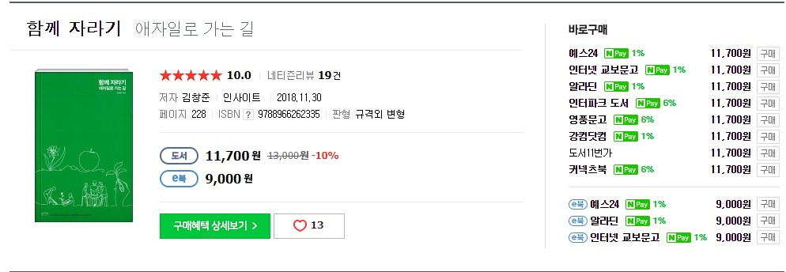

# 기간

2주일

# 목적

문득 도서 검색을 하다 눈에 띄는 책이라 구입

# 리뷰

책에 대한 내용은 전체적으로 너무 좋은 평가라 조금 조심스럽다.

책은 총 3부로 구성되어 있다.

1부. 자라기

2부. 함께

3부. 애자일

1부와 2부의 내용은 통계적인 내용 및 연구 결과에 대해 다룬것으로 보인다.

3부는 매우 짧은 내용이고, 애자일에 대해 다룬다. 내 생각엔 3부에 대한 설명을 위한 1부, 2부 였던것으로 보인다.

결국 자기 계발을 계속해서 진행하고, 코더가 아닌 소프트웨어 아키텍쳐를 목표로 하고, 의도적 수련을 하자. 그리고 함께 일을 할때 중요한 부분에 대한 설명.이고 결국 이것이 애자일로 가는 길이다.

애자일은 함께 성장하고, 짧은 주기 동안 지속적인 피드백을 받는 기법이다. 

> 고객에게 날마다 가치를 전하자

이 책의 저자가 말한 애자일에 대한 설명이다.

# 평점 및 한줄평

3부의 경우 흥미 있게 읽을만한 주제 였지만, 나머지 1~2부는 글쎄..

3/5