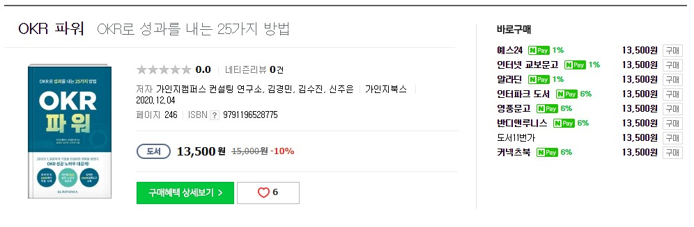

# 기간

7일

# 목적

OKR에 대해 전사에서 도입 계획이 있어, 좀 더 실용적인 OKR 도입 방법이 있나 찾아봄. 개인적인 OKR을 도입 고려 용도

# 리뷰

국내에서 처음 나온 OKR 관련 서적

애자일, 스프린트, OKR을 하나의 개념으로 보고 작성한 책

OKR은 보통 분기 단위(3개월)로 세우게 되는데 이 3개월을 12주의 스프린트로 생각하고, 기존의 MBO 방식(1년)과 달리 3개월의 목표 관리를 하여 기민하게(애자일) 빠르게 대처 가능한 목표 관리 방법 이라고 책은 소개 한다.

OKR은 사실 개념 자체는 어렵지 않지만, 실제 적용하기가 어려운 것 같다. 실제 인텔에서도 OKR을 도입하고 1년 반이 지나서 제대로 적응했다고 한다.

이 책을 만든 저자는 실제 여러 회사에 OKR 도입을 적용하면서 자신만의 OKR 적용 방법을 정리 하였다.

목차는 다음과 같다

- 파트1. 왜 지금은 OKR인가
- 파트2. OKR, 제대로 알고 시작합시다
- 파트3. OKR 제목 작성이 실행의 반이다.
- 파트4. 12번의 파도, 12주의 도전
- 파트5. OKR, 문화로 정착시켜라
- OKR 파워 부록

국내에서 처음 OKR 관련에 대해 나온 책이라 기대를 많이 한것에 비해 실속이 없는 느낌이다.

이미 나온 OKR 책에 대한 내용을 정리한 것으로 밖에 볼 수 없다.

아래 2개의 책을 보는걸 추천한다.

- OKR 전설적인 벤처투자자가 구글에 전해준 성공 방식
- 구글이 목표를 달성하는 방식 OKR

# 평점 및 한줄평

OKR 다른 서적을 보는 것을 추천

2/5

# 책 내용 중 참고 사항

## OKR 체크 리스트

1. 어느 레벨까지 OKR 제목을 세팅할지 결정하였는가?
    1. 전사 - 팀 - 개인 (처음 도입시 팀 단위까지 추천)
2. OKR 파일럿 진행 여부를 결정하였는가?
    1. 부서별 OKR 세팅 추천
3. OKR 제목 개수를 결정하였는가?
    1. 3개 이내 추천
4. OKR 운영 주기를 결정하였는가?
    1. 통상 3개월. 더 짧아도 문제 없음
5. KR 측정 방법을 결정하였는가?
    1. 구글의 방법 0.0~1.0
6. OKR 미팅 운영 방법을 세팅하였는가?
    1. 주1회 실행 계획 점검. 월1회 진척사항점검.
7. OKR 공유 시스템을 세팅하였는가?
    1. 구글시트, 노션, 트렐로등 투명하게 모든 OKR 공개

## 3-3-3의 원리

구글은 3-3-3의 원리를 강조한다.

OKR은 최대 3개월 단위의 달성 가능한 목표. 3개의 O, 갹 O 별로 3개의 KR을 세운다.