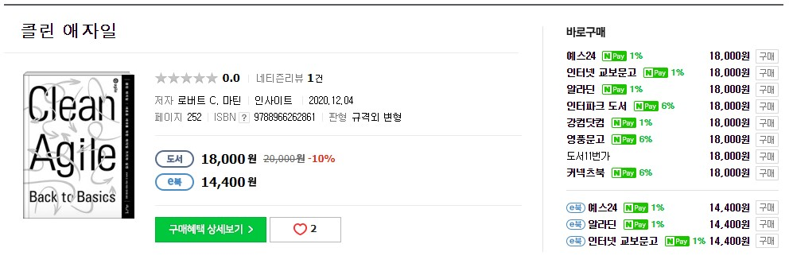
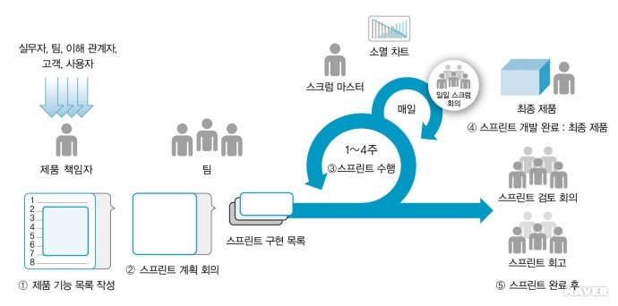
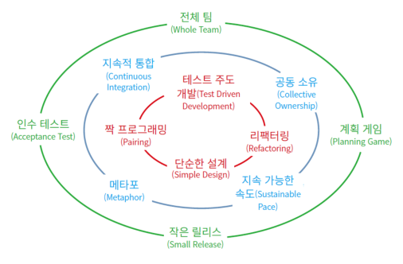

# 기간

7일

# 목적

클린씨리즈.. (클린코드, 클린코더, 클린 소프트웨어)를 만든 로버트 C 마틴이 작성한 책이라 별 고민없이 주문. 심지어 요즘에 거의 모든 IT 회사에서 적용하는 애자일에 관한 이야기를 다룬 책이다. 애자일에 직접적인 관계를 가진 (애자일 선언문을 만든) 당사자 이기 때문에 더 고민 없이 구매했던 것 같다.

# 리뷰

애자일을 다룬 책이므로 우선 애자일 선언문 부터 살펴 보자.

책의 서문에 나와 있는데로 이 책은 애자일의 근본적인 내용을 다룬다.

> 애자일은 무엇이고, 무엇이었고, 앞으로도 영원히 무엇일지를 다룬다.

## 애자일 선언문

```
우리는 소프트웨어를 개발하고, 또 다른 사람의 개발을
도와주면서 소프트웨어 개발의 더 나은 방법들을 찾아가고
있다. 이 작업을 통해 우리는 다음을 가치 있게 여기게 되었다:

- 공정과 도구보다 개인과 상호작용을
- 포괄적인 문서보다 작동하는 소프트웨어를
- 계약 협상보다 고객과의 협력을
- 계획을 따르기보다 변화에 대응하기를

가치 있게 여긴다. 이 말은, 왼쪽에 있는 것들도 가치가 있지만,
우리는 오른쪽에 있는 것들에 더 높은 가치를 둔다는 것이다.
```

마감 기한은 바뀌지 않지만, 요구 사항은 계속해서 바뀐다.

### 반복주기에 대한 설명

- 스크럼이랑 조금 다른 개념인것으로 보인다.
- 프로젝트 일정을 일정한 크기로 더 작게 나눈다.
- 이것을 반복주기 혹은 스프린트라고 한다. 반복주기의 기간은 1~2주가 적당하다.
- 첫번째 반복 주기는 반복주기 0이라고 부르고 스토리(짧은 기능 목록)를 만든다.
- 반복주기 1은 스토리를 몇개나 완료할 수 있을지 추산한다.
- 반복주기 1이 끝나면 반복 주기 하나 동안 스토리를 얼마나 완료할 수 있는지 측정 가능한 수치를 처음으로 얻는다.
- 아래는 스크럼 프로세스
    

### 애자일의 핵심

- 애자일은 프로젝트를 더 작은 반복 주기로 나누는 프로세스다
- 각 반복 주기의 결과물을 측정하여 지속적으로 일정을 평가하는 데 사용한다.
- 기능은 비즈니스 가치 순서대로 구현하므로 가장 중요한 것이 먼저 구현된다.
- 품질은 가능한 높게 유지한다. 일정은 주로 범위(구현 해야되는 기능)를 조절하여 관리한다.

### XP

- 모든 애자일 프로세스 중에서 XP가 가장 잘 정의되어 있고, 가장 완전하며, 가장 덜 혼란스럽다.
- 애자일이 무엇인지 이해하고 싶다면 XP를 공부하는 것이 최선의 방법
- XP 삶의 순환 도표
    

책을 읽으면서, 평소 회사에서 이미 진행하고 있는 애자일에 대해 다시 생각해보았다. 애자일 자체의 개념은 간단하지만, 실천하기는 힘들다. 이러한 부분에 대해 실천하기 위해서는 많은 노력이 필요할 것으로 보인다. 

반복주기 관련해서는 현재 개인적으로 진행하고 있는 개인 OKR과도 흡사한 부분이 보인다. 3개월 단위의 목표를 세우고 매 주마다 목표에 대한 할일을 세우고 매 주마다 그것에 대한 피드백을 받는다.

애자일은 1주일의 스프린트를 정한다고 생각하면 매 주 스토리 보드를 만들고(할일). 매주 해당 스토리 보드에 포인트를 계산하고(피드백). 모든 스토리 보드가 완료될 때까지 프로젝트를 진행한다(목표).

애자일을 개인적인 프로젝트에도 적용 가능한지와 활용 가능한지에 대한 부분은 추가로 확인을 해봐야 될 것 같다. (지라, 트렐로 등 도구)

# 평점 및 한줄평

애자일에 대한 고민. 혹은 궁금한 분은 한번 쯤 읽어 볼 책. 믿고 보는 로버트 C 마틴

5/5