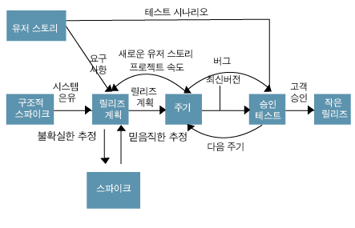

# 기간

7일

# 목적

이전에 구매해서 한번 읽었던 책. 최근에 읽은 서적 중에 클린 애자일에서 애자일에 가장 근접한 방법론 중 XP를 소개해서 이전에 구매했던 것들이 생각나서 한번 다시 펼쳐서 읽어봄.

# 리뷰

> 익스트림 프로그래밍 (Extreme Programming, XP)의 목표는 뛰어난 소프트웨어 개발이다.

책은 총 2부로 나누어져 있다. 1부에서는 XP에 대해 설명하고, 2부에서는 XP의 철학을 다룬다.

책 자체는 개발 방법론이고, XP의 개념에 충실한 책인 것 같다. 실무에 XP를 어떻게 적용하고 사용할 수 있는지에 대한 부분은 다루지 않는다. 완전한 개념에 대한 부분을 설명하는 책이라, 조금 지루한 부분이 없지 않아 있고, 책 자체도 두꺼운 편으로 보인다. 예전에 읽었을 때. 약간 실망했던 책인데, 다시 읽어도 그 느낌은 지울 수 없다. 

사실 켄트 벡은 TDD 및 XP로 너무 유명한 분이긴 하다. XP에서도 TDD를 굉장히 강조하기 때문에. TDD에 대해서는 다시 한번 읽어보고 실제 프로젝트에 적용 가능 한지 테스트를 해보긴 해봐야 될 것 같다. 사실 개발 방법론들은 처음 접해보면 너무 좋다 라는 생각이 들긴 하지만, 실제 적용해 봤을 때 적용하기 힘든 부분들이 분명히 존재하고, 어느 정도는 프로젝트에 맞게 그리고 상황에 맞게 적용을 해야 되는 부분들이 존재 하는 것 같다. 만약 XP를 적용한다고 해도 모든 실천 방법들을 적용하는게 아닌 상황에 맞는 몇가지 방법만 적용해도 충분히 프로젝트가 잘 굴려갈 수 있다고 생각한다.

> XP의 5가지 가치: 의사소통, 단순성, 피드백, 용기, 존중

> XP의 13가지 기본 실천방법: 함께 앉기, 전체 팀, 정보를 제공하는 작업 공간, 활기찬 작업, 짝 프로그래밍, 스토리, 일주일별 주기, 분기별 주기, 여유, 10분 빌드, 지속적 통합, 테스트 우선 프로그래밍, 점진적 설계

책 자체가 좀 더 얇고 핵심 내용들만 있으면 더 좋았을 것 같다는 생각은 지울 수 없다. 너무 사족이 많은 느낌이다. 그래도 XP 자체를 만든 창시자이기 때문에 이 책을 읽어볼만한 것 같다.

이 책을 읽고, 바로 XP를 적용하기는 힘들지만, XP에 대한 철학이나 개념등을 접할 수 있는 책인 것 같다. 

추후에 애자일 관련 내용들을 한번 더 읽어보면 생각이 달라질 수도 있기 때문에 한번은 더 읽을 법한 책인 것 같다.

# 평점 및 한줄평

애자일 및 XP에 대해 궁금하다면 읽어볼 만 한 책.

한줄평

3.5/5

# XP 관련 정리

- 구조적 스파이크: 팀원이 공통적으로 사용할 용어, 즉 System Metaphor를 만들어내기 위한 시스템
- 사용자 스토리:  요구사항 수집, 의사소통 도구, 기능단위 필요한 내용을 간단하게 기재
    - 작성법
        - [사용자 역할]은 [행위/목표]를 수행하여 [이유]를 한다.
        - 사용자 역할으로서, 효과를 받기 위해 목표를 원합니다.
        - <사용자>는 <목적>을 위해 <기능>을 할 수 있어야 한다.
    - 사용자 스토리 예
        - 사용자는 특정 입찰에 대한 문의를 할 수 있어야 한다.
        - 사용자는 아이디를 찾을 수 있다.
        - 사용자는 OTP를 통해 로그인할 수 있다.
        - 관리자는 입찰 정보를 삭제할 수 있어야 한다.
        - 사용자는 게시판에서 리스트를 확인할 수 있어야 한다.
        - 사용자는 게시물을 삭제할 수 있어야 한다.
        - 사용자는 특정 입찰에 참여할 수 있어야 한다.
        - 사용자는 자기가 작성한 글을 사이트에 등록할 수 있다.
        - 사용자는 도서 정보를 조회할 수 있다.
        - 동일한 응답 시간에 다섯 배의 통신량을 감당한다.
        - 사용자가 자주 사용하는 번호는 두 번 클릭만으로 사용할 수 있게 한다.
        - 최종 고객으로서, 프로필 사진을 변경하기 위해 수정 버튼이 있었으면 좋겠습니다.
        - 누가, 무엇을, 왜
            - **고객**은 요청서를 쉽게 보내기 위해 필요한 정보를 한눈에 확인할 수 있다.
            - **고객**은 자연스러운 UX를 위해 프로필 페이지를 웹뷰가 아닌 네이티브로 사용할 수 있다.
            - **클라이언트 개발자**는 소셜 로그인 기능 개발을 위해 관련 API 엔드포인트를 사용할 수 있다.
            - **고객**은 채팅 내에서 여러 장의 사진을 쉽게 보내기 위해 멀티 셀렉트 기능을 사용할 수 있다.
- 스파이크: 어려운 요구사항 혹은 잠재 솔루션을 고려한 간단한 프로그램, 사용자 스토리의 신뢰성을 증대, 기술 문제의 위험 감소 목적
- 릴리즈 계획: 전체 프로젝트에 대한 배포 계획. 하나의 반복을 1 ~ 3주로 나누고 반복들을 균일하게 유지
- 승인 테스트: 릴리즈 전 인수 테스트 고객이 수행
- 소규모 릴리즈: 작은 배포는 XP 주기의 마지막 단계, 소규모로 빈번하게 배포하면 고객에게 여러 이득을 조기 제공

참고

- [https://www.slideshare.net/ssuserff7918/xp-17360706](https://www.slideshare.net/ssuserff7918/xp-17360706)
- [http://blog.skby.net/xp-extreme-programming/](http://blog.skby.net/xp-extreme-programming/)