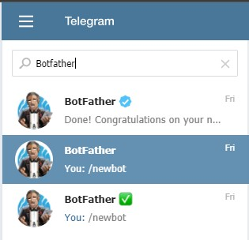
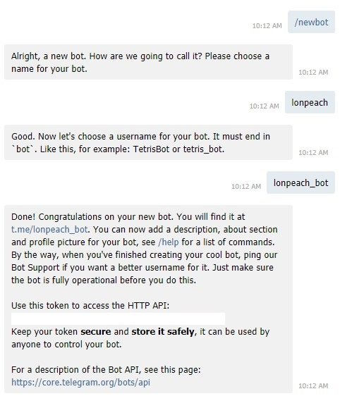
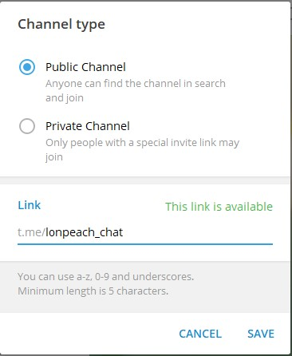
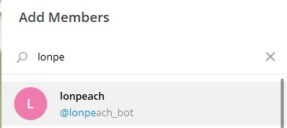
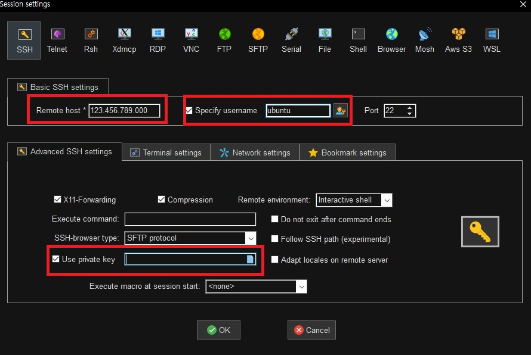

## 개요

현재 파이썬 크롤링 관련 공부를 진행 중. 공부하면서 활용 할 수 있는 분야가 없나 고민 중 사이트에서 품절 상태를 체크하여 텔레그램 봇으로 전송하는 간단한 봇 개발 하면 좋을 것 같아서 개발.

## 플로우

1. 텔레그램 봇 만들기
2. 파이썬 프로그램 생성
    1. 10 분마다 실행
    2. bs4를 이용하여 웹 분석 후 품절 상태인지 체크
    3. 특정 시간에는 알림이 가지 않도록 처리
3. 클라우드 서비스를 이용하여 파이썬 프로그램 실행

## 1. 텔레그램 봇 만들기 및 채널 설정

### 개인 봇 만들기

1. 텔레그램 접속 후 Botfather 검색. 여러개가 나오는데 뒤에 파란색 체크 박스가 공식 계정으로 보임. 해당 계정 클릭

    

2. /newbot을 입력하면 bot 이름 및 bot의 사용자 이름을 입력하라고 나온다. 봇 이름은 중복되지 않은 이름으로 입력해야 한다.

    

3. 입력하고 난 후 주소와 http 토큰 값이 나오므로 해당 값을 잘 기억해두자. url 주소로 이동하여 아무 글이나 작성한다.

    

4. 파이썬 텔레그램 봇 모듈을 설치하고, 아래 방법으로 chat Id를 확인 한다.

5. 파이썬 스크립트로 확인

    ```bash
    import telegram

    token = "Your Token"
    bot = telegram.Bot(token = token)
    updates = bot.get_updates()
    for u in updates:
        print(u.message['chat']['id'])
    ```

    ```bash
    pip install python-telegram-bot --upgrade
    ```

    - 텔레그램 봇 사용 문서
        - [https://github.com/python-telegram-bot/python-telegram-bot](https://github.com/python-telegram-bot/python-telegram-bot)

6. url로 확인도 가능 하다.

    ```
    https://api.telegram.org/bot<Your Token>/getUpdates

    ex) token이 1234라면
    https://api.telegram.org/bot1234/getUpdates

    ex) 반환 받은 json 데이터
    { "update_id": 8393, "message": { "message_id": 3, "from": { "id": 7474, "first_name": "AAA"}, "chat": { "id":, "title ":" "},"date ": 25497,"new_chat_participant ": {"id ": 71,"first_name ":"NAME ","username ":"YOUR_BOT_NAME "}}}
    ```
   
   - url에 접속하면 json 데이터를 얻을 수 있고, 해당 개체의 "chat"의 id를 확인 한다.

7. 아래 스크립트를 사용하여 봇으로 메시지를 보내 보자.

    ```python
    import telegram

    token = "Your Token"
    bot = telegram.Bot(token = token)
    chat_id = "Your Chat Id"
    text = 'Hello, Telegram!'
    bot.sendMessage(chat_id = chat_id , text=text)
    ```


### 채널을 생성하여 봇 공유 하기

현재 생성된 봇의 경우 개인만 볼 수 있는 봇이라 다른 사람들은 볼 수 없다.

다른 사람들과 같이 공유하기 위해서는 채널을 생성하여 해당 채널에 해당 봇을 집어 넣어야 한다.

1. 텔레그램에서 채널 생성

    

2. 채널 ID 획득을 위해 우선 public으로 채널을 생성한다. 채널 Id를 획득한 이후에는 private로 변경해도 무방 하다. 필자는 lonpeach_chat로 설정

    

3. 멤버에는 자신이 만든 봇을 추가 한다.

    

4. 아래 스크립트를 작성하여 채널 id를 획득한다. public_chat_name에는 자신이 설정한 link 주소를 입력한다. 필자의 경우 '@lonpeach_chat'

    chat_id의 경우 -123456 형태

    ```python
    import telegram

    token = 'Your Token'
    bot = telegram.Bot(token = token)
    public_chat_name = '@lonpeach_chat'
    id_channel = bot.sendMessage(chat_id=public_chat_name, text="hi!").chat_id
    print(id_channel)
    ```

    

5. 아래 스크립트를 사용하여 bot으로 메시지를 보내자

    ```python
    import telegram

    token = "Your Token"
    bot = telegram.Bot(token = token)
    chat_id = "Your Chat Id"
    text = 'Hello, Telegram!'
    bot.sendMessage(chat_id = chat_id , text=text)
    ```

    

## 2. 파이썬 프로그램 생성

- 크롤링의 경우 과도한 트래픽 유발은 법적인 문제를 피할 수 없어, 주의가 필요하다. 10분마다 실행하는 정도의 트래픽은 괜찮을 것으로 확인하여 해당 부분 10분마다 품절 상태를 체크하는 봇을 만들기로 하였다.

### 10분마다 실행 가능 하도록

- 실제 파이썬을 실행하는 OS의 경우 우분투 서버를 사용할 예정이라. 처음에는 크론을 사용하여 구현하려고 함 (10분마다 해당 스크립트를 실행하는 방법).
- 크론 보다는 크로스 플랫폼으로도 사용 가능한 파이썬 내부적으로 스케줄러 기능등을 사용할 수 있을 것 같아 해당 기능을 사용하기로 함.

#### pip 모듈 설치

```bash
pip install schedule --upgrade
```

#### 10분마다 현재 시간 출력 하는 예제

```python
import schedule
import time

def job():
    now = time.localtime()
    print("current time = ", str(now))

schedule.every(10).minutes.do(job)

while True:
    schedule.run_pending()
    time.sleep(1)
```

- 자세한 사용 방법은 아래 사이트 참고
    - [https://github.com/dbader/schedule](https://github.com/dbader/schedule)

### bs4를 이용하여 웹 분석 후 품절 상태인지 체크

- 파이썬으로 크롤링을 진행할때 필수로 사용하는 beautifulsoup4 사용법은 너무 많아 여기서 소개하기는 힘들 것 같고 따로 공부를 진행해야 될 것 으로 보임

#### pip 모듈 설치

```bash
pip install beautifulsoup4 --upgrade
pip install requests --upgrade
```

#### 사이트 크롤링

```python
import sys
import io
from bs4 import BeautifulSoup
import requests
import telegram

def job():
    sys.stderr = io.TextIOWrapper(sys.stderr.detach(), encoding = 'utf-8')
    sys.stdout = io.TextIOWrapper(sys.stdout.detach(), encoding = 'utf-8')

    BASE_URL = "Your want web site url"

    with requests.Session() as s:
        res = s.get(BASE_URL)
        if res.status_code == requests.codes.ok:
            soup = BeautifulSoup(res.text, 'html.parser')
            article = soup.select_one('div.btn_choice_box.btn_restock_box > button')
            cartExist = soup.select_one('#cartBtn')
            wishBtn = soup.select_one('#wishBtn')

            if article == None or cartExist or wishBtn:
                print("구매 가능")
            else:
                print("품절 상태")
```

- 필자가 크롤링을 하는 사이트의 특징
    - 아이템을 구매할 수 있으면 cartBtn, wishBtn의 아이디가 있는 버튼이 존재함.
    - 만약 품절 상태인 경우 btn_restock_box의 태그가 활성화 됨.
- cartBtn, wishBtn이 있거나 혹은 btn_restork_box 버튼이 없으면 구매 가능 상태로 판단하여 구매 가능 상태를 출력 해주는 스크립트
- res.raise_for_status()등으로 200번이 아닌 경우 에러를 발생하지 않고 그냥 ok 상태일때만 출력가능하도록 구현. (에러 발생등으로 파이썬 스크립트가 죽지 않도록)
- 공식 문서
    - [https://www.crummy.com/software/BeautifulSoup/bs4/doc/](https://www.crummy.com/software/BeautifulSoup/bs4/doc/)
    - [https://requests.readthedocs.io/en/master/user/quickstart/](https://requests.readthedocs.io/en/master/user/quickstart/)

### 특정 시간에는 알림이 가지 않도록 처리

#### pip 모듈 설치

```python
pip install datetime --upgrade
pip install pytz --upgrade
```

#### 시간 체크 파이선 스크립트

```python
import pytz
import datetime

def job():
    now = datetime.datetime.now(pytz.timezone('Asia/Seoul'))
    if now.hour >= 23 or now.hour <= 6:
        return

		# 아래 로직은 실행하지 않도록
```

- 11시 부터 6시까지는 알림이 오지 않도록 설정

### 완성 소스

```python
import sys
import io
from bs4 import BeautifulSoup
import requests
import schedule
import time
import telegram
import pytz
import datetime

count = 1

def job():
    global count
    count += 1
    now = datetime.datetime.now(pytz.timezone('Asia/Seoul'))
    if now.hour >= 23 or now.hour <= 6:
        return

    sys.stderr = io.TextIOWrapper(sys.stderr.detach(), encoding = 'utf-8')
    sys.stdout = io.TextIOWrapper(sys.stdout.detach(), encoding = 'utf-8')

    token = 'your token'
    bot = telegram.Bot(token = token)
    BASE_URL = "Your want web site url"
		chat_id = "your chat id"

    with requests.Session() as s:
        res = s.get(BASE_URL)
        if res.status_code == requests.codes.ok:
            soup = BeautifulSoup(res.text, 'html.parser')
            article = soup.select_one('div.btn_choice_box.btn_restock_box > button')
            cartExist = soup.select_one('#cartBtn')
            wishBtn = soup.select_one('#wishBtn')

            if article == None or cartExist or wishBtn:
                bot.sendMessage(chat_id=chat_id, text="구매 가능")
            else:
                if count % 6 == 0:
                    bot.sendMessage(chat_id=chat_id, text="품절 상태")
                else:
                    print("60분에 1번만 알림 가도록 설정")

# 10분 마다 실행
schedule.every(10).minutes.do(job)

print("Start App")

# 파이선 스케줄러
while True:
    schedule.run_pending()
    time.sleep(1)
```

- 파이선 스케줄러를 사용하여 10분마다 실행한다.
- 특정 시간에는 알림이 오지 않도록 설정한다 (11시~6시)
- 품절 상태의 경우 60분마다 알림이 가도록 한다. (count 변수를 두어 6번 실행마다 1번 알림이 가도록 구현)
    - 이 부분은 정확히 60분 마다 오는 것은 아니고, 6번 마다 1번 정도 간격으로 오도록 구현 함. 로직상 오류가 있지만 무시할 수 있는 수준이라 무시.

## 3. 클라우드 서비스를 이용하여 파이썬 프로그램 실행

- docker등을 이용하여 쉽게 배포할 수 있는 환경을 구축하면 좋을 것 같으나, 간단한 프로그램이고, 인스턴스 앱은 바로 제거 할 예정이기 때문에 수동으로 환경 설정 후 실행 하는 방법을 택함.

### 클라우드 선택

- [오라클 클라우드](https://www.oracle.com/kr/cloud/free/)의 경우 현재 무료로 2개의 인스턴스를 주기 때문에 해당 클라우드 서비스를 이용.
- 가입 및 인증은 생략
- Create VM으로 인스턴스 생성 후 ip 획득 (우분투 20으로 설정 및 public, private key 생성)
- 오라클 클라우드 사이트의 경우 한국어도 지원하니 한국어로 변경해서 봐도 좋을 것 으로 보임.

### SSH 접속

- MobaXterm을 사용하여 ssh 접속
- 세션 생성 후 아래 값 입력

    

    - Remote host의 경우 ip 주소 입력 (오라클 vm에 공용 IP 주소)
    - username은 ubuntu 입력 (오라클 vm에 사용자 이름)
    - use private key의 경우 오라클에서 발급받은 private key 입력

### 세팅

- 파이썬 설치
- 파이썬 pip 설치
- 작성한 스크립트 클라우드 서버에 업로드 후 실행 (혹은 git으로 clone 후 실행)

파이썬 설치 우분투의 경우 자동으로 파이썬이 설치되어 있음

```bash
sudo apt-get update
python3 --version
```

파이썬 pip 설치

```bash
sudo apt install python3-pip

pip3 install python-telegram-bot --upgrade
pip3 install schedule --upgrade
pip3 install beautifulsoup4 --upgrade
pip3 install requests --upgrade
pip3 install datetime --upgrade
pip3 install pytz --upgrade
```

위에 완성한 소스를 우분투에 저장

- MobaXterm의 경우 바로 파일을 업로드 할 수 있어 해당 기능 사용.
- bot.py로 저장

### 백그라운드에서 실행 가능 하도록 작업

아래 명령어로 실행. 현재 bot.py로 저장한 상태

```bash
# ssh 접속 해제시 같이 종료 됨
python3 bot.py

# ssh 접속이 해제되도 계속 실행 가능하도록. log.txt도 남김
nohup python3 bot.py > log.txt &

# 실행 중인지 확인
ps -ef | grep bot.py
# 출력된 pid를 보고 해당 프로그램 종료 가능
kill <pid>
```

## 결론
- 소스 자체는 클래스화 시켜 다듬어야 될 필요성이 있음. (파이썬 코드 네이밍 컨벤션 등 체크)
- docker 등을 사용하여 배포 하면 좋을 것으로 보임.
- python 이외에 golang 등을 사용하여 구현해도 재미있을 듯.