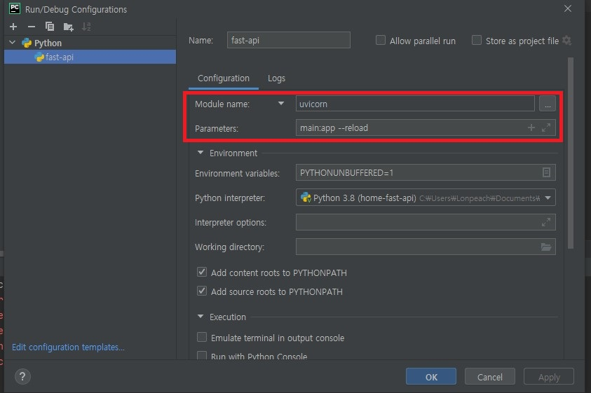
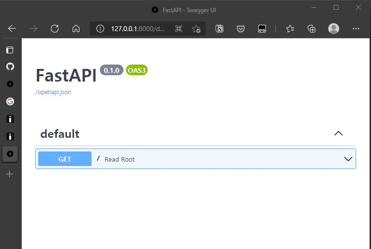
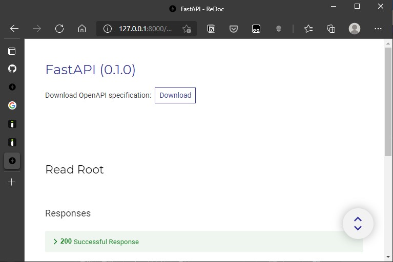

## 환경

- Windows 10
- Pycharm 2021.1.2
- [Github](https://github.com/karais89/home-fast-api)

## 포스팅 목적

- FastAPI의 사용 방법에 대해 학습 용도.
- 다듬어진 포스팅만 작성하려고 하니 글 자체를 작성하지 않게 되버리는 것 같아, 우선 포스팅을 하고 수정 및 계속해서 작성하는 형태로 변경. 실제 글은 영양가가 없을 가능성이 큽니다.
- 기본적으로 FastAPI 문서 자체를 번역 하는 형태를 취할 예정이고, 구글 번역을 바탕으로 진행할 예정이라 영어에 익숙한 분들은 원문을 보는게 더 좋을 것 같습니다.

## 0. FastAPI란?

- [https://fastapi.tiangolo.com/](https://fastapi.tiangolo.com/)

> FastAPI는 고성능의 배우기 쉽고, 빠르게 코딩 가능한 프레임 워크이다.

### 특징

- 빠른 속도: **Nodejs** 및 **Golang**과 동등한 매우 높은 성능 (Starlette 및 Pydantic 덕분에). [사용 가능한 가장 빠른 Python 프레임 워크 중 하나입니다.](https://fastapi.tiangolo.com/#performance)
- 높은 생산성: 개발 속도가 2배~3배 증가 됨
- 적은 버그: 개발자의 실수가 40% 감소 됨
- 직관적: 훌륭한 편집기 지원. 자동 완성. 디버깅 시간 감소 됨
- 쉬움: 사용하고 배우기 쉽게 설계되었습니다. 문서를 읽는 시간이 단축 됨
- 짧음: 코드 중복을 최소화합니다. 각 매개 변수 선언의 여러 기능. 더 적은 버그.
- 견고함: 생산 준비 코드를 가져옵니다. 자동 대화형 설명서 사용.
- 표준 기반: [OpenAPI](https://github.com/OAI/OpenAPI-Specification) (이전에는 Swagger라고 함) 및 [JSON 스키마](https://json-schema.org/)를 기반으로 하며 완전히 호환됩니다.

### 사용 후 느낀 장점

- 빠른 속도 (실제 측정은 해보지 않았지만 기존 장고나 플라스크를 사용하기 꺼려했던 이유 중 하나)
- 타입 선언을 어느 정도 강제 한다는 부분
- 홈페이지의 메뉴얼이 잘 되어 있다 (한글 지원은 좀 아쉽다)
- 코드 작성 후 자동 문서화 및 쉬운 테스트 가능
- 파이썬 언어에서 오는 장점 (많은 라이브러리 및 검색의 용이)

결론은 Restful API 작성 용도로 정말 좋은 프레임 워크라는 생각이 들었다.

## 1. 파이참에서 FastAPI의 설정

- 가상 환경 설정 등은 제외 - 아래 명령어로 pip 설치 혹은 파이참에서 설치

```bash
pip install fastapi
pip install uvicorn[standard]
```

- 기본적으로 프로젝트 생성시 fastAPI 관련 설정은 없음
- Edit Configurations.. 에서 + 버튼으로 python 추가 후 아래 처럼 입력



아래 명령어로도 실행 가능

```bash
uvicorn main:app --reload
```
- 단 파일명은 main.py 파일

## 2. Hello World

```python
from fastapi import FastAPI

app = FastAPI()

@app.get("/")
def read_root():
    return {"Hello": "World"}
```

- [127.0.0.1:8000](http://127.0.0.1:8000/) 접속
- [127.0.0.1:8000/docs](http://127.0.0.1:8000/docs) 접속
- [127.0.0.1:8000/redoc](http://127.0.0.1:8000/redoc) 접속






## 3. 결론

- 파이썬을 사용하여 간단한 Restful API를 구현하고 싶은 분이라면 FastAPI가 그 대안이 될 수도 있을 것 같다.