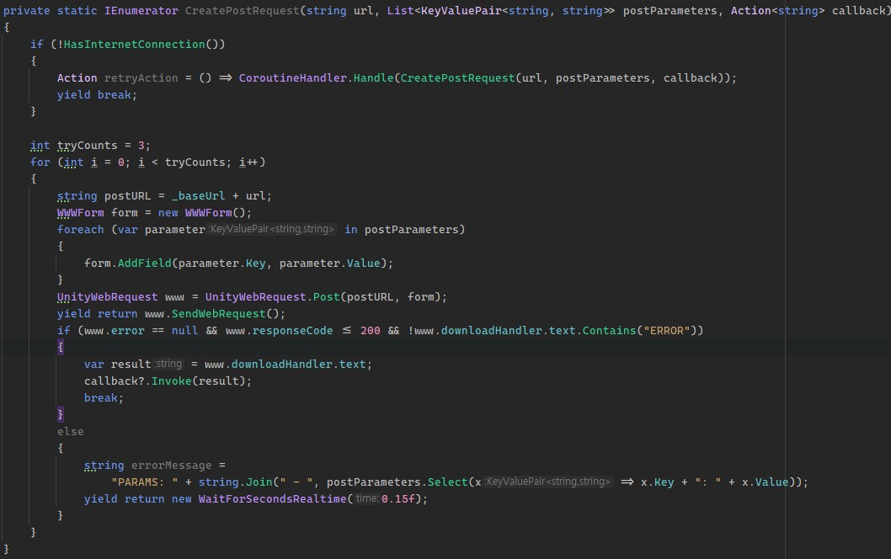
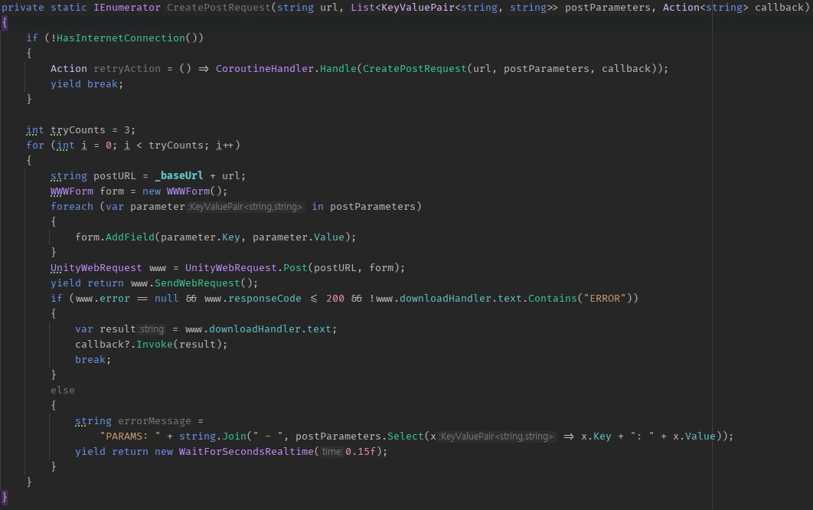
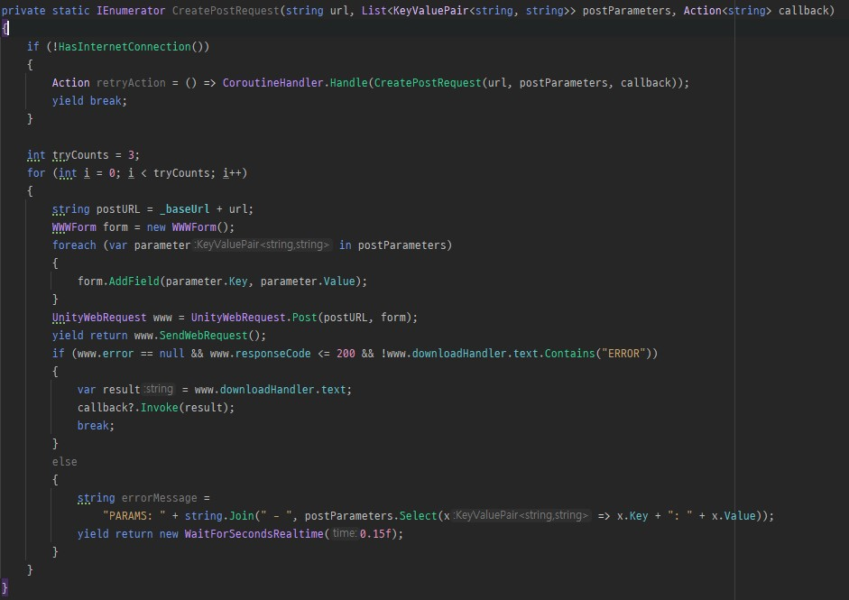
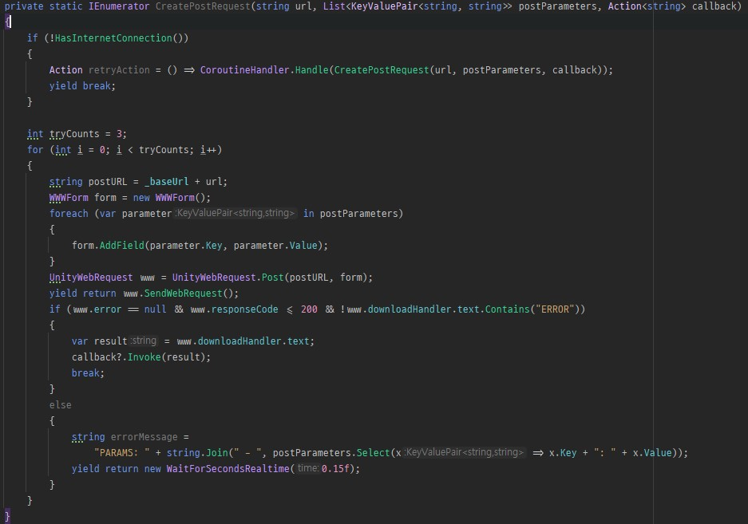

## 간단한 기록 용도
- 개발자의 경우 고정형 폰트를 사용하게 된다. (IDE에서 기본적으로 제공하는 폰트의 경우 모두 고정형 폰트를 사용하게 된다)
- 블로그 운영을 잘 안하고 있다가, 오늘 서칭을 하다가 [마소에서 나온 고정폭 글꼴(Cascadia Code)][1]을 봤었다. 2019년에 발표한것으로 보이는데, 기존에는 [D2 Coding][2]을 잘 사용해 오다가 좀 질리는 감이 있어서 한번 적용을 해봤는데, 폰트 자체가 굉장히 깔끔한 느낌인 것 같아 한번 웹에도 적용하기 위해 조금 서칭을 해봤다.
- [Fira Code][3]의 경우도 괜찮아 보이긴 하는데.. 개인적으로는 Cascadia Code가 더 이쁘다.
- 웹 자체에 대한 지식이 없기 때문에.. 삽질 하면서 적용했다.
    - css 파일에 @font-face를 이용해서 폰트를 다운로드 받도록 하고, 사용하는 곳에서 font-family에 입력하면 되는 방식이다. 기본적으로 웹에서 제공하는 폰트 확장자는 별도로 제공하는 것으로 보인다.
    - 자세한 부분은 다른 웹 사이트에서 서칭으로 확인하는게 더 좋을 것으로 보인다.
- ligatures(합자)를[^1] 지원하는 정말 가독성이 좋은 부분인건가? 싶기는 한데 한번 사용은 해볼 예정이다.
- 웹 사이트에 적용되어 현재 코드 블록의 경우 아마? Cascadia Code로 출력될 것으로 보인다.
- [Visaul Studio 2022에는 해당 폰트가 추가 될 예정][4]이고, [윈도우의 터미널에서는 기본 폰트로 사용][5]하고 있기 때문에 해당 폰트를 미리 사용해보는 것도 좋을 것 같다.

## 폰트 비교
- 코드 자체는 의미 없는 코드 이다. 폰트 스타일만 확인 용도로 이미지 별도 첨부

### Cascadia Code


### Fira Code


### D2 Coding


### D2 Coding ligatures 지원 폰트


## 현재 블로그에서의 코드 출력
```cs
private static IEnumerator CreatePostRequest(string url, List<KeyValuePair<string, string>> postParameters, Action<string> callback)
{
    if (!HasInternetConnection())
    {
        Action retryAction = () => CoroutineHandler.Handle(CreatePostRequest(url, postParameters, callback));
        yield break;
    }
    
    int tryCounts = 3;
    for (int i = 0; i < tryCounts; i++)
    {
        string postURL = _baseUrl + url;
        WWWForm form = new WWWForm();
        foreach (var parameter in postParameters)
        {
            form.AddField(parameter.Key, parameter.Value);
        }
        UnityWebRequest www = UnityWebRequest.Post(postURL, form);
        yield return www.SendWebRequest();
        if (www.error == null && www.responseCode <= 200 && !www.downloadHandler.text.Contains("ERROR"))
        {
            var result = www.downloadHandler.text;
            callback?.Invoke(result);
            break;
        }
        else
        {
            string errorMessage =
                "PARAMS: " + string.Join(" - ", postParameters.Select(x => x.Key + ": " + x.Value));
            yield return new WaitForSecondsRealtime(0.15f);
        }
    }
}
```

## 결론
- 결국에 기본 폰트로 돌아가게 되긴 하지만.. (결국엔 순정) 예쁜 떡이 먹기에도 좋다고 가끔씩은 폰트에 대해서도 한번씩 관심을 갖는것도 괜찮지 않을까 싶다.
- ligatures 기능이 좀 신기하기도 하고, D2 Coding이 좀 질리는 부분이 있어 변경했는데 개인적으로 마음에 드는 부분이라 계속 사용할 것 같다.
- ligatures 이 부분에 있어서는 개발자들 간에도 호불호가 많이 갈리는 영역인 것 같다.

[1]: https://github.com/microsoft/cascadia-code/releases
[2]: https://github.com/naver/d2codingfont
[3]: https://github.com/tonsky/FiraCode
[4]: https://devblogs.microsoft.com/visualstudio/weve-upgraded-the-ui-in-visual-studio-2022/comment-page-3/
[5]: https://docs.microsoft.com/ko-kr/windows/terminal/cascadia-code

[^1]: 합자는 여러개의 문자를 하나의 문자로 합쳐주는 기능입니다. 해당 기능을 통해 대소문자 혹은 가독성을 해칠수 있는 문자의 결합을 하나로 합쳐주어 가독성을 높일 수 있습니다.