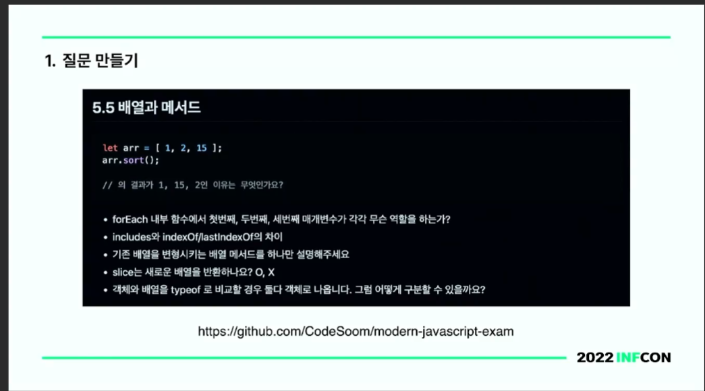
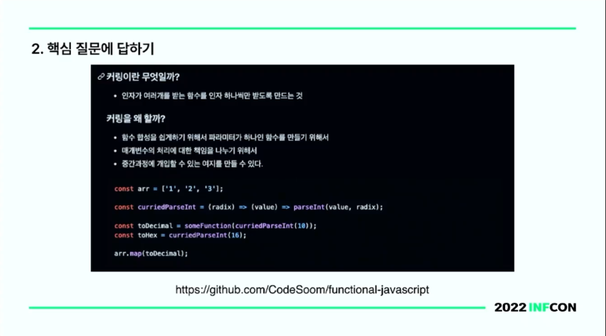
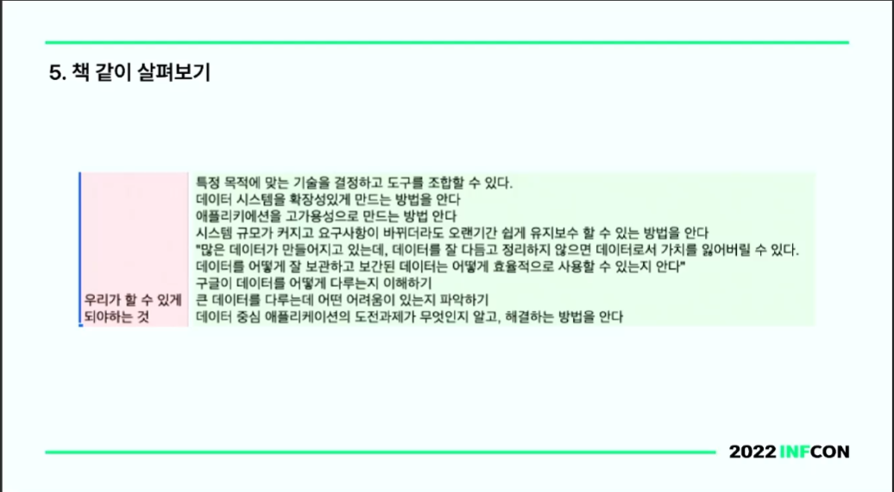

[https://www.inflearn.com/course/infcon2022/unit/126525](https://www.inflearn.com/course/infcon2022/unit/126525)

인출 위추의 스터디 여정기 (코드숨)

## 입력 위주의 학습법 vs 인출 위주의 학습법

- 인출 위주의 학습법은 피드백을 즉각적으로 받을 수 있다.
- 입력 위주의 학습법은 아무런 피드백 받을 수 없다.
- 입력 위주의 학습법은 이해 한 것 같다는 착각에 빠지게 된다.

## 인출 위주의 스터디

1. 이미 알 것 같은 내용을 듣는 것 보다는 모르는 것을 발견하기
2. 가만히 듣고만 있는 것 보다는 적극적으로 인출하기
3. 이미 정리된 것 보다는 인출을 통해 정리하기

### 1. 질문 만들기

> 관계형 모델은 실제 세계의 데이터를 관계라는 개념을 사용해서 표현한 데이터 모델이다

→ 질문으로 

> 관계형 모델은 실제 세계의 데이터를 어떤 개념을 사용해서 표현한 모델인가?

질문을 책에 적어놓고, 이 질문에 대답을 할 수 있다면 올바르게 학습한 것으로 피드백 받을 수 있다.

이 방법은 [어떻게 공부할 것인가](https://product.kyobobook.co.kr/detail/S000000625448)라는 책에 나오는 내용 이다.

1. 각자가 챕터마다 문제를 하나씩 만들어 옵니다.
2. 랜덤하게 문제를 뽑아서 랜덤한 사람에게 질문을 합니다.
3. 답변에 대해서 토론을 하고 정리합니다.

질문 만들기의 예시

### 2. 핵심 질문에 답하기

무엇, 왜, 어떻게

핵심 질문에 답하기

무엇인지, 왜 사용하는지, 어떻게 사용하는지에 대해 답변할수 있다면?

1. 무엇, 왜, 어떻게에 대한 질문을 합니다.
2. 답변에 대해서 토론을 합니다.
3. 답변에 대해서 정리합니다.

핵심 질문에 답하기에 대한 예시

### 3. 강의식으로 전달하기

어려운 책은 질문을 만들기 어려움.

어려운 이유? = 책의 흐름에 대해 파악하기 힘들어서 어렵다고 생각한다.

강의식이 무조건 나쁜 건 아니다. 참여자들이 많이 배워가는 것도 중요하다고 생각한다.

### 4. 짧은 리뷰

전반적인 흐름 파악이 중요

> 10분 ~ 15분 정도 스터디 범위를 훑어 보면서 공부 했던 것을 떠올립니다.

### 5. 책 같이 살펴보기

1. 5분 동안 책 전체에서 내가 읽고 싶은 부분을 탐색합니다.
2. 탐색한 것을 짧게 공유합니다. (왜 읽고 싶었는지? 어떤 것을 탐색했는지?)
3. 15분 정도 읽고 싶은 부분을 읽습니다.
4. 내용을 공유하고 토론합니다.

책 같이 살펴보기 예시

### 6. 그룹 작게 나누기

스터디 인원이 많을 때 인출할 기회가 줄어든다.

오프라인에서도 책상을 나눠서 그룹을 만듬

1. 3~4명씩 각 다른 채널로 나눠진다.
2. 주어진 시간동안 활동을 한다.
3. 다시 모여서 공유한다.

### 7. 과제

책에서 도전해볼것을 실제로 도전해보고 작성하기

장점: 참여자들의 목표가 하나로 모아짐

### 8. 빈 칸 채우기 퀴즈

개발자에게도 암기가 중요하다.

> 반복 읽기 vs 빈칸 채우기
> 

빈칸 채우기는 생각하면서 읽어야 되서 학습 효과가 뛰어나다.

능동적으로 읽을 수 밖에 없다. 장기 기억에 효과적이다.

엑셀로 만들고 정답 제출 하면 정답 유무까지 나오는 형태.

- 정답은 콤마로 구분

### 9. 완전한 문장으로 만들기

리팩터링이란 무엇일까요?

리팩터링이란 기능은 그대로인데 설계를 개선하는 행위입니다.

1. 질문을 합니다.
2. 책을 보지 않고 최대한 완전한 문장으로 답변해 봅니다.
3. 책을 보고 완전한 문장으로 만듭니다.

### 10. 같이 서평 작성하기

스터디에 대한 회고

1. 생각나는 것을 쏟아내기.
2. 쏟아낸 것을 정리합니다.
3. 시간 안에 완성해야 합니다.

## 더 시도해 볼 것

### 직접 해보기

- 책에서 나온 내용을 실제로 실습하는 시간

### 빈 칸 채우기 + 플래시 카드

### 리더가 필요 없는 스터디 만들기

### 내용보다는 공부하는 방법에 대해서

### 다른 회사 개발팀과 같이 스터디하기

### 시도해보는 것만으로도 우리는 많은 것을 배운다

## 결론

- 10가지 방법을 전부 시도해보라는 의미는 아닌 것으로 보이고, 취사 선택 할 수 있을 것으로 보인다.
- 결국 학습을 능동적으로 진행하자는 결론으로 보이고, 무엇을 만드는게 가장 좋은 학습법이지 않을까 싶다. (사이드 프로젝트)
- 스터디를 어떤 방향으로 진행할지에 대해 고민이 된다면 참고하면 조금은 도움이 되지 않을까 싶다.