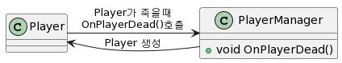

## 환경

- macOS Ventura v13.0
- Unity 2021.4.36f1
- Github Desktop
- Rider 2022.1
- UniRx v7.1.0

원문 : [2022年現在におけるUniRxの使いみち](https://qiita.com/toRisouP/items/af7d32846ab99f493d92)

이 포스팅은 원문을 단순히 구글 번역을 하여 정리한 내용입니다. 일본어를 잘하시는 분은 원문을 보시는게 더 좋으실 것 같습니다.

---

## 소개

제가 "UniRx 입문"이라는 기사를 쓰기 시작한 지 5년, 마지막 기사를 쓴 지 4년이 지났습니다.
기사를 업데이트하지 않은 지난 몇 년 동안 UniRx를 둘러싼 환경이 크게 바뀌었습니다.
UniRx라는 라이브러리 자체에 특히 큰 업데이트는 없지만 Unity의 C# 버전이 업데이트되거나 UniRx보다 편리한 라이브러리가 등장하기도 했습니다.

이번은 2022년 현재의 Unity에 있어서의 UniRx의 입 위치와 그 사용법에 대해 해설합니다.

## UniRx의 위치

### 현대 UniRx 상황

2017년경의 오래된 버전의 Unity에서는 `.NET 3.5` 상당히 부족한 C#의 기능 밖에 사용할 수 없었습니다.
비동기 처리에 `async/await`조차 사용할 수 없고, `코루틴`을 사용할지 `UniRx`를 사용할지 선택하는 상황이었습니다.
따라서 시간 관련 처리는 코루틴이나 UniRx를 사용하여 작성할 수 밖에 없었습니다.

그렇지만, 2022년 현재에 있어서는 `C# 8.0/.NET Standard 2.0`와, 꽤 최신의 C#의 기능을 이용 가능하게 되었습니다.
이 때문에 무언가 기능을 구현할 때 2017년경에 비해 취할 수 있는 옵션이 대폭 늘어나고, 옛날에는 일반적이었던 수법도 현대에서는 오래된 기술이 된 것도 있습니다.
UniRx도 그 중 하나입니다.
현대에서는 무리하게 UniRx를 사용할 필요가 없어서 `async/await`쓰거나 다른 라이브러리를 병용하는 것이 스마트하게 끝난다는 패턴이 존재하고 있습니다.

UniRx 자체는 확실히 편리하고 강력한 라이브러리이며, 사용 목적에 맞는 다면 매우 편리합니다.
하지만 UniRx 자체는 까다롭고, 다양한 기법들이 존재 하기 때문에, 잘 다루어지기까지 꽤 시간이 걸립니다.
게다가 현대에 있어서는 "그 밖에 선택사항이 많아졌기 때문에 UniRx를 무리하게 사용할 필요는 없다"라고 하는 상황이기도 합니다.

그러므로 **UniRx는 Unity 초보자가 가장 먼저 학습하는 라이브러리가 아니게 되었다(async/await부터 먼저 학습하는 것이 더 실천적이다)** 라는 상황입니다.

하지만 UniRx의 쓰임새가 완전히 없어진 것은 아니고, 용도에 따라서는 아직도 현역에서 편리하게 사용할 수 있는 라이브러리입니다.
이러한 전제를 근거로, 현대에 있어서의 UniRx의 용도를 정리해 보겠습니다.

### 현대 UniRx 애플리케이션

UniRx 자체는 "이벤트 처리"와 "비동기 처리"에 특화된 라이브러리입니다.
이 중 "이벤트 처리"에 대해서는 UniRx는 아직도 현역으로 사용할 수 있는 수준으로 편리합니다.
한편 "비동기 처리"에 대해서는 `async/await`를 사용할 수 있는 현대에 있어서는, UniRx를 사용하는 것은 드문 상황이지요.

또, UniRx의 특징인 풍부한 오퍼레이터군도, 딱 빠지는 상황이라면 아직도 취급할 수 있습니다.
다만 복잡한 오퍼레이터 체인이 될 정도라면, 솔직하게 `async/await`쓰는 편이 전체적으로 알기 쉬워지는 경우가 많습니다.

**UniRx 애플리케이션**

- 이벤트 처리의 기구로서 사용
    - 여러 객체에 메시지를 전달하는 장면에서 여전히 사용할 수 있습니다.
    - MessageBroker로서의 용도도 있지만, 현대에 있어서는 "MessagePipe"라고 하는 선택사항도 있다
- 복잡한 이벤트 처리 로직 구축
    - 딱 빠지는 오퍼레이터가 있다면 간결하게 쓸 수 있다.
    - 조금이라도 응용을 시도하면 단번에 어려워지므로 `async/await` 사용하는 것이 좋습니다.
- 비동기 처리의 메커니즘으로
    - **단발 비동기 처리를 다루는 경우 현대에서는 async / await로 대체하는 것이 좋습니다.**
    - 단 `Retry`, `Switch`등의 일부 오퍼레이터가 편리하므로 그 목적으로 사용할 수도 있습니다.
- UI 구성에 사용
    - MV(R)P 패턴이 편리

**역주**
- 결론적으로는 현재 UniRx의 다양한 오퍼레이터에 대한 부분을 익히는 노력으로 다른 기술들을 익히는게 가장 좋은 선택으로 보입니다.
- UI를 구성할때 MV(R)P 패턴을 사용하여 구현한다면, 실제 처리 부분을 조금 더 깔끔하게 구현 가능한 정도의 선에서 사용해야 될 것으로 보입니다.
- 비동기/동기 처리는 UniTask를 사용합시다.
- MessageBroker의 경우도 VContainer의 MessagePipe로 대체 가능합니다.
- 이벤트의 상위호환 라이브러리 정도로 사용하는게 정신 건강에 좋지 않을까 싶습니다.

### UniRx와 async/await와 UniTask

조금 전부터 몇 번이나 `async/await` 다루고 있습니다만, 이쪽은 간단하게 "편리하게 된 코루틴" 이라고 하는 인식으로 일단은 문제 없습니다.
`async/await` 자체는 비동기 처리의 대기 처리를 간소하게 쓸 수 있도록 하기 위한, C#의 언어 기능입니다.
(구조는 전혀 다르지만) `async/await`는 외형으로서는 Unity의 코루틴과 매우 비슷합니다.

UniRx에서도 코루틴과의 조합은 편리했지만, `async/await`에서도 UniRx와 조합하면 그 편리성이 높아집니다.
특히 [UniTask](https://github.com/Cysharp/UniTask)라는 라이브러리가 강력하며, 여기를 도입함으로써 Unity에서 `async/await`의 취급을 대폭 강화할 수 있습니다.
**(async/await와 UniTask는 반드시 세트로 다루고 싶을 정도로 강력합니다)**

여기서 오해하고 싶지 않지만, "async/await이 있기 때문에 UniRx는 불필요해졌다" 는 것은 아닙니다.
UniRx는 UniRx에서 사용할 수 있는 경우도 아직도 있고, async/await또한 편리하게 사용할 수 있는 경우도 다수 있습니다.
**옛날에는 UniRx 밖에 선택사항이 없었지만, 현대에 있어서는 UniRx를 사용하지 않아도 보다 간단하게 구현할 수 있는 수법이 늘어났다고 하는 것입니다.**

### UniRx가 편리한 장소, async/await가 편리한 장소

UniRx는 결코 다목적이 아닙니다.
상황에 따라서는 `async/await`(혹은, 완전히 다른 도구)를 사용하는 편이 깨끗하게 쓸 수 있는 경우도 많이 있습니다.

그럼 UniRx `async/await`를 어떻게 구사할까요, 기본적으로는 다음 구분으로 문제 없습니다.

- UniRx가 편리하게 사용할 수 있는 경우
    - 불특정 다수에 여러 번 이벤트 메시지를 전달하는 경우
    - 특정 처리의 흐름(시퀀스)을 여러 번 반복 실행하는 경우
    - 종속성을 역전하려는 경우
    - Push형으로 구동할 필요가 있는 경우

- `async/await`(및 `UniTask`조합)을 편리하게 사용할 수 있는 경우
    - "**한 번만** 실행되는 처리"를 기다리는 경우
    - 절차적 (`if`문 `for`문)으로 처리를 작성하고 싶은 경우
    - 처리의 동작이 Pull형으로 끝나는 경우

UniRx는 **'반복 실행'**에 특화되어 있습니다.
그 때문에 "몇번인가 발행되는 이벤트를 처리한다" "`Update()`의 루프 대신에 사용한다"라고 하는 용도에 매치하고 있습니다.

한편으로 `async/await`는 **"뭔가의 처리를 1회만 기다린다"**에 특화하고 있습니다.
그 때문에 "초기화 처리가 끝나는 것을 기다린다" "외부와의 통신을 기다린다"라고 하는 경우는 `async/await`에서 쓰는 편이 스마트하게 쓸 수 있습니다.
(단발의 처리를 UniRx로 쓰는 것도 물론 할 수 있지만, 중복이 되기 쉽다)

## 2. 실제 UniRx 애플리케이션

그러면 현대에서 UniRx를 어떤 경에서 사용하는지 소개합니다.
일부는 **예전에는 UniRx를 사용하기도 했지만, 현대에서는 다른 방법으로 쓰는 것이 좋다**는 것도 있습니다.

### A. 이벤트 통지에 사용

이벤트란, "무언가의 조건을 만족했을 때, 그 때의 정보를 통지해 다른 장소에서 처리를 실행한다"라고 하는 구조를 가리킵니다.
이벤트를 이용하면 "조건을 판정하는 부분"과 "실제로 처리를 실시하는 부분"을 분리해 구현할 수 있게 됩니다.


이벤트의 사용법으로서는 다음의 패턴을 생각할 수 있습니다.

- 비 정기적으로 여러 번 반복하는 처리를 다루기 쉽다.
- 실제의 처리 부분이 복수 있을 때, 그 조건 판정의 부분을 한 곳에서 처리한다
- 컴포넌트간의 종속성 구성

"비 정기적으로 여러 번 반복하는 처리를 다루기 쉽다"는 Unity에서는 OnTriggerEnter등의 이벤트를 예로 들 수 있습니다.
"언제 일어날지 모르지만, 발생했을 때는 즉시 대응한 처리를 실행하고 싶다"라고 하는 때에 이벤트의 개념을 사용할 수 있습니다.


"실제의 처리 부분이 복수 있을 때, 그 조건 판정의 부분을 한 곳에서 처리한다"는, 예를 들면 "Input"을 들 수 있습니다.
게임을 하고 있는 사람(플레이어)으로부터의 Input을 받아들이고 캐릭터를 조작하게 됩니다.
이 때 아무것도 생각하지 않고 어리석게 구현하면 다양한 컴포넌트와 `if(Input.GetKeyDown("Attack"))`같은 처리가 흩어져 버립니다.
이러한 문제도 이벤트 개념을 사용하여 스마트하게 구현할 수 있습니다.

#### UniRx와 이벤트

우선 "Input을 판정해 그것을 Observable로 변환하는 컴퍼넌트"를 생각합니다.

```cs
using UniRx;
using UnityEngine;

namespace Events
{
    public sealed class InputEventProvider : MonoBehaviour
    {
        /// <summary>
        /// 공격 버튼 입력
        /// </summary>
        public IReadOnlyReactiveProperty<bool> Attack => _attack;

        /// <summary>
        /// 이동 방향 입력
        /// </summary>
        public IReadOnlyReactiveProperty<Vector3> MoveDirection => _moveDirection;

        /// <summary>
        /// 점프 입력
        /// </summary>
        public IReadOnlyReactiveProperty<bool> Jump => _jump;

        // 구현
        private readonly ReactiveProperty<bool> _attack = new BoolReactiveProperty();
        private readonly ReactiveProperty<bool> _jump = new BoolReactiveProperty();
        private readonly ReactiveProperty<Vector3> _moveDirection = new ReactiveProperty<Vector3>();

        private void Start()
        {
            // Destroy시 Dispose()
            _attack.AddTo(this);
            _jump.AddTo(this);
            _moveDirection.AddTo(this);
        }

        private void Update()
        {
            // 다양한 입력을 ReactiveProperty에 반영
            _jump.Value = Input.GetButton("Jump");
            _attack.Value = Input.GetButton("Attack");
            _moveDirection.Value = new Vector3(
                x:Input.GetAxis("Horizontal"),
                y:0,
                z:Input.GetAxis("Vertical"));
        }
    }
}
```

이 컴퍼넌트를 준비하면, 실제로 입력 이벤트를 사용해 처리를 실시하는 컴퍼넌트로부터 이것을 참조시킵니다.
이제 "UniRx를 사용하여 입력 이벤트를 처리"할 수있었습니다.

```cs
using System;
using UniRx;
using UnityEngine;

namespace Events
{
    /// <summary>
    /// 예: Input을 보고 이동
    /// </summary>
    public class PlayerMove : MonoBehaviour
    {
        [SerializeField] private float _moveSpeed = 1.0f;
        [SerializeField] private InputEventProvider _inputEventProvider;

        private CharacterController _characterController;

        private void Start()
        {
            _characterController = GetComponent<CharacterController>();

            // 점프
            // 점프 버튼 입력 이벤트 결정
            _inputEventProvider.Jump
                // 버튼을 눌렀을 때,
                .Where(x => x)
                // 접지 중이며,
                .Where(_ => _characterController.isGrounded)
                // 마지막으로 점프한 지 1초 이상 경과하면,
                .ThrottleFirst(TimeSpan.FromSeconds(1))
                .Subscribe(_ =>
                {
                    // 점프 처리 수행
                    Jump();
                });

            // 이동 처리
            _inputEventProvider
                .MoveDirection
                // 일정값 이상 입력하면
                .Where(x=>x.magnitude > 0.5f)
                .Subscribe(x =>
                {
                    // 그쪽으로 이동
                    _characterController.Move(x.normalized * _moveSpeed);
                });
        }

        private void Jump()
        {
            // 점프 처리(생략)
        }
    }
}
```


#### 보충: "Pub/Sub" 개념

이벤트 처리의 일종으로서, "Pub/Sub"라고 하는 것이 있습니다.

일반적인 이벤트 처리에 있어서는, 일반적으로는 "누구로부터 메세지가 보내 오는지"를 구독측이 어느 정도는 의식할 필요가 있습니다.
그것을 `Pub/Sub` 있어서는 "이벤트 메세지 그 자체"에 주목해, "누구로부터 보내져 왔는지는 신경쓰지 않는다"라고 하는 모델이 되고 있습니다.
(같이 송신측도 "누가 수신하고 있는지는 신경쓰지 않는다"라고 하는 형태가 됩니다)


<details><summary>UML Source Code</summary>
    <p>

```
@startuml
left to right direction

interface IPublisher
interface ISubscriber

note top of Publisher_A : 송신측은 수신측이 누군지 모른다
note top of Subscriver_A : 수신측은 송신측이 누군지 모른다

Publisher_A --> IPublisher
Publisher_B --> IPublisher

IPublisher ..> ISubscriber : Message

note "Pub/Sub는 본체는 숨기고\n보이지 않는 어딘가를 통해\n메시지를 전송한다." as N2
IPublisher .. N2
N2 .. ISubscriber


ISubscriber <-- Subscriver_A
ISubscriber <-- Subscriver_B

@enduml
```

</p>
</details>

`Pub/Sub`를 사용하면 송신자와 수신자를 더 느슨하게 결합할 수 있습니다.
컴퍼넌트간의 참조 관계나 의존관계를 정리해 휘두르는 일 없이, 보다 데이터 플로우를 중심으로 한 구현을 실시하는 것이 가능해집니다.
그러나 다른 한편으로는 올바르게 메시지를 관리 할 수 ​​없으면 스파게티 코드가 가속된다는 문제점도 `Pub/Sub`있습니다.
초보자에게 추천할 수 있는 기능은 아닙니다만, 이런 것도 있으면 머리의 한쪽 구석에서 두면 어느 것이 도움이 될 때가 올 것입니다.

이제 이것 `Pub/Sub`이지만 구현하는 방법에는 여러 가지가 있습니다.

- UniRx의 "MessageBroker"라는 기능 사용
- [MessagePipe](https://github.com/Cysharp/MessagePipe) 라는 라이브러리 사용

`Pub/Sub`을 가볍게 시도하고 싶다면 UniRx `MessageBroker`를 쉽게 사용할 수 추천합니다.
거기에서 한층 더 밟아, "DI와 조합해 사용하고 싶다" "서버 통신을 얽힌 `Pub/Sub`것을 실시하고 싶다"라고 하는 경우는 `MessagePipe`를 사용해 보면 좋을 것입니다.

### B. 비동기 처리에 사용
앞에서 결론에서 언급하면 ​​**비동기 처리에 UniRx를 사용하는 것은 더 이상 권장 하지 않습니다.**
과거 2017년 이전의 Unity에서는 비동기 처리의 선택사항으로서 괜찮은 것이 UniRx 정도밖에 없었습니다.
그러나 현대에서는 `async/await`나 UniTask의 등장에 의해, 굳이 UniRx를 사용해 비동기 처리를 취급할 필요성이 없어졌습니다.

(원래 「비동기 처리」란 무엇을 가리키는지입니다만, 이쪽은 말하면 길어지기 때문에 다른 기사에서 다시 투고 예정입니다)

#### 추가

"비동기 처리에 UniRx를 사용하는 것은 비추천"이지만 일부 Operator가 매우 편리합니다.
특히 `OnErrorRetry`는 에러 발생시 지정 횟수까지 재 시도를 해주는 것입니다.
이런 Operator를 `async/await` 함께 `try-catch` 사용하면 상당히 복잡해지기 때문에, async/await와 함께 Observable을 같이 사용하는 것도 어려울 수 있지만 존재합니다.

단, 어리석게 `ToObservable().OnErrorRetry()`만 해도 잘 움직이지 않고, `Observable.Defer()`와 병용할 필요가 있거나 합니다.
이 함수들은 상당히 까다롭기 때문에, 왜 `Observable.Defer()` 필요한지 모르는 사람은, 이 테크닉은 사용하지 않는 편이 안전할지도 모릅니다.

```cs
private async UniTaskVoid SampleAsync(string uri, CancellationToken token)
{
    var result =
    // Observable.Defer로 감싸서 Retry 발화시 GetAsync를 다시 실행하도록 합니다.
    await Observable.Defer(() => GetAsync(uri, token).ToObservable())
    // 에러 발생시 1초 기다린 후 총 3회까지 시도
    .OnErrorRetry((UnityWebRequestException ex) => Debug.LogException(ex), retryCount: 3, TimeSpan.FromSeconds(1));

    Debug.Log(result);
}

private async UniTask<string> GetAsync(string uri, CancellationToken token)
{
    using (var uwr = UnityWebRequest.Get(uri))
    {
        await uwr.SendWebRequest().WithCancellation(token);
        return uwr.downloadHandler.text;
    }
}
```

#### 예: AsyncOperation

Unity에서 등장하는 비동기 처리로 취급할 필요가 있는 객체 중：`AsyncOperation`가 있습니다.
이것은 UnityAPI에서 비동기 처리를 호출할 때 반환되는 객체입니다.

【`AsyncOperation`한 객체를 돌려주는 Unity의 API의 예】
- `UnityWebRequest.SendWebRequest()`
- `SceneManager.LoadSceneAsync()`
- `AssetBundle.LoadAssetAsync`

`AsyncOperation`는 본래라면 코루틴으로 처리하는 객체입니다만, `UniTask`를 도입하고 있는 경우는 `async/await`로 기술하는 것이 가능합니다.

```cs
// 텍스처 다운로드
public async UniTask<Texture> FetchTextureAsync(string uri, CancellationToken token)
{
    using (var uwr = UnityWebRequestTexture.GetTexture(uri))
    {
        await uwr.SendWebRequest().WithCancellation(token);
        return ((DownloadHandlerTexture) uwr.downloadHandler).texture;
    }
}
```

---

(이하 비추천)

한때, UniRx 정도 괜찮은 비동기 처리의 핸들링 방법이 없었던 시대는 다음과 같은 쓰기를 하고 있었습니다.
`async/await`와 비교해 보면, **UniRx 쪽이 압도적으로 중복코드가 많고 복잡합니다.**

```cs
    /// <summary>
    /// 텍스처 다운로드 Observable
    /// </summary>
    public IObservable<Texture> FetchTextureObservable(string uri)
    {
        // 코루틴을 Observable로 변환
        return Observable.FromCoroutine<Texture>(observer =>
        FetchTextureCoroutine(uri, observer));
    }

    /// <summary>
    /// 통신하는 코루틴
    /// </summary>
    private IEnumerator FetchTextureCoroutine(
        string uri,
        IObserver<Texture> observer)
    {
        using (var uwr = UnityWebRequestTexture.GetTexture(uri))
        {
            yield return uwr.SendWebRequest();

        if (uwr.result != UnityWebRequest.Result.Success)
        {
            observer.OnError(new Exception(uwr.error));
        }
        else
        {
            var result = ((DownloadHandlerTexture) uwr.downloadHandler).texture;
            observer.OnNext(result);
            observer.OnCompleted();
        }
    }
}
```

### C.Model-View-(Reactive)Presenter 패턴에 사용
Model-View-(Reactive)Presenter, 통칭 MV(R)P패턴은 Unity에서 주로 UI 구현에서 사용되는 경우가 많은 패턴입니다.
View와 Model 2개의 오브젝트를 UniRx를 이용해 연결하는 구현 패턴이 됩니다.

이쪽은 다른 기사에서 해설하고 있습니다.

- [【Unity】Model-View-(Reactive)Presenter 패턴이란 무엇인가](https://qiita.com/toRisouP/items/5365936fc14c7e7eabf9)

### D.MonoBehaviour의 로직 작성
UniRx에 존재하는 `UpdateAsObservable()`와 `Observable.EveryUpdate()` 애용하고 있는 분은 많을 것입니다.
여기에 대해서는 **UniRx를 그대로 사용해도 되지만, 경우에 따라서는 async/await쪽이 간단하게 구현 가능한 경우도 있다고** 기억해 두면 좋을 것입니다.

#### 간단한 로직을 UniRx로 작성

예로서 다음 로직을 생각해 봅시다.

조건이 충족되면 처리를 실행한 후 몇 초 동안 쿨타임에 들어갑니다.
(공격을 내면 그 후 몇 초간은 다시 공격을 할 수 없다, 같다)

이것을 UniRx로 작성하면 다음과 같습니다.

```cs
using System;
using UniRx;
using UniRx.Triggers;
using UnityEngine;

namespace Samples
{
    public sealed class SimpleLogicUniRx : MonoBehaviour
    {
        private void Start()
        {
            // 매 프레임 실행
            this.UpdateAsObservable()
                // 공격 버튼을 누르면
                .Where(_ => Input.GetButtonDown("Attack"))
                // 처리를 1회 실행시킨 후, 1초간 쿨타임
                .ThrottleFirst(TimeSpan.FromSeconds(1))
                .Subscribe(_ => Action())
                .AddTo(this);
        }

        /// <summary>
        /// 정기적으로 실행되는 처리
        /// </summary>
        private void Action()
        {
            // 공격
            Debug.Log("Action!");
        }
    }
}
```

이러한 「오퍼레이터를 조합하는 것만으로 구현할 수 있는 처리」에 대해서는 UniRx를 사용해 써도 문제 없습니다.

#### UniRx로 작성하기 어려운 경우

UniRx의 장점은 「풍부한 오퍼레이터를 사용할 수 있다」입니다만, 반대로 단점으로서 오퍼레이터의 범위 외의 처리는 굉장히 구현하기 어려워 집니다.

조금 전의 예의 「조건을 만족하면 뭔가 처리를 실행해 그 후 몇 초간 쿨타임에 들어간다」를 조금 확장해, 다음과 같은 처리를 생각해 봅시다.

- 조건 A를 만족하면 처리 X를 호출하고 N 초 동안 쿨타임에 들어갑니다.
- 조건 B를 만족하면 처리 Y를 호출하고 M 초 동안 쿨타임에 들어갑니다.
- 처리 X와 Y는 각각 배타적이며, 서로의 쿨타임 중에는 서로의 처리가 차단된다.

알기 쉽게 바꿔 말한다면, "강 공격을 내면 쿨타임이 길다. 약공격을 내면 쿨타임이 짧다. 쿨타임 중에는 공격을 일절 할 수 없다"같은 패턴입니다.

자, 이것을 UniRx만으로 작성하려고하면 어떻게 될까요?
오퍼레이터의 단순한 연결만으로는 구현할 수 없고, 상당히 얽힌 코드로 구현 코드가 나올 것 같습니다.
**이러한 도중에 조건 분기가 들어가거나 조건에 따라 처리 내용이 크게 바뀌는 것을 UniRx는 매우 구현하기 힘듭니다.**

이러한 경우는 **UniRx를 사용하지 않고 async/await(또는 코루틴)으로 써 버리는 쪽이 결과적으로 깨끗하게 구현할 수 있습니다.**

```cs
using System.Collections;
using UnityEngine;

namespace Samples
{
    public sealed class ComplexLogicCoroutine : MonoBehaviour
    {
        private void Start()
        {
            StartCoroutine(LogicLoop());
        }

        private IEnumerator LogicLoop()
        {
            // Destroy 될 때까지 무한 루프
            while (true)
            {
                if (Input.GetButtonDown("AttackA"))
                {
                    // 입력 A가 실행되면 처리 X를 호출하여 1초 대기
                    ActionX();
                    yield return new WaitForSeconds(1);
                }
                else if (Input.GetButtonDown("AttackB"))
                {
                    // 입력 B가 실행되면 처리 Y를 호출하여 2초 대기
                    ActionY();
                    yield return new WaitForSeconds(2);
                }
                else
                {
                    // 입력이 없으면 1프레임 대기
                    yield return null;
                }
            }
        }

        private void ActionX()
        {
            Debug.Log("do X!");
        }

        private void ActionY()
        {
            Debug.Log("do Y!");
        }
    }
}
```

```cs
using System;
using System.Threading;
using Cysharp.Threading.Tasks;
using UnityEngine;

namespace Samples
{
    public sealed class ComplexLogicUniTask : MonoBehaviour
    {
        private void Start()
        {
            // CancellationToken생성
            var token = this.GetCancellationTokenOnDestroy();

            // 루프 시작
            LogicLoopAsync(token).Forget();
        }

        private async UniTaskVoid LogicLoopAsync(CancellationToken ct)
        {
            // Destroy 될 때까지 무한 루프
            while (!ct.IsCancellationRequested)
            {
                if (Input.GetButtonDown("AttackA"))
                {
                    // 입력 A가 실행되면 처리 X를 호출하여 1초 대기
                    ActionX();
                    await UniTask.Delay(TimeSpan.FromSeconds(1), cancellationToken: ct);
                }
                else if (Input.GetButtonDown("AttackB"))
                {
                    // 입력 B가 실행되면 처리 Y를 호출하여 2초 대기
                    ActionY();
                    await UniTask.Delay(TimeSpan.FromSeconds(2), cancellationToken: ct);
                }
                else
                {
                    // 입력이 없으면 1프레임 대기
                    await UniTask.Yield();
                }
            }
        }

        private void ActionX()
        {
            Debug.Log("do X!");
        }

        private void ActionY()
        {
            Debug.Log("do Y!");
        }
    }
}
```
**역주**
- GetCancellationTokenOnDestroy은 MonoBehaviour의 라이프 사이클과 동일하게 CancellationToken이 생성된다.

#### MonoBehaviour의 로직 작성 요약
- Update() FixedUpdate()에 관련된 로직은 UniRx로 기술할 수 있다
- 다만 UniRx를 사용하는 경우는 기존의 오퍼레이터로 구현할 수 있는 범위 내에 두어 둔다
- **조금이라도 UniRx로 쓸 수 없다고 느끼면 곧바로 포기하고 코루틴이나 async/await에 다시 쓰는 편이 최종적으로 읽기 쉬워진다**

### E.Update()와 같은 범위 분리
UniRx의 사용법으로서 "Update()등의 스코프를 분리한다"가 있습니다.

- Update()와 FixedUpdate() 등의 처리를 문맥 별로 분리한다
- Update()나 FixedUpdate() 실행 시작 타이밍 조정

이 경우 UniRx를 사용할 수 있습니다.

#### 예: Update()를 문맥별로 분리
예를 들면 다음과 같이, Update()에 복수의 처리를 하는 코드가 있었다고 합니다.

```cs
using UnityEngine;

namespace Samples
{
    public sealed class SamplePlayer : MonoBehaviour
    {
        // 여기에 많은 필드 변수가 정의
        private void Update()
        {
            // 공격 처리에 따른 처
            CheckAttack();

            // Player의 위치에 따른 처리
            CheckPosition();

            // Player의 체력에 따른 처리
            CheckHealth();

            // 움직임 처리
            Move();
        }

        // ↓ 메서드가 줄지어 정의되어있다가 가정한다.

        /*
        * 생략
        */
    }
}
```

그런데, 이 Update()문을 보고 느끼는 것은 없을까요.
"이 처리의 순서는 바꿔도 문제 없을까?", "어떤 처리와 어떤 처리는 연관된 처리가 있는가?"
라는 의문이 나올 수 있습니다.

이러한 처리 순서에 따라 제대로 동작하지 않는 메서드가 있을 수 있고, 처리 순서가 무방한 메서드가 있을 수 있습니다.
이러한 부분이 주석에 써 있을지도 모르고, 전혀 주석이 없는 코드일지도 모릅니다.
`Update()`라는 하나의 메소드에 나란히 쓰고 있는 이상은, 항상 이러한 것을 의식해 코드를 작성/읽어야 합니다.

이러한 문제는 UniRx를 사용하면 다소 개선할 수 있습니다.

```cs
using System;
using UniRx;
using UniRx.Triggers;
using UnityEngine;

namespace Samples
{
    public sealed class SamplePlayer : MonoBehaviour
    {
        private void Start()
        {
            // Player의 위치에 따른 처
            this.UpdateAsObservable()
                .Subscribe(_ => CheckPosition())
                .AddTo(this);

            // Player의 체력에 따른 처리
            this.UpdateAsObservable()
                .Subscribe(_ => CheckHealth())
                .AddTo(this);

            // 공격 처리 확인 및 이동 처리
            this.UpdateAsObservable()
                .Subscribe(_ =>
                {
                    CheckAttack();
                    Move();
                })
                .AddTo(this);
        }

        // ↓ 메서드가 줄지어 있다고 가정한다.

        /*
        * 생략
        */
    }
}
```

이와 같이, 각 처리마다 따로 따로 `Observable` 저장하는 것으로 처리 끼리의 스코프를 명확하게 구분 할 수 있었습니다.
또 처리마다 `Observable`가 분리되어 있기 때문에, 일부 처리만 오퍼레이터를 추가하거나 조정도 쉬워집니다.

#### 예: 일부 처리만 실행 시작 타이밍을 어긋나기

`Update()`를 각 처리마다 `Observable` 나누어 버리는 이점으로서, "실행 개시 타이밍을 조정하기 쉽다"라고 하는 것이 있습니다.

예를 들어 특정의 메소드가 불려 갈 때까지는 `Update()`의 처리의 일부를 스킵 해 두고 싶다고 하는 경우입니다.
(적 캐릭터가 화면에 비칠 때까지 이동 처리를 멈추고 싶은 등)

```cs
using UniRx;
using UniRx.Triggers;
using UnityEngine;

namespace Samples
{
    public sealed class SampleEnemy : MonoBehaviour
    {
        private void Start()
        {
            // 화면에 비치면 초기화 처리를 호출합니다.
            this.OnBecameVisibleAsObservable()
                .Take(1)
                .Subscribe(_ => Initialize())
                .AddTo(this);
        }

        /// <summary>
        /// 초기화 처리
        /// </summary>
        private void Initialize()
        {
            // 매 프레임 Move()를 호출하도록 설정
            this.UpdateAsObservable()
                .Subscribe(_ => Move())
                .AddTo(this);
        }

        /// <summary>
        /// 이동 처리
        /// </summary>
        private void Move()
        {
            // 이동 처리
        }
    }
}
```

#### Update()와 같은 범위를 분리합니다.
이것은 UniRx가 처리를 모두 `Observable`라고 하는 객체에 감싸는 성질을 이용한, 약간의 테크닉입니다.
기억해두면 사용하기 편리하기 때문에 개인적으로는 가끔 사용하는 기술 이기도 합니다.

덧붙여 이 기술을 `async/await + UniTask`로 사용하는 것도 가능합니다.
다만 UniRx와 비교해 이쪽은 기술량이 증가해 코드가 다소 복잡해 집니다.
그 때문에 이 용도에 있어서는 UniRx의 사용이 더 편리한 것으로 보입니다.

```cs
private void Start()
{
    var token = this.GetCancellationTokenOnDestroy();

    UniTask.Void(async () =>
    {
        while (!token.IsCancellationRequested)
        {
            CheckPosition();
            await UniTask.Yield();
        }
    });

    UniTask.Void(async () =>
    {
        while (!token.IsCancellationRequested)
        {
            CheckHealth();
            await UniTask.Yield();
        }
    });

    UniTask.Void(async () =>
    {
        while (!token.IsCancellationRequested)
        {
            CheckAttack();
            Move();
            await UniTask.Yield();
        }
    });
}
```

### F. 종속성을 정리하는 데 사용

UniRx는 종속성을 구성하는 데 사용할 수 있습니다.
(UniRx의 기능보다는 `Observer` 패턴의 성질 그 자체)

방금 설명한 「이벤트 처리」와 같은 이야기입니다.
(시점이 의존 관계로 정리가 되어 있을 뿐, 하고 있는 것은 이벤트 처리 그 자체)

#### 예: Player 및 PlayerManager
예를 들어, 다음과 같은 경우를 생각해 봅시다.

- `PlayerManager`: `Player` 생성 및 수명주기 관리
- `Player`: 자신이 죽은 것을 `PlayerManager` 알려준다.

자, 이것을 생각 없이 그대로 구현하면 다음과 같은 코드가 될 것입니다.

```cs
using UnityEngine;

namespace Samples2
{
    public class PlayerManager : MonoBehaviour
    {
        // Player의 Prefab
        [SerializeField] private Player _playerPrefab;

        // 지금 존재하는 플레이어의 실체
        private Player _currentPlayer;

        private void Start()
        {
            CreatePlayer();
        }

        public void OnPlayerDead()
        {
            // 플레이어가 죽었을 때의 처리가 여기에
            _currentPlayer = null;

            // 새로운 플레이어 생성
            CreatePlayer();
        }

        private void CreatePlayer()
        {
            // 플레이어 생성
            _currentPlayer = Instantiate(_playerPrefab);

            // Player에게 Manager를 가르치기
            _currentPlayer.Initialize(this);
        }
    }
}
```

```cs
using UnityEngine;

namespace Samples2
{
    public class Player : MonoBehaviour
    {
        private PlayerManager _playerManager;

        public void Initialize(PlayerManager playerManager)
        {
            // 초기화 시 Manager 유지
            _playerManager = playerManager;
        }

        private void OnDestroy()
        {
            // 이번에는 OnDestroy되면 '사망'이라는 취급으로
            _playerManager.OnPlayerDead();
        }
    }
}
```

이 코드에는 하나의 큰 문제가 있습니다.
그것은 `Player`와 `PlayerManager`가 상호 참조하는 것입니다.



상호 참조는 나중에 스파게티 코드로 발전 할 위험이 매우 높습니다.
따라서 가능한 한 상호 참조를 제거해야합니다.

그래서 이것을 UniRx (또는 UniTask)를 사용하여 정리해 보겠습니다.

#### UniRx를 사용하여 종속성 구성
UniRx Observable를 이용하면 참조 관계를 일방통행으로 정리할 수 있습니다.

```cs
using UniRx;
using UnityEngine;

namespace Samples2
{
    public class PlayerManager : MonoBehaviour
    {
        // Player의Prefab
        [SerializeField] private Player _playerPrefab;

        // 지금 존재하는 플레이어의 실체
        private Player _currentPlayer;

        private void Start()
        {
            CreatePlayer();
        }

        private void OnPlayerDead()
        {
            // 플레이어가 죽었을 때의 처리가 여기에
            _currentPlayer = null;

            // 새로운 플레이어 생성
            CreatePlayer();
        }

        private void CreatePlayer()
        {
            // 플레이어 생성
            _currentPlayer = Instantiate(_playerPrefab);

            // 생성된 플레이어를 모니터링하고
            // 사망 이벤트가 오면 OnPlayerDead 실행
            _currentPlayer
                .PlayerDeadAsync
                .Subscribe(_ => OnPlayerDead())
                .AddTo(this);
        }
    }
}
```

```cs
using System;
using UniRx;
using UnityEngine;

namespace Samples2
{
    public class Player : MonoBehaviour
    {
        /// <summary>
        /// 플레이어가 사망한 통지를 발행하는 Observable
        /// </summary>
        public IObservable<Unit> PlayerDeadAsync => _playerDeadSubject;

        // 1회만 통지를 발행하는 경우에는 AsyncSubject가 편리
        private readonly AsyncSubject<Unit> _playerDeadSubject = new AsyncSubject<Unit>();

        private void OnDestroy()
        {
            // 플레이어가 사망한 통지 발행
            _playerDeadSubject.OnNext(Unit.Default);
            _playerDeadSubject.OnCompleted();

            _playerDeadSubject.Dispose();
        }
    }
}
```


UniRx `Observable`를 사용하여 알림 흐름을 정리하고 참조 관계를 일방통행으로 만들 수 있습니다.
원래 `Observable`는 "불특정 다수에게 자신의 상태를 감시하게 한다"라는 용도를 위한 기능입니다.
그러므로 이러한 "뭔가 상태가 변화했을 때 그것을 상대에게 전달한다"는 경우에서는 `Observable` 강력하게 작용합니다.

#### 응용 프로그램 : 상태 알림
`Observable`의 "불특정 다수에게 자신의 상태를 감시시킨다"라고 하는 용도를 좀 더 생각해 보겠습니다.

예를 들어 액션 게임에서 "뭔가 이벤트가 일어났을 때 그에 따라 복수의 처리를 동시에 실행시킨다"라는 패턴은 자주 존재합니다.
이러한 처리를 구현하는 경우, 이벤트 발행측이 통지처를 모두 파악하는 코드는 매우 파악하기 어렵게 됩니다.

예로서 다음과 같은 구현이 있다고 합니다.

- 플레이어가 데미지를 받으면 다음 처리가 실행됩니다.
    - 체력 감소
    - 넉백 효과
    - 데미지 애니메이션 재생
    - 파티클 이펙트가 나온다
    - 효과음 재생
    - 디버깅 할 때만 UI에 숫자를 표시하고 싶습니다.

이것을 "데미지를 받았을 때에 하나하나 통지처의 메소드를 호출해 간다"라고 하는 구현으로 하면 이렇게 됩니다.


<details><summary>UML Source Code</summary>
    <p>

```
@startuml
package PlayerComponents {
    class PlayerCore {
    }
    class PlayerHealth {
        +OnPlayerDamaged(int value)
    }
    class PlayerMove {
        +OnPlayerDamaged(int value)
    }
    class PlayerAnimation {
        +OnPlayerDamaged(int value)
    }
    class PlayerEffectEmmiter {
        +OnPlayerDamaged(int value)
    }
    class PlayerSfx {
        +OnPlayerDamaged(int value)
    }
}

package Debug {
    class DebugGUI {
        +OnPlayerDamaged(int value)
    }
}

PlayerCore-->PlayerHealth
PlayerCore-->PlayerMove
PlayerCore-->PlayerAnimation
PlayerCore-->PlayerEffectEmmiter
PlayerCore-->PlayerSfx
PlayerCore->DebugGUI

note top of PlayerCore : Player의 피해를 관리하는 클래스
note bottom of PlayerHealth : 체력 컴포넌트
note bottom of PlayerMove : 이동 컴포넌트
note bottom of PlayerAnimation : 애니메이션 컴포넌트
note bottom of PlayerEffectEmmiter : 파티클 컴포넌트
note bottom of PlayerSfx : 사운드 컴포넌트
note bottom of DebugGUI : Debug 정보 표시
@enduml
```

</p>
</details>

이 구현의 약점은 "PlayerCore 모두를 관리하지 않으면 안된다"라고 하는 점에 있습니다.
통지처를 모든 PlayerCore 것이 알고 있는 상태로 해, 게다가 상황에 따라서 통지한다/안한다 판단을 PlayerCore하지 않으면 안됩니다.
이에 대한 PlayerCore 책임이 커지고, 점점 복잡한 코드로 성장해 버립니다.

---

이러한 문제는 `Observable`를 사용하여 해결할 수 있습니다.

`PlayerCore`에 `Observable` 정의하고 각 컴포넌트가 필요에 따라 `Subscribe` 하는 형식으로 해 줍니다.
이렇게 하면 `PlayerCore` 책임이 크게 줄어들고 "이벤트 알림을 처리하는 방법"의 책임이 각 구성 요소에 분산됩니다.


#### UniTask를 사용하여 종속성 구성
`UniTask` 및 `async/await`를 사용하여 종속성을 구성할 수 있습니다.
단, UniRx와 달리 `UniTask`는 "이벤트 통지 횟수가 1회에 한정한다" 경우에만 이용 가능합니다.

```cs
using Cysharp.Threading.Tasks;
using UnityEngine;

namespace Samples2
{
    public class Player : MonoBehaviour
    {
        /// <summary>
        /// 플레이어가 사망하면 완료되는 UniTask
        /// </summary>
        public UniTask PlayerDeadAsync => _playerDeadUtc.Task;

        private readonly UniTaskCompletionSource _playerDeadUtc = new UniTaskCompletionSource();

        private void OnDestroy()
        {
            // 플레이어가 사망하면 UniTask 완료
            _playerDeadUtc.TrySetResult();
        }
    }
}
```

```cs
using System.Threading;
using Cysharp.Threading.Tasks;
using UnityEngine;

namespace Samples2
{
    public class PlayerManager : MonoBehaviour
    {
        // Player의Prefab
        [SerializeField] private Player _playerPrefab;

        // 지금 존재하는 플레이어의 실체
        private Player _currentPlayer;

        private void Start()
        {
            SetupPlayerAsync(this.GetCancellationTokenOnDestroy()).Forget();
        }

        private void OnPlayerDead()
        {
            // 플레이어가 죽었을 때의 처리가 여기에
            _currentPlayer = null;

            // 새로운 플레이어 생성
            SetupPlayerAsync(this.GetCancellationTokenOnDestroy()).Forget();
        }

        private async UniTaskVoid SetupPlayerAsync(CancellationToken token)
        {
            // 플레이어 생성
            _currentPlayer = Instantiate(_playerPrefab);

            // 생성된 플레이어를 모니터링하고
            // 사망하면 OnPlayerDead 실행
            await _currentPlayer.PlayerDeadAsync;
            token.ThrowIfCancellationRequested();

            OnPlayerDead();
        }
    }
}
```

#### 종속성을 정리하는 데 사용되는 요약
UniRx를 사용하면 종속성을 정리하고 이벤트 흐름을 개선할 수 있습니다.
또 통지 회수가 1회에 한한 경우에 있어서는 "UniRx"나 "UniTask+async/await"의 어느 쪽에서도 기술하는 것도 가능합니다.

덧붙여 개인적으로는, 통지 회수가 1회만이라면 UniTask+async/await, 몇번이나 통지한다면 Observable로 구분해서 사용 하고 있습니다.
Observable라고 하는 형태만을 보았을 때에, "이것은 Observable 몇번 이벤트를 발행하는 것일까"를 모릅니다.
그렇다면 "UniTask 그렇다면 절대 많아도 1회 밖에 발행되지 않는다", "Observable 그렇다면 복수회 발행될 것이다" 라고 나누는 것이 편하기 때문입니다.
(상대측의 구현 내용을 상상해 쓰는, 같은 불필요한 일 하지 않아도 된다)

### G. 스크립트 실행 순서를 조정하는 데 사용

Unity에는 [Script Execution Order](https://docs.unity3d.com/kr/2022.1/Manual/class-MonoManager.html) 라는 스크립트 실행 순서를 조정하는 메커니즘이 있습니다.
`Script Execution Order`은 마지막 보루로 남겨 두어야 할 정도로 **안이하게 만져서는 안되는 기능입니다.**

그렇다면 실행 순서를 관리하고 싶을 때 어떻게해야할까요? UniRx를 사용하여 이벤트에서 작동하도록 해 버리는 것입니다.
즉, "전의 컴퍼넌트가 끝나면 다음의 컴퍼넌트가 연쇄해 실행된다"라고 하는 구조로 합니다.
이렇게 하면 컴포넌트 간의 호출 순서 `Update()`나 `FixedUpdate()` 생각하지 않아도 됩니다.

#### 예 : UniRx로 구성 요소 간의 타이밍 조정
예를 들어, 다음과 같은 구현을 생각해 보겠습니다.

- `PlayerInput`에서 버튼 입력을 수락
- 버튼 입력을 확인하고 `PlayerMoveController` 점프 처리를 수행합니다.
- 점프 상태가 되면 `PlayerAnimation` 점프 애니메이션 재생

"각 컴퍼넌트가 Update()를 실행해, 조건을 만족하면 각 처리를 실행한다" 라고 하는 어리석은 구현도 가능합니다.
하지만 이 방법의 경우, 실행 순서가 어긋나서 처리가 1프레임 늦어지거나, 상태 체크를 흘리는 등의 문제가 일어날 수 있습니다.

그 때문에 그러한 것을 `Update()` 사용하는 코드를 멈추고 **UniRx를 이용해 처리가 연쇄하는 구현** 으로 해 보겠습니다.

```cs
using UniRx;
using UnityEngine;

namespace Samples3
{
    /// <summary>
    /// 입력 이벤트 관리
    /// </summary>
    public sealed class PlayerInput : MonoBehaviour
    {
        /// <summary>
        /// 점프 버튼의 입력 상태를 나타내는 ReactiveProperty
        /// </summary>
        public IReadOnlyReactiveProperty<bool> JumpButton => _jumpButton;

        private readonly ReactiveProperty<bool> _jumpButton = new ReactiveProperty<bool>(false);

        /*
        * 그 밖에도 여러 가지 이벤트가 줄지어 있지만 생략
        */

        private void Start()
        {
            // Destroy 시에 Dispose 되도록(듯이) 한다
            _jumpButton.AddTo(this);
        }

        private void Update()
        {
            // 버튼 상태를 반영하여 알림
            _jumpButton.Value = Input.GetButton("Jump");
        }
    }
}
```

```cs
using System;
using UniRx;
using UniRx.Triggers;
using UnityEngine;

namespace Samples3
{
    public sealed class PlayerMoveController : MonoBehaviour
    {
        /// <summary>
        /// 접지 되었습니까?
        /// </summary>
        public IReadOnlyReactiveProperty<bool> IsGrounded => _isGrounded;

        private readonly ReactiveProperty<bool> _isGrounded = new ReactiveProperty<bool>(false);

        /// <summary>
        /// 점프 이벤트
        /// </summary>
        public IObservable<Unit> OnJump => _jumpSubject;

        private readonly Subject<Unit> _jumpSubject = new Subject<Unit>();

        [SerializeField] private LayerMask _groundLayerMask;
        [SerializeField] private PlayerInput _playerInput;
        private Rigidbody _rigidbody;

        private void Start()
        {
            _isGrounded.AddTo(this);
            _jumpSubject.AddTo(this);
            _rigidbody = GetComponent<Rigidbody>();

            // 접지 상태 확인
            this.FixedUpdateAsObservable()
                .Subscribe(_ =>
                {
                    // 레이를 발밑으로 날리다
                    _isGrounded.Value = Physics.SphereCast(origin: transform.position + Vector3.up * 0.04f,
                    radius: 0.02f,
                    direction: Vector3.down, hitInfo: out var _, maxDistance: 0.05f, _groundLayerMask);
                })
                .AddTo(this);


            // 입력 이벤트 처리
            _playerInput.JumpButton
                 // 점프 버튼을 누른 순간에 접지하면 실행
                .Where(x => x && _isGrounded.Value)
                // Input 이벤트는 Update() 타이밍이므로,
                // 다음 FixedUpdate 타이밍으로 타이밍 조정
                .ObserveOnMainThread(MainThreadDispatchType.FixedUpdate)
                .Subscribe(_ =>
                {
                    // 점프실행
                    Jump();
                })
                .AddTo(this);
        }

        private void Jump()
        {
            _rigidbody.AddForce(Vector3.up * 10.0f, ForceMode.VelocityChange);

            // 점프 이벤트 발행
            _jumpSubject.OnNext(Unit.Default);
        }
    }
}
```

```cs
using UniRx;
using UnityEngine;

namespace Samples3
{
    public sealed class PlayerAnimation : MonoBehaviour
    {
        [SerializeField] private Animator _animator;
        [SerializeField] private PlayerMoveController _moveController;

        /// <summary>
        /// 점프 애니메이션 재생
        /// </summary>
        private bool IsJumping
        {
            set => _animator.SetBool("Jumping", value);
        }

        private void Start()
        {
            // 점프 이벤트가 오면 점프 애니메이션 시작
            _moveController.OnJump.Subscribe(_ => IsJumping = true).AddTo(this);

            // 접지하면 점프 애니메이션 해제
            _moveController.IsGrounded.Where(x => x).Subscribe(_ => IsJumping = false).AddTo(this);
        }
    }
}
```

UniRx를 사용하면 3개의 컴포넌트가 충돌 없이 순서대로 동작시킬 수 있게 되었습니다.
이와 같이 각 컴퍼넌트로부터 Update()와 FixedUpdate()를 최대한 배제하는 것으로, 동작 순서를 완전하게 제어할 수 있게 됩니다.
(정확히 반응)

**역주**
- ObserveOnMainThread(MainThreadDispatchType.FixedUpdate)을 사용하여 FixedUpdate에서 점프 처리를 실행하도록 처리하였다.

#### 예: 초기화 순서 조정(async/await)
실행 순서의 조정 Update()와 FixedUpdate() 어떠한 것에 한정되지 않고, 초기화(Start()나 Awake())의 순서도 중요하게 되는 일도 있습니다.
이러한 상황에서도 UniRx를 사용할 수 있습니다.
그렇지만, "초기화"라고 하는 기본적으로 1회 밖에 실행되지 않는 처리에 대해서는 "async/await+UniTask"로 쓰는 편이 깨끗해집니다.

```cs
using System.Linq;
using System.Threading;
using Cysharp.Threading.Tasks;
using UnityEngine;

namespace Samples3
{
    public sealed class EnemyManager : MonoBehaviour
    {
        [SerializeField] private Enemy _enemyPrefab;

        /// <summary>
        /// 적을 복수체 생성하여 초기화
        /// </summary>
        public async UniTask InitializeAsync(CancellationToken token)
        {
            // 10개 생성하고 모든 초기화가 끝날 때까지 기다린다
            // (UniTask.WhenAll을 암시 적으로 호출 중)
            await Enumerable.Range(0, 10).Select(x => CreateEnemyAsync(token));
        }

        /// <summary>
        /// 적을 생성한다
        /// </summary>
        private async UniTask CreateEnemyAsync(CancellationToken token)
        {
            var enemy = Instantiate(_enemyPrefab);
            // 초기화가 끝날 때까지 기다리다
            await enemy.InitializedAsync;
            // 초기화 중에 취소되면 중지
            token.ThrowIfCancellationRequested();
        }
    }
}
```

```cs
using System.Threading;
using Cysharp.Threading.Tasks;
using UnityEngine;
using UnityEngine.AddressableAssets;
using UnityEngine.ResourceManagement.AsyncOperations;

namespace Samples3
{
    /// <summary>
    /// 적
    /// </summary>
    public sealed class Enemy : MonoBehaviour
    {
        /// <summary>
        /// 초기화가 완료되었는지 여부
        /// </summary>
        public UniTask InitializedAsync => _initialTaskCompletionSource.Task;
        private readonly UniTaskCompletionSource _initialTaskCompletionSource = new UniTaskCompletionSource();

        private AsyncOperationHandle<GameObject> _operationHandle;

        /// <summary>
        /// 이 적 객체의 자식 요소 (비동기로 초기화됨)
        /// </summary>
        private GameObject _child;

        /// <summary>
        /// Start에서 초기화 처리가 실행됨
        /// </summary>
        private void Start()
        {
            var ct = this.GetCancellationTokenOnDestroy();
            InitializeAsync(ct).Forget();
        }

        /// <summary>
        /// 초기화 처리
        /// </summary>
        private async UniTaskVoid InitializeAsync(CancellationToken token)
        {
            _operationHandle = Addressables.InstantiateAsync("Child");
            await _operationHandle;
            _child = _operationHandle.Result;
        }

        private void OnDestroy()
        {
            Addressables.Release(_operationHandle);

            // Destroy가 먼저 실행되 취소합니다.
            _initialTaskCompletionSource.TrySetCanceled();
        }
    }
}
```

### H. 컬렉션의 변동을 통지
컬렉션 Array과 Dictionary같은 여러 데이터를 처리하는 객체를 가리킵니다.

#### UniRx로 컬렉션 변동 모니터링
ReactiveCollectionUniRx 에는 약간 ReactiveDictionary의 객체가 있습니다.

- ReactiveCollection
- ReactiveDictionary

이러한 객체를 이용하는 것으로, "배열이나 맵의 내용이 변동했다"라는 것을 즉시 감지해 이벤트 처리를 실행하는 것이 가능해집니다.

#### 보충:ObservableCollections
UniRx ReactiveCollection에 가까운 기능을 제공하는 라이브러리 ObservableCollections가 있습니다.

- [ObservableCollections](https://github.com/Cysharp/ObservableCollections)

이곳은 UniRx에 의존하지 않고, 다양한 컬렉션의 감시를 할 수 있게 되는 라이브러리가 되고 있습니다.
(UniRx에는 존재하지 않는, ObservableHashSet, ObservableRingBuffer 있습니다)

"UniRx를 도입하고 싶지 않다" "UniRx가 제공하는 ReactiveCollection 것보다 더 심도 있는 처리를 하고 싶다"라고 하는 경우는 이쪽의 도입도 검토하면 좋을 것입니다.

#### I. (이하, 생각하면 가필합니다)

## 요약
- "UniRx 전용"해서 사용해야 되는 시대는 사라졌습니다.
    - 현대는 UniRx 이상에 편리한 라이브러리와 언어 기능이 갖추어져 있습니다.
    - 특히 async/await+UniTask는 매우 강력하며 UniRx 대신 사용할 수 있는 패턴이 많습니다.
- 그러나 한편으로 UniRx의 용도가 완전히 없어진 것은 아니다.
    - 단순한 `Observer` 패턴의 구현 라이브러리로 사용해도 편리
    - `ReactiveProperty`는 특히 편리성이 높고 현역에서 사용할 수 있습니다.
- **UniRx를 너무 과신하지 말자**
    - 사용 장소의 판별은 중요
    - async/await+UniTask쪽이 깨끗하게 쓸 수 있는 패턴도 있다
    - (async/await 모른다면 코루틴을 사용할 수 있습니다)