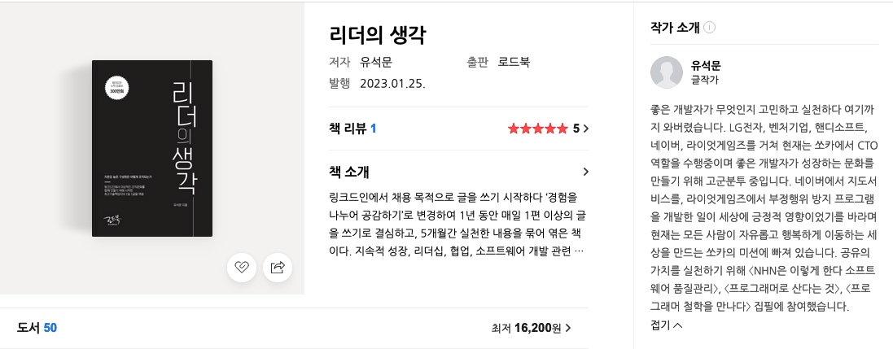

# 기간

2주

# 목적

에세이 형태의 글. 리더라는 단어가 눈에 띄어 구입하게 되었다.
다른 개발자들은 어떻게 살고 있고, 무슨 생각을 가지고 있을지 궁금하던 시기에 마침 관련 서적을 발견하여 바로 구입하게 되었습니다.

# 리뷰

이 저자의 책은 조금 더 구입해서 읽어볼 예정입니다.
<NHN은 이렇게 한다 소프트웨어 품질관리>, [<프로그래머로 산다는 것>](/2018-12-30-to-live-as-a-programmer/index.md), <프로그래머 철학을 만나다>를 집필했습니다.

개발자인데 자신의 생각을 잘 정리하여 글을 잘 쓰는 것 같습니다.

글은 총 4부로 나누어져 있습니다.

- 1부. 지속적인 성장
- 2부. 리더십
- 3부. 협업
- 4부. 소프트웨어 개발

책은 4개의 큰 주제와 1~2장 분량의 짧게 읽을 수 있는 소 주제로 나뉘어져있습니다.
책을 읽다보면 개발자로서 중요하다고 생각했던 내 생각들을 다시 정리 할 수 있었고, 놓쳤던 부분들이 있어서 반성하게 되었던 글들도 있었습니다. 중간 중간 중요한 자료들은 QR 코드 등으로 확인 할 수 있도록 기재해 놓았던 부분들도 좋았습니다.

책 자체는 짧게 짧게 읽어서 길게 보았지만, 한번 나중에 다시 정독해 볼 가치가 있을 것 같은 책이었습니다.

# 평점 및 한줄평

나 이외에 개발자가 무슨 생각을 하는지 엿 볼 수 있는 책이었다. 

4/5