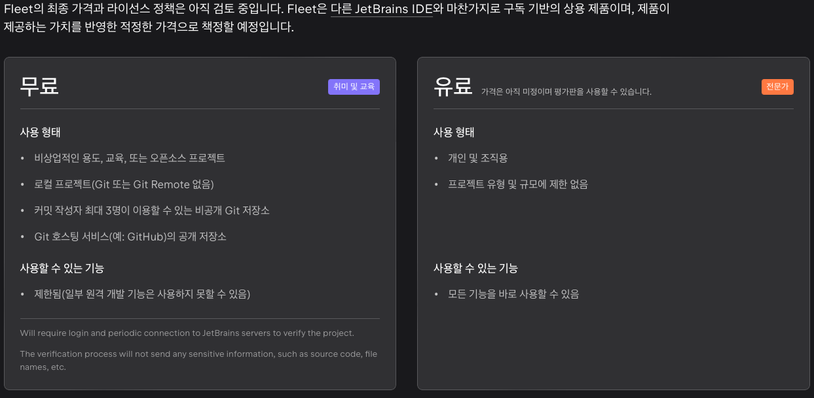

# 2022-10-15-TIL

## 📝 오늘 공부한 내용

[JetBrains Fleet 공개 테스트 버전 사용](https://www.jetbrains.com/ko-kr/fleet/)

### 장점
- 가벼운 에디터
- 스마트한 IDE (코드 자동 완성, 정의 및 사용 위치 탐색 등)
- 분산형으로 유연성 제공 (클라우드 코드 실행)
- 협업 효율성 극대화 (짝 프로그래밍 가능)
- 다양한 언어 지원

비상업적인 용도, 교육, 또는 오픈 소스 프로젝트의 경우 무료로 제공 하지만, 결국 구독 서비스의 상품으로 추가될 예정으로 보인다.
해당 부분이 vsCode를 대체할 정도의 강력한 IDE가 될지는 미지수 이다.

[JetBrains Fleet 기본 메뉴얼](https://www.jetbrains.com/help/fleet/getting-started.html)

### 사용 언어
- MD 파일
    - 해당 블로그 글을 에디터를 사용해서 작성해 보았다.
- C#
    - 유니티에서 사용가능할까?

### 사용 해보면서 느낀 점
- markdown의 프리뷰 기능 제공 안하는 것으로 보임
- 폴더에 드래그 해서 이미지 추가 안되는 것으로 보임
- 아직 공개 테스트 버전이라 많은 기능으로 세부적인 기능들은 추가 안된 것으로 보이긴 한다.
- 스마트 모드를 키면 자동으로 해당 언어에 대해 제공해준다고 함 (자바, 코틀린, 자바스크립트/타입스크립트, 파이썬, 고, PHP, C#)
    - 우선 유니티 프로젝트 최상위 폴더를 열고 스마트 모드를 켜주니, ReSharper service를 다운 받는 것으로 보임
    - 자동으로 뭔가를 설정해주는 것 같긴하다.
    - 프로젝트 싱크도 해주고 있긴 하네..
    - 지원 안되는 것으로 보인다. 향후에는 지원을 해줄련지..
    - vscode의 유니티 지원은 어느 정도인지 확인해봤는데 확실히 rider가 훨씬 좋다.
        - 디버깅이 제대로 안되고.
        - [유니티에서 공식 지원 중단](https://forum.unity.com/threads/update-on-the-visual-studio-code-package.1302621/)
- 일주일 더 써보기

## 👏 칭찬

새로 나온 IDE를 다운 받고 호기심을 가지고 확인 해본 부분은 칭찬 하고 싶다.

## ⚠️ 개선할 것

쓸데 없는 시간 낭비는 아닐까 싶긴 하다.
확인하다 보니 기존 사용하던 젯브레인의 라이센스 갱신에 대한 부분도 찾아본 부분으로 쓸데 없는 시간 낭비를 한 것 같다. (23년 7월 종료)
22년 10월 일괄 젯브레인 라이센스가 오름에 따라, 계속해서 젯브레인 제품을 사용해야 될지에 대해 리서치 하는데 시간이 소비된 것 같다.