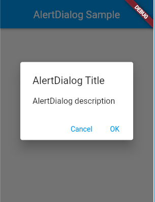
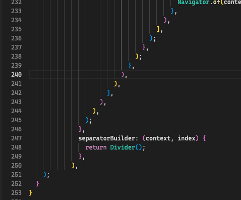

# 2022-10-25-TIL

## 📝 오늘 공부한 내용

### 5.3.3 TodoProvider 작성하기 (더미데이터 버전)
- Provider는 네트워크 등 외부 데이터 영역과의 통신을 담당하는 코드입니다.
- Todo 앱에서 Provider 기능 (CRUD)
    1. 모든 Todo를 가져오는 기능
    2. 특정 Todo를 가져오는 기능
    3. Todo를 생성
    4. Todo를 수정
    5. Todo를 삭제하는 기능

- [AlertDialog](https://api.flutter.dev/flutter/material/AlertDialog-class.html)를 사용하면 다이얼로그 형태로 띄워 바로 입력할 수 있다.
- [showDialog](https://api.flutter.dev/flutter/material/showDialog.html) 함수를 사용한다.

- 플러터에서 제공해주는 클래스의 경우 다양한 부분에 대해 모두 대응하기 위해 범용적으로 제작되어 있어, 손쉽게 수정이 가능하다.
    - 위젯에 적용된 부분을 다른 프레임워크 등에서도 충분히 적용할만할 것으로 보인다. (유니티의 UI 모듈을 만들때 참고한다던지)
    - 하지만 지나치게 범용적인 부분이 있어, 분명히 플러터 내부에서도 어느정도의 코드 가독성을 해치는 부분이 있기 때문에, 동일하게 갈 필요는 없을 것으로 보인다.

- [SimpleDialog](https://api.flutter.dev/flutter/material/SimpleDialog-class.html)로 간단한 다이얼로그도 띄울 수 있습니다.
연
> 플러터의 경우 조금만 신경 쓰지 않으면 뎁스가 엄청나게 길어지는 부분이 있어, 코드를 읽기 힘들어 보인다.
> 결국 모든 공통된 부분은 별도의 하위 위젯으로 만드는 꾸준한 리팩터링도 중요해 보인다.

결국 만들다 보면 말도 안되게 콜백 지옥 같은 괄호의 향연을 볼 수 있는 부분..

플러터의 경우 뭔가 이미 너무 잘 만들어진 위젯들이 많다.
그리고 모든 위젯을 전부 공부하는 것은 말이 안되는 것 처럼 보인다.
실제 개발시 입맞에 맞게 자신이 원하는 위젯을 공식 api 문서에서 검색하는 능력이 필요해 보인다.

### ❓ 질문 만들기
1. Provider는 무엇인가?
2. AlertDialog는 무엇인가?
3. showDialog은 언제 사용하는가?
4. SimpleDialog는 무엇인가?

## 👏 칭찬
- 다양한 시도를 많이 하고 있다. fleet 에디터에서 작성하고 있고, space를 사용하여 현재 레포를 관리하고 있다.
- 해당 부분에 대해 장단점 등을 파악하고 가장 개발하기 쉬운, 환경으로 개발을 진행해야 될 것으로 보인다.

## ⚠️ 개선할 것
- 플러터 관련 학습 방법에 대해 고민을 해봐야 될 것 같다. (기존 다른 언어와 다른 학습 방법이 필요해 보인다.)