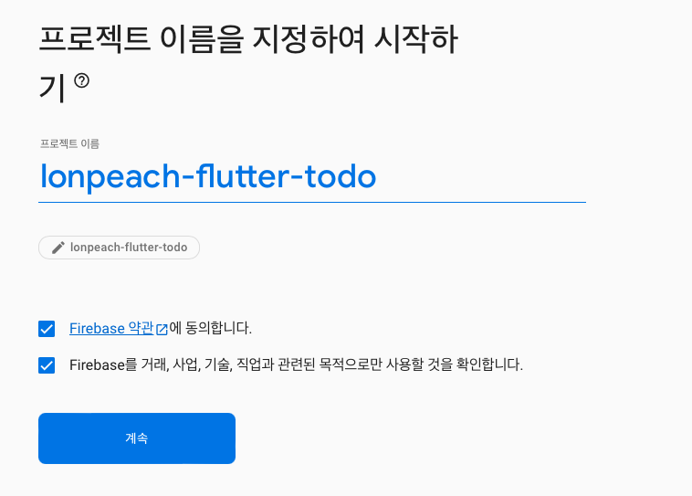
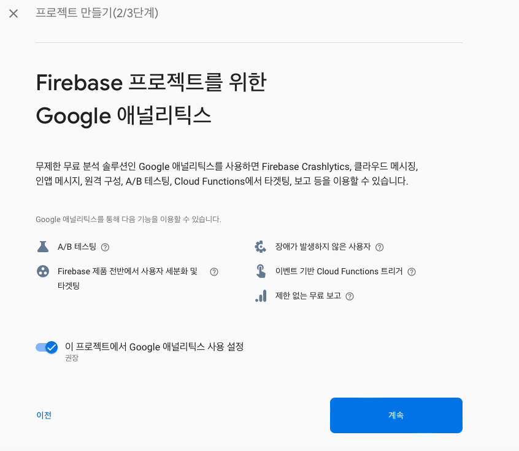

# 2022-10-27-TIL

## 📝 오늘 공부한 내용

### 5.4.0 Firebase & Firestore란?
- Firebase는 구글의 BaaS입니다.
    - 아주 간단하게 백엔드를 구현 가능 합니다.
    - 회원가입, 로그인, 데이터베이스 등의 다양한 기능을 구현 가능합니다.
- Firestore는 Firebase에서 제공해주는 데이터베이스 기능의 이름입니다.
    - 관계형 데이터베이스가 아닌 NoSQL 기반의 데이터 베이스 입니다.

### Firebase 세팅하기
- 기본적인 세팅 하는 방법은 구글 리서치 등으로 가능하여 별도 정리 하지 않음.
- https://console.firebase.google.com

#### 프로젝트 생성

#### iOS 앱 등록, Andorid 등록
- 생략

#### FireStore
- Collection은 테이블
- Document는 한 데이터의 Row

이전에도 느낀건데, 실제 플러터에서 파이어베이스 라이브러리 설정이 그렇게 호락호락하지는 않다.
m1의 문제인지 라이브러리 버전의 문제인지, 어느정도 해결을 해야 정상적인 빌드가 된다.
뭐 어찌저찌 하다 보니 또 빌드 되는 상황..

FireBase이외에도 좋은 대안들이 많기 때문에, 다른 대안을 충분히 선택할 수 있다.

### 언어 선택의 기로
- golang, python, rust
- 백엔드, 자동화, 재미 (배움)
- golang이 가장 적합한 언어가 아닌가 싶다.

## 👏 칭찬
- N/A

## ⚠️ 개선할 것
- 먼저 시작하지 않고, 항상 고민하는 부분 개선 필요. 모든 부분에 전부 좋을 순 없다. 합리적인 언어 선택 후 바로 투입 진행 해야 될 듯 하다.